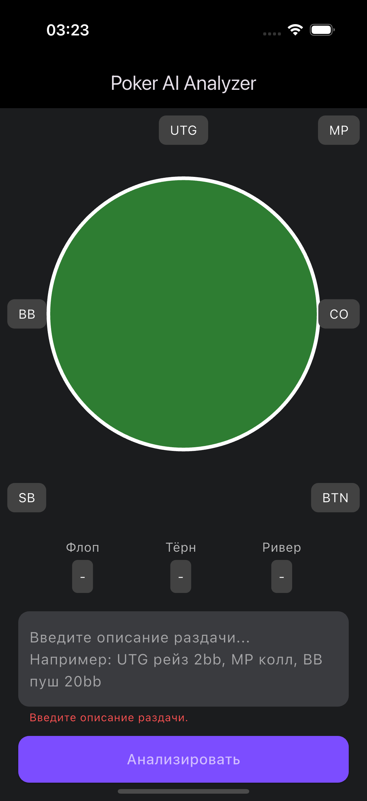

# Poker Analyzer

[](https://github.com/ClubBoss/Poker_Analyzer/actions/workflows/demo_build.yml)

Poker Analyzer is a production‑ready platform for training and analyzing tournament poker decisions.

## Key Features
- Push/fold drills with EV and ICM metrics
- Postflop decision practice with mistake tracking
- Theory injection and interactive lessons
- Automated pack generation and plug‑in converters
- Adaptive learning paths with progress charts

## Architecture Overview
```
+-------------+       +-----------------+
| Flutter UI  |<----->| Learning Engine |
+-------------+       +-----------------+
        |                      |
        v                      v
+-----------------+    +----------------------+
| Autogen Pipeline|    | Theory Integrity CI  |
+-----------------+    +----------------------+
```
- **Flutter UI** – visual interface for training and analytics
- **Autogen Pipeline** – scripts compiling packs and theory data
- **Learning Engine** – evaluates decisions and adapts paths
- **Theory Integrity CI** – automated checks validating training content

## Installation & Setup
1. Install Flutter 3.0 or higher.
2. Run `flutter pub get` to install dependencies.
3. Run `flutter gen-l10n` to generate localization files.
4. Precompile training packs with `dart tools/precompile_all_packs.dart`.
5. Launch with `flutter run`.

### Demo Build
Run a lightweight demo:
```bash
flutter run -t main.dart
flutter build apk --target=main.dart
```

## Usage Examples
- **Run a training pack**: `flutter run`
- **Verify theory content**: `dart tools/validate_training_content.dart --ci`
- **Generate packs**: `dart tools/precompile_all_packs.dart`
- **Path YAML Visualizer**: open `tools/path_yaml_visualizer.html`
- **Pack Library Publisher Dashboard**: open `tools/publisher_dashboard.html`

## Contributing
- Use branches prefixed with `codex/<task>` using ASCII characters.
- Run tests with `flutter test` and validate content via `dart tools/validate_training_content.dart --ci`.
- Validate seed files: `dart run bin/usf_lint.dart <seed_directory>`.
- Precompile packs before committing: `dart tools/precompile_all_packs.dart`.
- For plug-in development, see [docs/plugins/README.md](docs/plugins/README.md) and [PLUGIN_DEV_GUIDE](docs/plugins/PLUGIN_DEV_GUIDE.md).

## Troubleshooting
If Git reports hidden characters in refs:
```bash
tools/check_head_refs.sh
echo 'ref: refs/heads/main' > .git/HEAD
```

## CI & QA
GitHub Actions run unit tests, build the demo APK, and enforce theory integrity.

### CI configuration
Environment variables can tune the skill tag coverage gate:

- `COVERAGE_MODE` – `soft` (default) or `strict`.
- `COVERAGE_MIN_UNIQUE_TAGS` – minimal distinct tags (default `5`).
- `COVERAGE_MIN_PCT` – minimal tag coverage fraction (default `0.35`).

Set these in CI to adjust thresholds or switch modes (PRs run with `COVERAGE_MODE=strict`).

## License & Credits
© 2024 Poker Analyzer contributors. License pending.


- fast-path test Mon Aug 11 01:16:01 +04 2025
