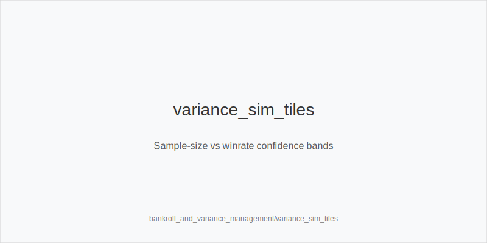
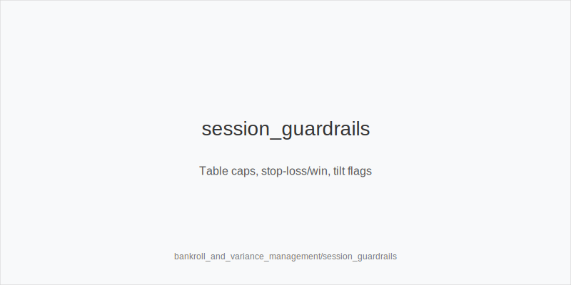

What it is
This playbook turns bankroll, variance, and session-management choices into stable frequency shifts using one compact action set: 3bet_ip_9bb, 3bet_oop_12bb, 4bet_ip_21bb, 4bet_oop_24bb, small_cbet_33, half_pot_50, big_bet_75, size_up_wet, size_down_dry, protect_check_range, delay_turn, probe_turns, double_barrel_good, triple_barrel_scare, call, fold, overfold_exploit. You keep the same trees and sizes. You adjust how often you use them based on bankroll tier, soft windows, and execution load.

[[IMAGE: bankroll_curves | Downswing depth vs BB/100 & stdev]]

Why it matters
Bankroll and variance policy changes EV/hour more than micro in-hand tweaks. Proper caps, shot rules, and texture-consistent sizing prevent tilt lines and keep decisions reliable when scaling tables. The mantra is physics first, reads second: texture picks size family; bankroll and load move frequencies.

[[IMAGE: variance_sim_tiles | Sample-size vs winrate confidence bands]]

Rules of thumb

* Bankroll tiers -> table count: in softer pools add tables; in tough pools reduce tables and increase protect_check_range and delay_turn. Why: load affects accuracy more than mix tweaks.
* Shot-taking: predefine buy-ins and exit rules. During shots bias to small_cbet_33 and half_pot_50; reserve big_bet_75 for size_up_wet with blockers. Why: reduce variance tax.
* Stop-loss/win: set guardrails. Under fatigue trim thin calls and triple_barrel_scare; add delay_turn and protect_check_range. Why: error rate grows faster than edge.
* Soft windows: expect fast folds and passive rivers. Widen 3bet_oop_12bb and 3bet_ip_9bb with blockers, tag overfold_exploit; take thinner half_pot_50 value. Why: immediate folds and merged calls increase.
* Tough pools: fewer speculative calls IP/OOP; fold more versus big_bet_75 without blockers. Why: under-bluffed polar nodes.
* Texture discipline: size_down_dry on A83r or K72r with small_cbet_33; size_up_wet on JT9ss or 986ss with big_bet_75 when equity and blockers support pressure. Why: volatility needs leverage support.
* Preflop ladders steady: 3bet/4bet sizes never change; widen or tighten frequency only. Why: consistent ladders lower mistakes.
* Multiway or high variance tables: prefer half_pot_50 over big_bet_75 unless you hold nut advantage and blockers. Why: realization drops multiway.
* Recovery mode after downswings: simplify plans, default to small_cbet_33, half_pot_50, delay_turn; protect_check_range in stab-prone nodes. Why: stabilize redline and reduce punt risk.
* EV/hour triage: leave tough lists, join soft waitlists. Softer table selection beats small in-hand edges. Map to more overfold_exploit and fewer hero calls. Why: better immediate yield.

Mini example
Late-night soft window HU 100bb. In lobby you see many short stacks and few 4-bets. Preflop: widen 3bet_oop_12bb with A5s and tag overfold_exploit. 3-bet pot A82r, pot ~18bb: small_cbet_33 (size_down_dry). Turn 9c in a pool that tanks then folds to pressure: half_pot_50 as double_barrel_good; reserve big_bet_75 for dynamic cards with blockers. Two hours later you move from 6 to 12 tables. Under load, you shift toward small_cbet_33, more delay_turn with medium strength, and fewer triple_barrel_scare attempts unless scare + blockers are clear. On polar big river bets without blockers, fold. If the shot drops by the preset stop-loss, revert stake and keep the same tokens at lower frequency.

Common mistakes

* Off-tree sizes under tilt or overload. Why it happens: urgency bias. Fix: keep 33/50/75 only; shift frequency.
* Forcing big_bet_75 on dry rivers. Why it happens: desire to win the pot now. Fix: size_down_dry thin value or check.
* Shot-taking with no exit rules. Why it happens: optimism. Fix: predefine stop-loss/win and revert plan.
* Refusing to leave tough pools. Why it happens: sunk-cost fallacy. Fix: join soft waitlists; map to overfold_exploit and thin half_pot_50 value.

Mini-glossary
Bankroll tier: stake band that sets table caps and shot rules; shifts frequencies, not sizes.
Shot: temporary move up with preset exits; favor small_cbet_33, half_pot_50.
Risk-of-ruin (intuitive): chance of bust given winrate and stdev; lower it by table caps and discipline.
BB/100: winrate metric that interacts with variance and sample size.
stdev/100: volatility metric; higher means more discipline and fewer thin bluffs.
Soft window: time block with weaker pools; widen 3bet frequencies and value with half_pot_50.
Stop-loss/win: session guardrails that trigger exits or cooldowns.
Table cap: max concurrent tables tied to accuracy; higher caps mean simpler lines.
Autopilot: reduced attention mode; keep sizes simple and protect checks.
Execution load: cognitive demand from tables and session length; bias to delay_turn and protect_check_range.

Contrast
This module adjusts frequencies using bankroll, variance, and load. It does not add sizes or tokens. The same HU and postflop tokens carry over to 6-max and MTT contexts.

[[IMAGE: session_guardrails | Table caps, stop-loss/win, tilt flags]]

See also
- exploit_advanced (score 29) -> ../../exploit_advanced/v1/theory.md
- icm_final_table_hu (score 29) -> ../../icm_final_table_hu/v1/theory.md
- live_etiquette_and_procedures (score 29) -> ../../live_etiquette_and_procedures/v1/theory.md
- live_full_ring_adjustments (score 29) -> ../../live_full_ring_adjustments/v1/theory.md
- live_session_log_and_review (score 29) -> ../../live_session_log_and_review/v1/theory.md