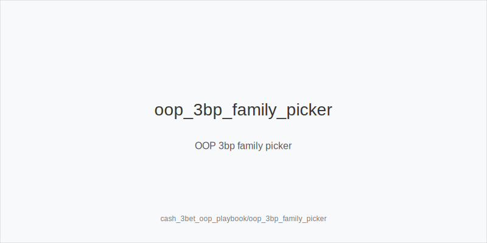
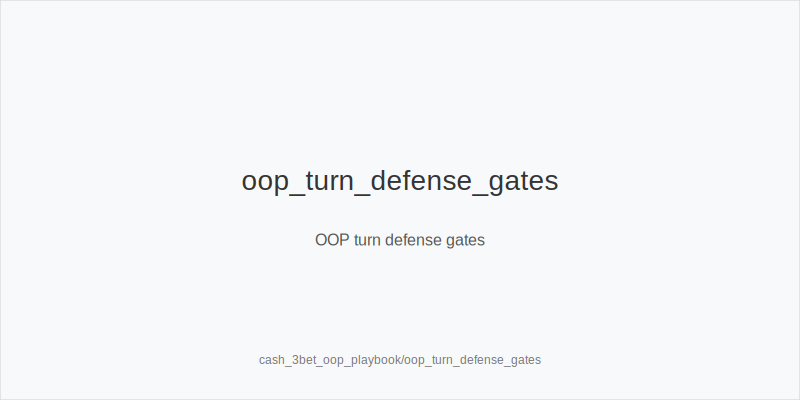
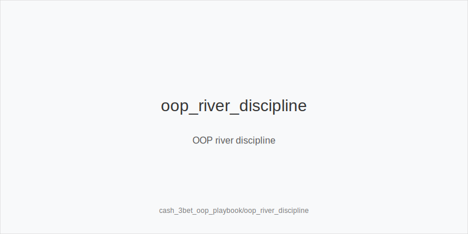

# What it is
A playbook for **OOP-only 3-bet pots** where Hero is the 3‑bettor from the blinds. We keep fixed ladders and size families: preflop **3bet_oop_12bb**; postflop **small_cbet_33, half_pot_50, big_bet_75**. Families are **size_down_dry** (static: A83r, K72r) and **size_up_wet** (dynamic: JT9ss, T98s, 986ss). No off‑tree lines, no new sizes or trees.

# Why it matters
OOP after 3‑betting has lower SPR but higher raise risk. EV comes from picking the right family by texture, protecting checks to prevent auto‑stabs, blocker‑gated pressure when **Fv75** rises, and river discipline versus polar bets. Patterns transfer to 6‑max and HU whenever you are the OOP 3‑bettor.

# Rules of thumb
- **Preflop ladder:** default **3bet_oop_12bb**; widen only with evidence (tag **overfold_exploit** after persistence). It sets a workable SPR and prices IP calls.
- **Pick by texture:** static → **size_down_dry** with **small_cbet_33** control; dynamic → **size_up_wet** with **half_pot_50** denial. Family first, then size.
- **Protect checks & delay turns:** add **protect_check_range** on stabby boards; at mid SPR vs raise‑prone IP, prefer **delay_turn** with medium strength.
- **Upgrade gates:** move to **big_bet_75** only with top blockers **and** a documented **Fv75** spike; otherwise keep **half_pot_50**.
- **Blocker‑led second barrels:** on dynamic turns, **double_barrel_good** when equity + blockers support; keep 50% by default.
- **Probe rule:** only **probe_turns** after a flop **Sequence: chk-chk**. Never label a turn probe_turns as a probe if you faced a flop bet.
- **River discipline:** facing polar **big_bet_75** without key blockers → **fold**. Call only with top blockers and evidence. As PFA with scare + blockers and a prebuilt plan → **triple_barrel_scare**.
- **Raise‑prone opponents:** reduce flop c‑bet frequency, add **protect_check_range**, and lean on **delay_turn** to avoid raise trees.
- **Multiway after callers pile in:** realization drops; prefer merged **half_pot_50** and fewer pure bluffs.
- **Plan turn → river:** if turn **big_bet_75** leaves trivial behind, require blockers/equity; otherwise stay at **half_pot_50** or **delay_turn**.
- **Economics tie‑in:** in rakey games trim thin OOP bluffs/calls; prefer value‑heavy 3‑bets. In time games, keep volume‑friendly lines (**small_cbet_33, half_pot_50, delay_turn**).
- **No off‑tree fixes:** string‑bet/line‑rule issues don't change families or sizes-stay within **33/50/75**.

[[IMAGE: oop_3bp_family_picker | OOP 3bp family picker]]

[[IMAGE: oop_turn_defense_gates | OOP turn defense gates]]

[[IMAGE: oop_river_discipline | OOP river discipline]]

# Mini example
- **Static:** SB 3bets BTN (12bb). Flop A83r → **size_down_dry + small_cbet_33** (controlled). Turn raise‑prone → **delay_turn**. River faces **big_bet_75** without blockers → **fold**.
- **Dynamic:** BB 3bets CO. Flop JT9ss → **size_up_wet + half_pot_50**. Turn scare with top blockers + **Fv75↑** → **big_bet_75** ( **double_barrel_good** ).
- **After checks:** MP opens, BB 3bets, MP calls. Flop K72r checks through → **Sequence: chk-chk** → good turn card → **probe_turns**.

# Common mistakes
- Auto **small_cbet_33** on wet textures (invites raises and gives equity). 
- Upgrading to **big_bet_75** without blockers/evidence. 
- Calling river **big_bet_75** without blockers. 
- Mislabeling a turn probe_turns as **probe_turns** (probe only after chk-chk). 
- Over‑c‑betting into raise‑prone IP; skipping **protect_check_range**/**delay_turn**. 
- Off‑tree sizes under pressure.

# Mini-glossary
**Raise risk:** likelihood IP raises your bets; pushes toward **delay_turn** and protected checks. 
**Protected checks:** **protect_check_range** mixes checks that can continue vs stabs. 
**Probe sequence:** **Sequence: chk-chk** → **probe_turns**. 
**Blocker gates:** use key blockers to unlock **big_bet_75** and some river calls. 
**Fv50/Fv75:** fold‑vs‑size rates guiding 50% vs 75% choices.

# Contrast
Unlike **cash_3bet_ip_playbook**, OOP play emphasizes **protect_check_range**, **delay_turn**, and gated upgrades instead of broad c‑bet pressure. Same tokens, same **33/50/75** families-only frequencies shift.

See also
- cash_blind_defense_vs_btn_co (score 27) → ../../cash_blind_defense_vs_btn_co/v1/theory.md
- cash_turn_river_barreling (score 27) → ../../cash_turn_river_barreling/v1/theory.md
- donk_bets_and_leads (score 27) → ../../donk_bets_and_leads/v1/theory.md
- hu_postflop_play (score 27) → ../../hu_postflop_play/v1/theory.md
- live_chip_handling_and_bet_declares (score 27) → ../../live_chip_handling_and_bet_declares/v1/theory.md

What it is

Why it matters

Rules of thumb

Mini example

Common mistakes

Mini-glossary

Contrast
