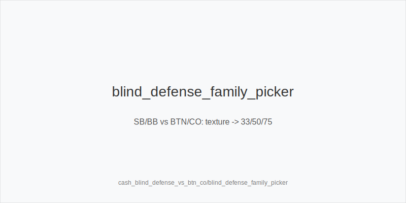
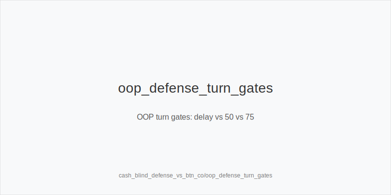
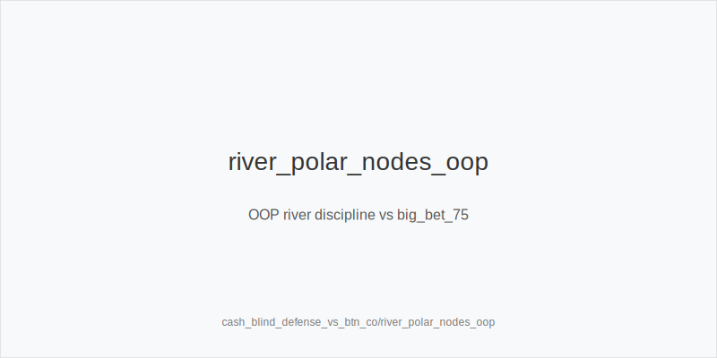

What it is
An SB/BB defense playbook versus BTN/CO steals. You act OOP most of the time. We keep fixed ladders (3bet_oop_12bb primary; 3bet_ip_9bb, 4bet_ip_21bb, 4bet_oop_24bb when clearly applicable) and the 33/50/75 families. Only frequencies shift. Every decision maps to one token.

Why it matters
BTN/CO apply price and position. OOP your realization drops and raise risk rises. EV comes from correct family by texture, protected checks that deny auto-stabs, blocker-gated turn pressure, and strict river discipline versus polar sizing. Fixed 33/50/75 lines make plans repeatable.

Rules of thumb
- Preflop pressure: default 3bet_oop_12bb vs steals; widen only with blockers and persistence -> overfold_exploit. Why: you price IP, set SPR, and exploit real fast folds without spew.
- Family by texture: static -> size_down_dry then small_cbet_33 at controlled freq; dynamic -> size_up_wet and half_pot_50 default. Why: physics-first selection beats guesswork and reduces raise exposure.
- Protect early at mid SPR: use protect_check_range on stabby textures and prefer delay_turn versus raise-prone IP with medium strength. Why: you avoid raise wars and keep equity alive OOP.
- Turn upgrade gates: escalate to big_bet_75 only with top blockers and documented Fv75 up; otherwise keep half_pot_50 or delay_turn. Why: larger bets need removal of continues plus evidence.
- River discipline: facing polar big_bet_75 without blockers -> fold; with scare plus top blockers and a plan -> triple_barrel_scare as PFA or call. Why: blockers filter bluffs and data beats hope.

Mini example
Line 1 steal node: UTG folds, MP folds, CO opens 2.5bb, BTN folds, SB 3bet_oop_12bb, BB folds. Flop K72r (static) -> size_down_dry + small_cbet_33; turn versus raise-prone IP -> delay_turn; river facing polar 75 without blockers -> fold.
Line 2 probe line: UTG folds, MP folds, CO min-raises, BTN calls, BB defends. Flop Q84r checks through. Sequence: chk-chk -> probe_turns on good turn; if turn stays dynamic and you hold key blockers with Fv75 up -> big_bet_75 as double_barrel_good.
Line 3 dynamic 3BP: BTN steals, SB 3bet_oop_12bb, BTN calls, BB out. Flop JT9ss -> size_up_wet with half_pot_50; upgrade only when blockers plus Fv75 justify it; river versus polar 75 without blockers -> fold.

Common mistakes
- Auto 33 on wet boards. Error: gives cheap cards and invites raises; Why players do it: habit from IP trees and love of small bets.
- Upgrading to 75 without blockers or Fv75 evidence. Error: overbluffs into sticky ranges; Why players do it: momentum after good turns and wishful reads.
- Probing without chk-chk. Error: stabs into uncapped IP and gets raised; Why players do it: urge to seize initiative regardless of eligibility.

Mini-glossary
protect_check_range: checks that can continue; reduces auto-stabs and keeps range uncapped.
Blocker gates: require top blockers before big_bet_75 or thin river calls.
Fv50/Fv75: fold vs 50%/75%; log before upgrades or calls.
Commitment gate: if a 75% turn leaves a trivial river, require equity/blockers or stay at 50% or delay_turn.

Contrast
IP 3-bet playbook presses more; here OOP we protect earlier, delay more, and upgrade only through blocker and evidence gates with the same tokens.

[[IMAGE: blind_defense_family_picker | SB/BB vs BTN/CO: texture -> 33/50/75]]

[[IMAGE: oop_defense_turn_gates | OOP turn gates: delay vs 50 vs 75]]

[[IMAGE: river_polar_nodes_oop | OOP river discipline vs big_bet_75]]

See also
- donk_bets_and_leads (score 29) -> ../../donk_bets_and_leads/v1/theory.md
- live_chip_handling_and_bet_declares (score 29) -> ../../live_chip_handling_and_bet_declares/v1/theory.md
- cash_3bet_oop_playbook (score 27) -> ../../cash_3bet_oop_playbook/v1/theory.md
- cash_limp_pots_systems (score 27) -> ../../cash_limp_pots_systems/v1/theory.md
- cash_population_exploits (score 27) -> ../../cash_population_exploits/v1/theory.md