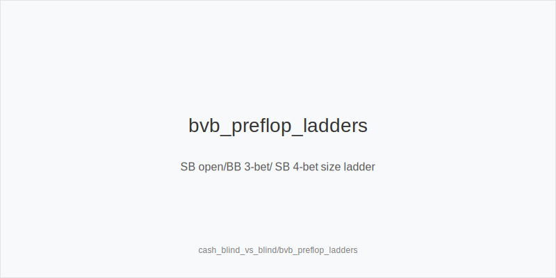
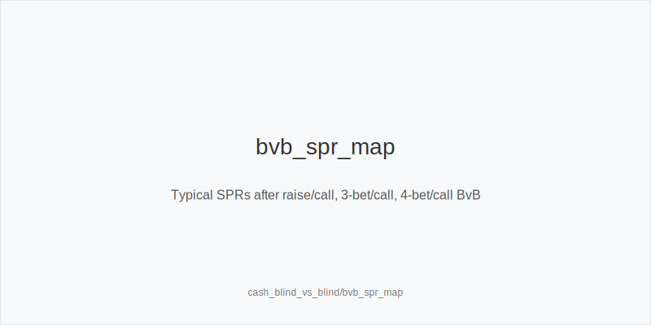
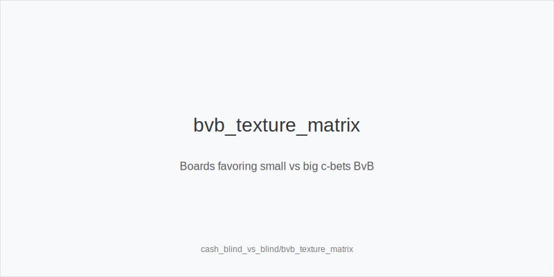

What it is
Blind-vs-blind (BvB) covers SB vs BB battles in 6-max cash. Ranges are widest,
equities run closer, and small size errors snowball. Initiative can flip street
to street, so plans must adapt. Sizes differ from CO/BTN vs blinds because
preflop ranges and positions are unique.

[[IMAGE: bvb_preflop_ladders | SB open/BB 3-bet/ SB 4-bet size ladder]]

[[IMAGE: bvb_spr_map | Typical SPRs after raise/call, 3-bet/call, 4-bet/call BvB]]

[[IMAGE: bvb_texture_matrix | Boards favoring small vs big c-bets BvB]]

Why it matters
Rake share drops once pots grow, so postflop EV swings are larger. Both players
hold many bluff-catchers and weak pairs, which rewards clear size baselines and
texture-aware aggression. Clean discipline avoids spew from dominated offsuit
junk and autopilot stabs.

Rules of thumb
- SB preflop: raise_or_fold_default with 2.5-3.0bb opens. Use
 complete_vs_under_isolation only when BB under-isolates; otherwise you create
 tough OOP spots with capped ranges.
- BB vs SB open: 3bet_ip_10bb versus 2.5-3.0 opens. Go more linear when SB
 opens wide; add suited-wheel bluffs against tighter SBs. Flat a robust set
 that realizes well IP.
- 4-bet ladders: SB uses 4bet_small_22bb; BB continues tighter IP. At 140bb+
 size up to 24-26bb to preserve leverage; when shallow, size down to keep clean
 jam stacks and defined SPR.
- Postflop sizes: small_cbet_33 on Axx/Kxx dry; half_pot_50 on middling 8-J
 high where ranges are close; big_bet_75 on wet T98/QJT two-tone to deny
 equity. Rivers: polarize_river when ranges cap and draws miss.
- Probing: as BB IP after flop checks through, probe_turns that improve BB
 (middle overcards, straight-completers). As SB OOP, delay_cbet_oop on
 middling textures; over-stabbing gets punished by wide IP floats.
- Initiative and shows: last aggressor owns initiative; on a called river bet,
 bettor_shows_first. If river checks through, live rules apply (first active
 left of button shows in many rooms).

Mini example
SB opens 2.5bb, BB 3-bets 10bb, SB calls (pot ~20.5bb, SPR ~4.3).
Flop K72r: BB small_cbet_33; SB calls with Kx and some pairs/backdoors.
Turn 5x: BB big_bet_75 to pressure under-Kx and pocket pairs that float flop.
River bricks: BB polarize_river using hands blocking Kx; check back give-ups.
Takeaway: combine size ladders with texture shifts to move stacks or exit cleanly.

Common mistakes
- Habit SB limps: cedes initiative and invites BB isolation; leaks OOP without a
 plan.
- BB over-polar 3-bet at 100bb: folds equity share versus wide SB and gives up
 linear value.
- SRP-style tiny stabs on wet boards: grants cheap realization to live draws at
 high volatility.
- Calling 4-bets OOP too wide: fold_vs_4bet_oop more; low SPR punishes dominated
 calls.

Mini-glossary
raise_or_fold_default: SB opening policy favoring raises or folds over blind
completes.
3bet_ip_10bb: Standard BB 3-bet size versus 2.5-3.0bb SB opens.
4bet_small_22bb: SB baseline 4-bet that sets low SPR and preserves leverage.
small_cbet_33, half_pot_50, big_bet_75: Postflop size family by texture.
delay_cbet_oop: SB checks flop to protect range and realize equity.
probe_turns: BB IP turn stab after flop checks through on favorable cards.
polarize_river: Use strong value or bluffs that block calls on capped rivers.
bettor_shows_first: Show order after a called river bet.

Contrast
Unlike BTN-vs-BB, both ranges start wider and less capped, and the SB is OOP far
more. Initiative flips more often and SPR bands shift faster because raises
escalate from the blinds without position advantage.

_This module uses the fixed families and sizes: size_down_dry, size_up_wet; small_cbet_33, half_pot_50, big_bet_75._

See also
- cash_population_exploits (score 23) → ../../cash_population_exploits/v1/theory.md
- hand_review_and_annotation_standards (score 23) → ../../hand_review_and_annotation_standards/v1/theory.md
- icm_mid_ladder_decisions (score 23) → ../../icm_mid_ladder_decisions/v1/theory.md
- live_etiquette_and_procedures (score 23) → ../../live_etiquette_and_procedures/v1/theory.md
- live_full_ring_adjustments (score 23) → ../../live_full_ring_adjustments/v1/theory.md