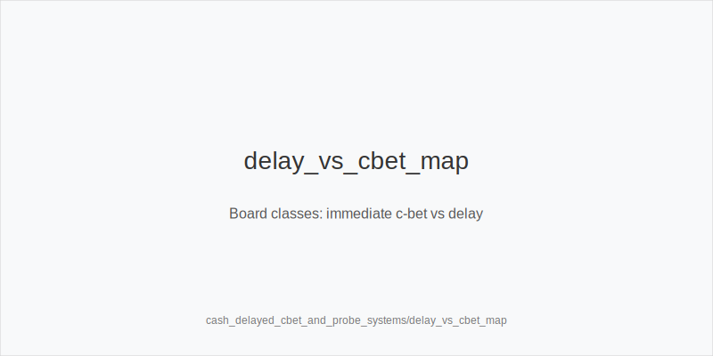
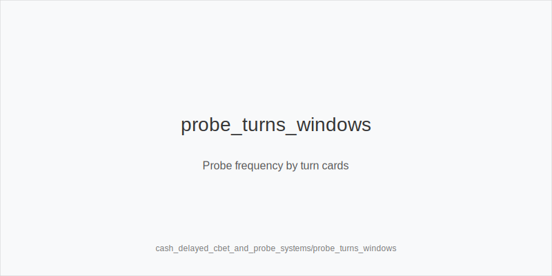
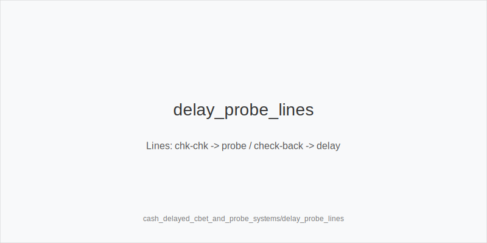

What it is
delay_turn means you check back the flop in position, then bet the turn. probe_turns means you bet the turn out of position after both players checked the flop. Both lines capture value and fold equity on better cards, control pot size, and protect medium-strength hands. They complement small_cbet_33; they do not replace it.

[[IMAGE: delay_vs_cbet_map | Board classes: immediate c-bet vs delay]]

[[IMAGE: probe_turns_windows | Probe frequency by turn cards]]

[[IMAGE: delay_probe_lines | Lines: chk-chk -> probe / check-back -> delay]]

Why it matters
Many pools over-defend flops versus tiny bets, then overfold turns. Others check back too many ace-highs and marginal top pairs. Delayed and probe lines exploit this: you invest when equity and credibility improve, avoid bloating flops on bad textures, and steer SPR so rivers are cleaner.

Rules of thumb
- Keep small_cbet_33 on dry Axx/Kxx and paired-low boards; size_down_dry on very static textures. Why: you keep worse in, tax floats cheaply, and do not need protection.
- Choose delay_turn on middling or connected flops like T98, J95, 875 that favor the caller. Why: your mediums and backdoor-heavy hands realize well and face fewer check-raises.
- Use probe_turns when the turn favors the OOP range (paired middles, low overcards that do not smash IP) or when villain under-c-bets. Tag overfold_exploit. Why: turn fold equity spikes.
- Default turn size is half_pot_50 for both delay_turn and probe_turns; size_up_wet to big_bet_75 only with strong equity or clear nut advantage. Why: geometry plus denial.
- Plan rivers. triple_barrel_scare when the river credibly completes your story with helpful blockers; otherwise check or thin value. After small flop bets on range turns, use double_barrel_good.

Mini example
UTG folds, MP opens 2.3bb, CO folds, BTN calls, SB folds, BB calls. Flop J95r checks to MP, who checks; BTN checks; BB checks. Turn A shifts range toward IP. BTN delay_turn for half_pot_50; BB folds, MP calls. River 2 bricks; MP checks, BTN bets small for thin value. Alt branch: if the turn pairs 9, checks go through and BB probe_turns half_pot_50 on the next card.

Common mistakes
- Auto c-betting dynamic flops with air, then shutting down. Why it is a mistake: you buy bad flops and face raises. Why it happens: overusing small_cbet_33 from dry-board success.
- Probing bad turns with no equity just because flop checked through. Why it is a mistake: poor fold equity and reverse-implied risk. Why it happens: fear of giving a free card.
- Oversizing delayed or probe bets on static turns with marginal hands. Why it is a mistake: you isolate better hands and fold worse. Why it happens: copying big_bet_75 from wet nodes.

Mini-glossary
delay_turn: IP bets the turn after checking back the flop.
probe_turns: OOP bets the turn after both checked the flop.
small_cbet_33 / half_pot_50 / big_bet_75: pot-based size families for clarity.
size_down_dry / size_up_wet: directional sizing on static vs dynamic textures.
double_barrel_good / triple_barrel_scare: turn and river aggression triggers.
overfold_exploit: intentional pressure where pools fold too often.

Contrast
Immediate c-bets print on many dry, high-card boards; delayed and probe systems shift aggression to turns where range and credibility improve, squeezing fold equity from populations that overfold turns and under-stab after flop checks.

See also
- cash_3bet_oop_playbook (score 25) → ../../cash_3bet_oop_playbook/v1/theory.md
- cash_blind_defense_vs_btn_co (score 25) → ../../cash_blind_defense_vs_btn_co/v1/theory.md
- cash_limp_pots_systems (score 25) → ../../cash_limp_pots_systems/v1/theory.md
- cash_short_handed (score 25) → ../../cash_short_handed/v1/theory.md
- cash_turn_river_barreling (score 25) → ../../cash_turn_river_barreling/v1/theory.md