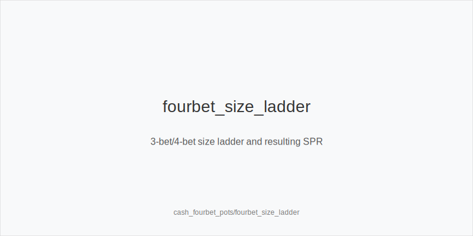
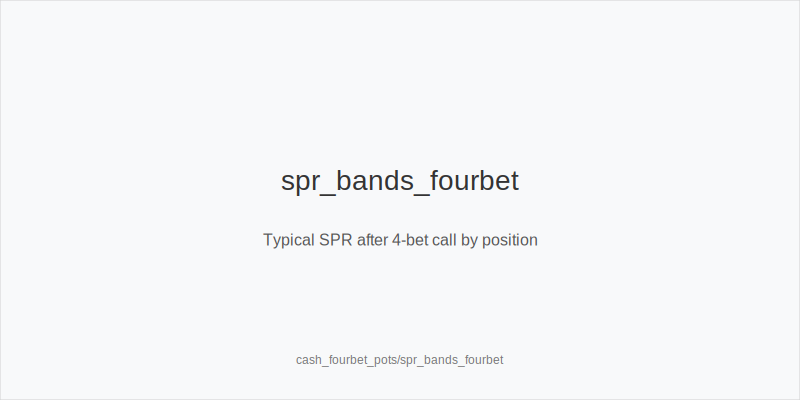
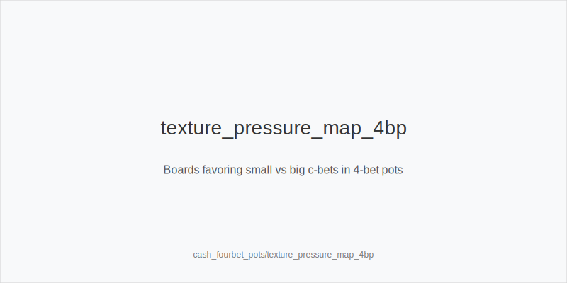

What it is
This module explains strategy for 4-bet pots in 6-max NLHE cash. You will standardize 4-bet sizes (~22bb versus 9/11bb 3-bets after 2.2-2.5bb opens, typical online), pick IP vs OOP range shapes, and plan postflop size families (33/50/75/125) around low SPR geometry. The goal is clean commitment bands, disciplined bluff selection, and texture-aware pressure.

[[IMAGE: fourbet_size_ladder | 3-bet/4-bet size ladder and resulting SPR]]

[[IMAGE: spr_bands_fourbet | Typical SPR after 4-bet call by position]]

[[IMAGE: texture_pressure_map_4bp | Boards favoring small vs big c-bets in 4-bet pots]]

Why it matters
4-bet pots run at low SPR (often ~1.6-2.2), so one or two bets decide stacks. Rake impact is smaller relative to pot, which magnifies both good value bets and bad calls. Clear preflop trees prevent loose OOP flats and curb over-bluffed IP lines. Good blockers and geometry planning turn fold equity into chips while protecting your stack when ranges are tight.

Rules of thumb
- Sizing discipline. Use 4bet_small_22bb versus 2.2-2.5 opens and 9/11bb 3-bets; size_up_wet to 24-26bb when 140bb+ or facing large 3-bets; size_down_dry when shallow to keep clean jam stacks. Why: correct size sets SPR bands that make turn jams natural and preserves leverage.
- Shape by position. 4bet_ip_linear versus wide blind 3-bets; 4bet_oop_polar from blinds versus CO/BTN and fold_vs_4bet_oop more when realization is poor. Why: IP realizes equity and punishes wide 3-bets; OOP needs nuts plus block_4bet_bluff_combo to avoid tough postflop spots.
- SPR planning. After a 4-bet call, SPR ~1.6-2.2; with top value or equity-plus-blockers, shove_spr_lt_1_5 by the turn is standard. Why: low SPR converts equity efficiently and denies theirs before rivers.
- Texture sizing. small_cbet_33 on Axx/Kxx dry where nut advantage is retained; big_bet_75 on QJT/T98 two-tone to deny_equity_turn and polarize; check_back_marginal_ip on middling textures to protect range and avoid thin stack-offs. Why: pressure should match board volatility and range advantage.
- Blockers and traps. Prefer Axs/Kxs as block_4bet_bluff_combo; trap_slowplay_rare only when pools over-bluff or when trapping keeps dominated hands in without losing folds elsewhere. Why: blockers cut strong combos and raise bluff EV.

Mini example
UTG folds, MP folds, CO folds. BTN opens 2.5bb, SB 3-bets 11bb, BB folds. BTN 4-bets 22bb (IP, typical online); SB calls. Pot 45.5bb; stacks ~78bb; SPR ~1.7.
Flop A84r: BTN small_cbet_33 for 15bb to tax KQ/QQ/JJ and deny gutters; SB calls.
Turn 5x: with AK/AQ and some Ax bluffs, BTN can shove_spr_lt_1_5 for ~63bb targeting worse Ax and folding underpairs. Geometry: small flop set up a clean turn jam at low SPR.

Common mistakes
- Calling 4-bets OOP too wide. Why it is a mistake: dominated hands realize poorly at low SPR; Why it happens: fear of being exploited and overrating suited playability.
- Using SRP-style tiny stabs on wet boards. Why it is a mistake: cheap cards let live equity realize; Why it happens: copying single-raised-pot habits without accounting for condensed ranges.
- Over-bluffing without blockers or failing to size up deep. Why it is a mistake: torching into tight 5-bet ranges or leaving SPR too high; Why it happens: ignoring blocker math and stack depth when selecting sizes.

Mini-glossary
4-bet: A raise over a 3-bet, standardized here to ~22bb to set SPR and preserve leverage.
Linear vs polar: Linear adds next-strongest value; polar mixes nuts and blocker bluffs.
SPR: Stack-to-pot ratio; low SPR simplifies commitment and enables turn shoves.
Blocker: A card that reduces opponent strong combos (e.g., Ax blocks AA/AK).

Contrast
Compared to cash_threebet_pots and cash_single_raised_pots, 4-bet pots start with lower SPR, tighter nut concentration, and clearer stack-off bands, so size discipline and blocker-driven decisions matter even more.

_This module uses the fixed families and sizes: size_down_dry, size_up_wet; small_cbet_33, half_pot_50, big_bet_75._

See also
- hand_review_and_annotation_standards (score 21) → ../../hand_review_and_annotation_standards/v1/theory.md
- live_chip_handling_and_bet_declares (score 21) → ../../live_chip_handling_and_bet_declares/v1/theory.md
- mtt_deep_stack (score 21) → ../../mtt_deep_stack/v1/theory.md
- cash_population_exploits (score 19) → ../../cash_population_exploits/v1/theory.md
- cash_short_handed (score 19) → ../../cash_short_handed/v1/theory.md