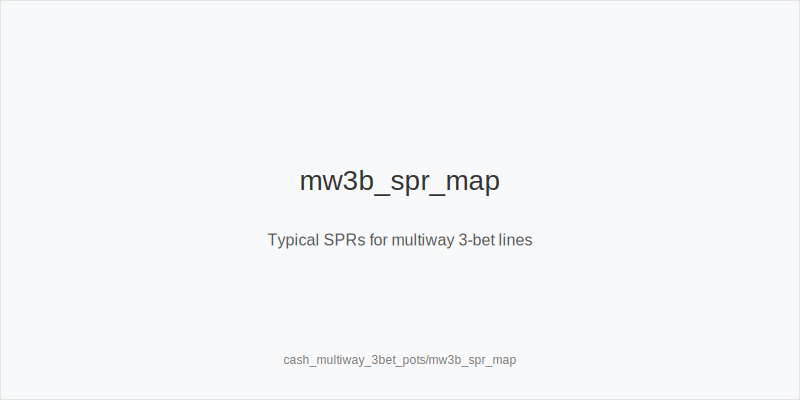
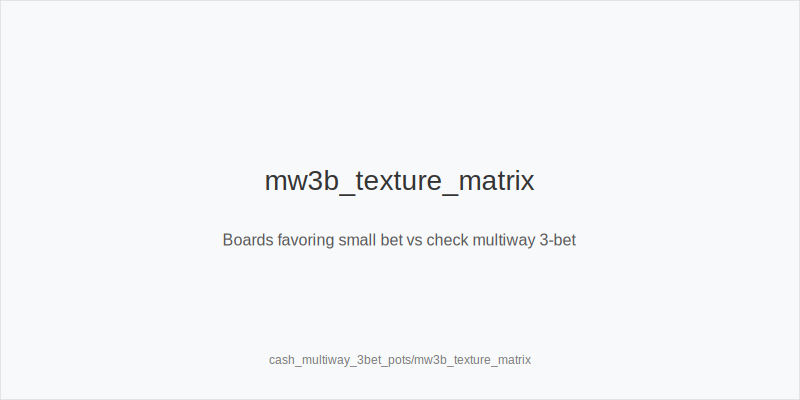
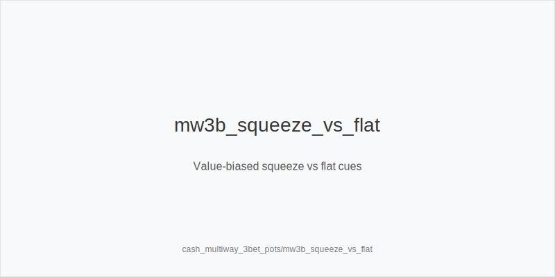

What it is
Multiway 3-bet pots occur when a raise is 3-bet and two players continue, such as
open + call, IP 3-bet, both call; or open, BB 3-bets OOP, both call. Ranges get
condensed toward broadway, suited, and paired hands. Typical sizes: 3bet_ip_9bb
versus 2.2-2.5bb opens and 3bet_oop_11bb from blinds. Cold calls of 3-bets are
rare but common enough at low and mid stakes to create multiway nodes.

[[IMAGE: mw3b_spr_map | Typical SPRs for multiway 3-bet lines]]

[[IMAGE: mw3b_texture_matrix | Boards favoring small bet vs check multiway 3-bet]]

[[IMAGE: mw3b_squeeze_vs_flat | Value-biased squeeze vs flat cues]]

Why it matters
SPR is low-ish against two ranges (often ~2.7-3.4 IP 3-bet; ~2.5-3.0 OOP 3-bet).
Bluff EV falls and reverse implied risk rises. Rake share shrinks as pots grow,
so value extraction and equity denial dominate results. One mis-sized bet can
snowball across two opponents and turn a good hand into a marginal stack-off.

Rules of thumb
- Preflop leverage. Prefer value-biased squeeze_iso_3bet; avoid_bloated_pot_oop
 with marginals. IP flats must realize well (suited, connected, high card).
 Why: poor realization compounds versus two players at low SPR.
- Flop sizing map. size_down_dry with small_cbet_33 on Axx/Kxx dry; use
 half_pot_50 when ranges are closer; reserve big_bet_75 for strong equity on
 highly volatile textures like T98/QJT two tone. Why: smaller bets deny cheaply
 while large bets tax live equity only when you can withstand action.
- Position plans. IP can delay_cbet_ip and probe_turns after checks; OOP should
 protect_check_range and defend_vs_small_cbet tighter. Why: position realizes
 equity; OOP gets punished by raises and multiway floats.
- Raise respect. fold_vs_raise_multiway more; continue with top pair plus good
 kicker, overpairs, or strong combo draws; occasionally raise_for_protection on
 very volatile boards. Why: multiway raises skew value-heavy.
- Turn and river. deny_equity_turn on scare or improving cards; polarize_river
 when ranges cap and draws miss. Why: timely pressure closes equity windows and
 extracts value while avoiding thin, dominated calls.

Mini example
UTG opens 2.5bb, MP folds, CO calls, BTN folds, SB folds, BB 3-bets to 11bb.
UTG calls, CO calls. Pot ~33.5bb; stacks ~89bb; SPR ~2.7. Flop A72r: BB makes
small_cbet_33 for ~11bb; UTG folds, CO calls. Turn 5x adds wheel gutters: BB
half_pot_50 (~28bb) to deny_equity_turn versus 86/A5. CO folds. BB controls
geometry by starting small on dry flop, then pressuring as turn adds equity.

Common mistakes
- Over-bluffing like heads up. Why it is a mistake: fold equity is lower across
 two ranges; Why it happens: copying single-opponent c-bet habits into multiway.
- Disrespecting raises. Why it is a mistake: raises are value-weighted; Why it
 happens: anchoring to heads-up defense thresholds with marginal pairs or
 gutters instead of fold_vs_raise_multiway.
- Bad preflop flats OOP. Why it is a mistake: awkward SPRs and poor realization;
 Why it happens: overrating suitedness and ignoring avoid_bloated_pot_oop.

Mini-glossary
small_cbet_33: About one-third-pot c-bet for cheap denial and range protection.
half_pot_50 / big_bet_75: Medium/large bets for closer ranges or high-volatility
denial on dynamic boards.
squeeze_iso_3bet: Value-biased 3-bet over open + caller(s) with blockers and
playability.
protect_check_range: Structured checks OOP that keep mediums and avoid face-up
weakness.

Contrast
Heads-up 3-bet pots allow more bluffing and bigger footprints; single-raised
multiway pots keep SPR higher and use even smaller sizings. Multiway 3-bet pots
sit between: low-ish SPR, fewer bluffs, stricter raise respect, sharper position
edge, and tighter value thresholds.

_This module uses the fixed families and sizes: size_down_dry, size_up_wet; small_cbet_33, half_pot_50, big_bet_75._

See also
- cash_blind_defense_vs_btn_co (score 23) -> ../../cash_blind_defense_vs_btn_co/v1/theory.md
- cash_population_exploits (score 23) -> ../../cash_population_exploits/v1/theory.md
- donk_bets_and_leads (score 23) -> ../../donk_bets_and_leads/v1/theory.md
- hand_review_and_annotation_standards (score 23) -> ../../hand_review_and_annotation_standards/v1/theory.md
- live_chip_handling_and_bet_declares (score 23) -> ../../live_chip_handling_and_bet_declares/v1/theory.md