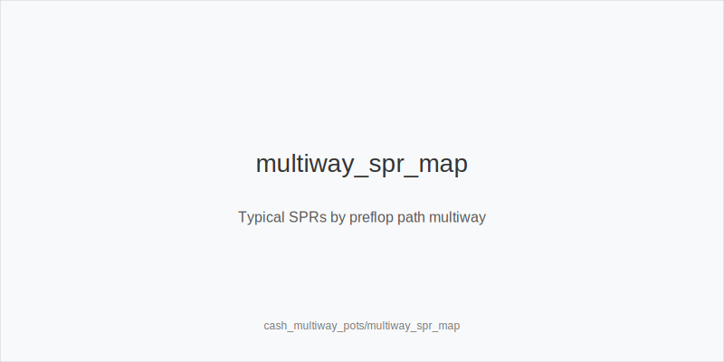
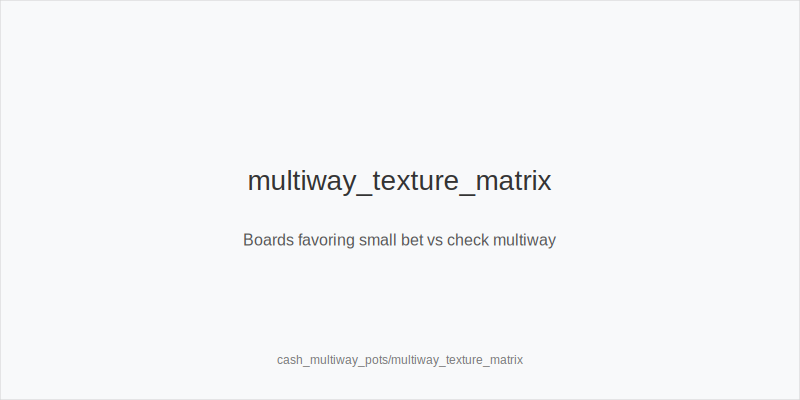
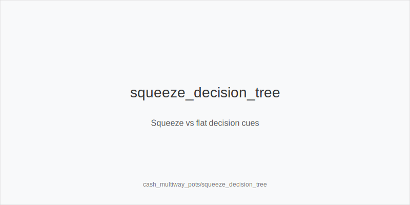

What it is
Multiway pots involve three or more players seeing the flop. Equity is shared, so raw hand strength drops and bluff frequency falls. Position gains value because realize_equity_ip is easier, while OOP must protect_check_range more. Typical sizings shrink: small_cbet_33 and half_pot_50 are common; big_bet_75 appears mainly with strong equity on volatile boards.

[[IMAGE: multiway_spr_map | Typical SPRs by preflop path multiway]]

[[IMAGE: multiway_texture_matrix | Boards favoring small bet vs check multiway]]

[[IMAGE: squeeze_decision_tree | Squeeze vs flat decision cues]]

Why it matters
Once pots grow, rake share becomes smaller relative to the pot, so decisions swing more EV. Errors compound because extra opponents reduce your fold equity and increase the chance someone connects. Disciplined checking OOP, tighter calls versus raises, and value-focused sizing IP protect your stack and capture mistakes from others.

Rules of thumb
- size_down_dry: On Axx/Kxx dry where you keep range and nut advantage, prefer small_cbet_33 to tax broadways and deny cheaply; check_back_marginal with weak kickers.
- size_up_wet only with strong equity: On T98/QJT two-tone, bet half_pot_50 or big_bet_75 only with overpairs, strong top pairs, or combo draws; otherwise check to protect_check_range.
- squeeze_iso_3bet value bias: Squeeze more value-heavy with blockers/playability (AQs, AKo, TT+) versus open+call. Avoid light squeezes OOP; avoid_bloated_pot_oop with marginals.
- fold_vs_raise_multiway: Treat raises as strong. Continue with top pairs plus kickers, overpairs, strong draws, or raise_for_protection on very volatile textures; fold marginal pairs and gutters.
- Turn priorities: deny_equity_turn on scare/improving cards that add overcards or complete draws; delay_cbet_ip and delay_cbet_oop when flop is marginal and turn favors you.
- River: polarize_river when ranges cap and draws miss; take value_thin_ip after checks with clear kicker advantage and blockers. Give up more OOP without clarity.

Mini example
UTG opens 2.5bb, CO calls, BTN calls. Pot ~9bb; effective stacks ~97.5bb; SPR ~10.8 versus each caller. 
Flop K72r. UTG small_cbet_33 for 3bb to tax QJ/AT; CO folds, BTN calls. Pot ~15bb. 
Turn 5x adds straight draws; UTG uses half_pot_50 for 7.5bb to deny_equity_turn versus 86/A5 and fold weak Kx without kickers; BTN folds. 
Plan: small on dry flop to keep range ahead, then apply pressure when the turn brings new equity.

Common mistakes
- Copying SRP heads-up habits: auto-cbetting and bluffing too much multiway where fold equity drops.
- Calling too wide OOP: poor realization; avoid_bloated_pot_oop by folding offsuit junk and weak suited hands without connectivity.
- Disrespecting raises: not fold_vs_raise_multiway with marginal pairs; multiway raises are value-weighted.
- Over-squeezing with junk: ignoring position/playability and creating bad SPRs OOP.

Mini-glossary
small_cbet_33: About one-third-pot continuation bet for cheap denial and range protection. 
half_pot_50 / big_bet_75: Medium and large bets to extract value or deny equity on dynamic boards. 
squeeze_iso_3bet: Re-raise over open + caller(s), biased to value with blockers and playability. 
raise_for_protection: Raise with strong but vulnerable hands to charge many live draws. 
deny_equity_turn: Turn bet on scare/improving cards to fold out overcards and weak draws. 
delay_cbet_ip / delay_cbet_oop: Skip flop, bet later when the turn improves your range or blockers. 
protect_check_range: Strategic checks that keep medium hands in your range and avoid face-up betting. 
polarize_river: Large river sizing with very strong hands and bluffs vs capped ranges. 
value_thin_ip: Thin value bet in position after checks and capped ranges.

Contrast
Compared to single-raised or 3-bet heads-up pots, multiway uses fewer bluffs, smaller default sizings, more checking OOP, stricter raise respect, and a bigger position edge due to realization and equity sharing.

See also
- cash_blind_defense_vs_btn_co (score 21) -> ../../cash_blind_defense_vs_btn_co/v1/theory.md
- cash_multiway_3bet_pots (score 21) -> ../../cash_multiway_3bet_pots/v1/theory.md
- cash_population_exploits (score 21) -> ../../cash_population_exploits/v1/theory.md
- donk_bets_and_leads (score 21) -> ../../donk_bets_and_leads/v1/theory.md
- hand_review_and_annotation_standards (score 21) -> ../../hand_review_and_annotation_standards/v1/theory.md