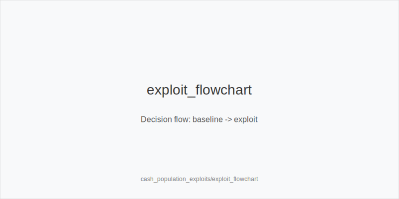

What it is
Population exploits are small, consistent deviations from baseline strategy that print against common pool tendencies. Keep solver-aligned structures, then bias frequencies or sizes where data or experience shows opponents err. Adjust preflop aggression versus stealers, choose smaller or larger flop sizes by texture, and pressure turns and rivers where pools overfold.

[[IMAGE: population_leaks_map | Common leaks by node]]

[[IMAGE: exploit_sizing_families | Size families and triggers]]

[[IMAGE: exploit_flowchart | Decision flow: baseline -> exploit]]

Why it matters
Most opponents are not balanced. They under-defend blinds, under-4bet, over-cbet dry boards, and give up turns. Each bias shifts EV if your geometry and sizes match the leak. Exploits compound: keep inferior ranges in with size_down_dry, then attack capped ranges later with double_barrel_good or triple_barrel_scare. Short-handed frequency and rake pressure amplify these edges.

Rules of thumb
- Preflop: widen 3bet_ip_9bb versus BTN steals and 3bet_oop_12bb versus SB steals; versus tight 3-bettors, keep 4bet_ip_21bb value-heavy and avoid bluff 4-bets OOP (prefer fold). Why: pools under-4bet, so blocker/value pressure prints while OOP bluff 4-bets realize poorly.
- Flop sizes: small_cbet_33 on dry Axx or paired lows; size_down_dry to retain dominated pairs and ace-highs; use big_bet_75 only when size_up_wet applies and you have real equity. Why: small bets tax air cheaply and keep mistakes in; big bets belong on volatile boards with equity.
- Turn play: when pools overfold OOP turns, fire half_pot_50 with overfold_exploit; if flop checked through and turn helps you, probe_turns; after IP flop checks, use delay_turn when the card favors you. Why: the turn is where many opponents give up, so targeted pressure captures folds.
- Rivers: triple_barrel_scare on credible scare rivers (ace, top-card, front-door complete) when your line carries the story; otherwise shut down. Why: polarization works only when your narrative and blockers support it.
- OOP structure and geometry: protect_check_range on middling textures where opponents stab too wide; size small early to keep errors in, then increase pressure when ranges cap. Why: OOP realization is weak, so keep pots manageable until you can apply leverage.

Mini example
BTN vs CO. CO opens 2.3bb, BTN 3bet_ip_9bb to 9bb exploiting under-4bet. CO calls. Pot ~19.5bb; stacks ~91bb; SPR ~4.7. Flop A72r. Pool overfolds to small bets here. BTN small_cbet_33 ~6.5bb; CO calls. Pot ~32.5bb; stacks ~84.5bb. Turn 5x, a range card for BTN. Many opponents overfold OOP turns. BTN half_pot_50 ~16bb, tagging overfold_exploit; CO folds often. On a wet T98ss flop instead, BTN avoids autopilot; without equity, choose size_down_dry or check. With strong equity, size_up_wet using big_bet_75, then continue on range-shifting turns (double_barrel_good).

Common mistakes
- Forcing big_bet_75 on wet boards without equity, hoping they fold anyway. Why it is a mistake: you burn chips into sticky ranges. Why it happens: overestimating fold equity in dynamic nodes.
- Bluff 4-betting OOP versus tight 3-bettors instead of keeping 4bet_ip_21bb value and folding junk. Why it is a mistake: low SPR and poor realization crush bluffs. Why it happens: sunk-cost bias after light 3-bet defense.
- Ignoring turn overfold nodes. Why it is a mistake: you miss the highest-ROI pressure point. Why it happens: autopilot checks instead of half_pot_50 when the card favors you.
- Stabbing turns IP when the card helps villain. Why it is a mistake: you bet into strength. Why it happens: skipping delay_turn discipline.
- Defending ego, not ranges. Why it is a mistake: failing to protect_check_range OOP gets you blown off equity. Why it happens: fear of appearing passive.

Mini-glossary
3bet_ip_9bb / 3bet_oop_12bb: aggression baselines versus steals by position.
4bet_ip_21bb / 4bet_oop_24bb: value-heavy 4-bet families to keep leverage.
small_cbet_33 / half_pot_50 / big_bet_75: size families tied to texture.
size_up_wet / size_down_dry: directional sizing on dynamic vs static boards.
probe_turns / delay_turn: take the betting probe_turns on favorable turns.
protect_check_range: structured checks OOP to keep medium hands safe.
double_barrel_good / triple_barrel_scare: turn/river aggression triggers.
overfold_exploit: intentional pressure where pools fold too often.

Contrast
Baselines aim for balance; population exploits bias frequency and sizing where opponents leak while keeping solver-aligned structures.

See also
- cash_short_handed (score 29) -> ../../cash_short_handed/v1/theory.md
- database_leakfinder_playbook (score 29) -> ../../database_leakfinder_playbook/v1/theory.md
- donk_bets_and_leads (score 29) -> ../../donk_bets_and_leads/v1/theory.md
- hand_review_and_annotation_standards (score 29) -> ../../hand_review_and_annotation_standards/v1/theory.md
- icm_final_table_hu (score 29) -> ../../icm_final_table_hu/v1/theory.md