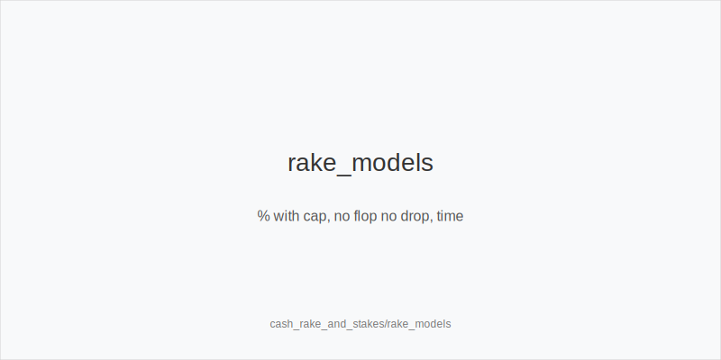
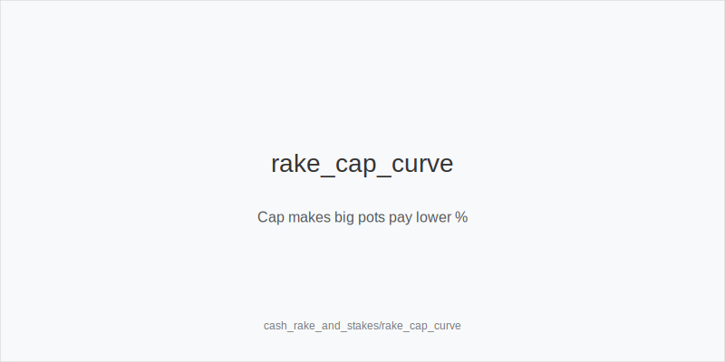
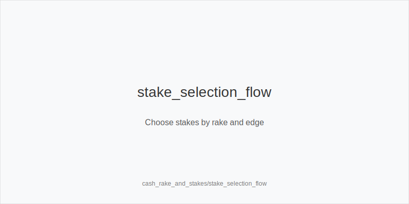

What it is
This module explains cash-game rake models and how they affect stake selection and winrate math. You will learn percentage-with-cap rake, no flop no drop policies, time charge, and how rakeback changes your net results. The goal is to choose games and lines that win after fees.

[[IMAGE: rake_models | % with cap, no flop no drop, time]]

[[IMAGE: rake_cap_curve | Cap makes big pots pay lower %]]

[[IMAGE: stake_selection_flow | Choose stakes by rake and edge]]

Why it matters
At small stakes, rake can be your biggest opponent. The structure of rake changes which hands are profitable, which tables are worth playing, and which stake your bankroll should target first. Understanding rake lets you pick games where your strategy converts edge into real profit. Smart selection compacts variance and raises true hourly.

Rules of thumb
- Know the model. Percentage-with-cap takes a % of the pot until a cap; no flop no drop means folded preflop pots pay zero; time charge is a fixed fee per time block. Why: each model changes optimal aggression and pot-size goals.
- Avoid many small pots in high rake. Small pots pay a high % of rake; tighten early and prefer hands that make strong top pairs or better. Why: fewer raked flops and stronger showdowns raise net EV.
- Build capped pots with edge. When a pot hits the cap, extra chips are rake-free; value bet more confidently and press positional edges once the cap is reached. Why: your marginal value improves after the cap.
- Raise more when no flop no drop applies. Preflop steals that work end the hand with zero rake; isolate limpers and pressure blinds. Why: aggression that ends preflop avoids fees entirely.
- Choose stakes by net winrate. If a higher stake has a better cap-to-blind ratio and similar opponents, moving up can increase net winrate even with the same raw skill. Why: better fee geometry can beat nominally smaller games.

Quick math
Net winrate (bb/100) gross_winrate - rake_paid_per_100 + rakeback_per_100.
Cap effect: once pot cap_threshold, each extra chip is 0% rake value sizings gain.

Mini example
UTG opens to 2.2 bb, MP folds, CO calls, BTN folds, SB folds, BB calls.
Flop K72 rainbow: BB checks, UTG bets small, CO folds, BB calls.
Turn 5 offsuit: BB checks, UTG bets again, BB folds.
In a % with cap game the pot never hit the cap, so rake stayed a noticeable %. UTG avoided bloating marginal spots and chose value-heavy lines; on loose tables that reach the cap often, UTG could value bet thicker once the cap is reached.

Common mistakes
- Ignoring rake when picking stakes. Why it is a mistake: a bad cap can erase thin edges; Why it happens: players compare only buy-in sizes, not fee structure or cap-to-blind ratio.
- Limping along in high rake rooms. Why it is a mistake: many small flops pay heavy fees; Why it happens: habit from soft home games without considering fee impact on small pots.
- Misusing time charge. Why it is a mistake: paying time in tight games with few hands/hour bloats cost per hand; Why it happens: choosing convenience over table quality and volume.

Mini-glossary
Rake cap: Maximum fee taken from a pot in percentage-with-cap systems; chips above the cap are rake-free.
No flop no drop: If no flop is dealt the house takes no rake, so preflop folds pay zero.
Time charge: Fixed fee per time block, common live; cost per hand falls as volume rises.
Net winrate: Your winrate after subtracting rake and adding any rakeback or rewards.

Contrast
Unlike core_bankroll_management, which sets bankroll cushions and stop-loss rules, this module helps you select stakes and tables where rake structure allows your edge to become real profit.

_This module uses the fixed families and sizes: size_down_dry, size_up_wet; small_cbet_33, half_pot_50, big_bet_75._

See also
- cash_blind_defense (score 5) → ../../cash_blind_defense/v1/theory.md
- cash_blind_defense_vs_btn_co (score 5) → ../../cash_blind_defense_vs_btn_co/v1/theory.md
- cash_blind_vs_blind (score 5) → ../../cash_blind_vs_blind/v1/theory.md
- cash_isolation_raises (score 5) → ../../cash_isolation_raises/v1/theory.md
- cash_limp_pots_systems (score 5) → ../../cash_limp_pots_systems/v1/theory.md