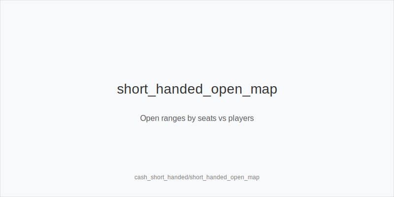
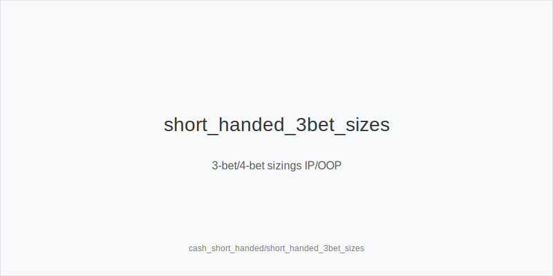
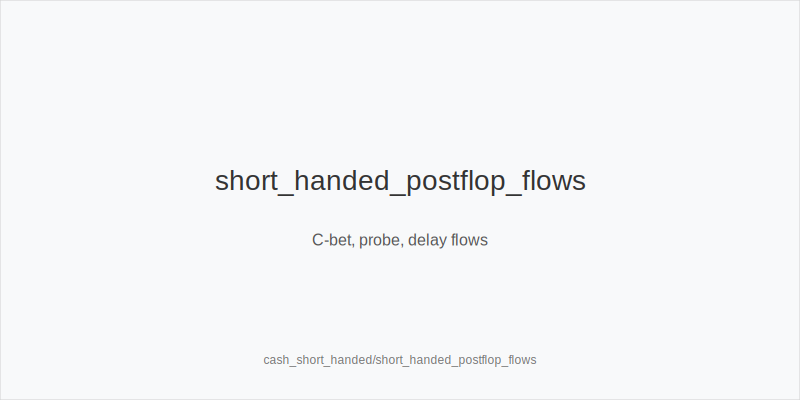

What it is
Short-handed means playing 4-5 handed most of the session and sometimes 3-handed on 6-max tables. With fewer players, ranges widen, position changes value faster, and the blinds come around more often. You open first-in more, defend blinds more, and face more heads-up pots while keeping the same size families but higher action frequencies.

[[IMAGE: short_handed_open_map | Open ranges by seats vs players]]

[[IMAGE: short_handed_3bet_sizes | 3-bet/4-bet sizings IP/OOP]]

[[IMAGE: short_handed_postflop_flows | C-bet, probe, delay flows]]

Why it matters
More steals and defenses create many marginal nodes. Rake per hand is similar, but you pay blinds more often. 3-bets lower SPR so decisions simplify and blockers matter more. Population leaks amplify: under-defended blinds, over-cbet on low boards, and overfolds to OOP turn barrels. Disciplined, size-led plans convert these into EV.

Rules of thumb
- First-in opens: widen when 4-5 handed, but tighten if a hyper-aggressive reg sits on your left. Prefer BTN and SB steals; trim weakest offsuit opens in CO under pressure. Why: position flips value faster and bad seats punish loose opens.
- 3-bet families: use 3bet_ip_9bb in position and 3bet_oop_12bb out of position; add value and blocker bluffs versus BTN and SB steals, stay value-lean versus earlier seats in 5-handed. Why: leverage and realization gap grow as ranges widen.
- 4-bet families: 4bet_ip_21bb and 4bet_oop_24bb keep leverage and tidy SPR; deploy more versus frequent 3-bettors and bluff less versus tight ranges. Why: clean geometry sets stack-off bands and preserves fold equity.
- Flop sizes: small_cbet_33 on dry Axx/Kxx; half_pot_50 on middling boards; big_bet_75 only when size_up_wet is justified by strong equity or clear nut advantage. Why: texture drives denial efficiency and value thickness.
- Lines and geometry: after a 3-bet, SPR ~3-5; favor initiative and position. Default small_cbet_33 IP and half_pot_50 OOP unless size_up_wet; protect_check_range OOP on middling textures; use delay_turn and probe_turns when the turn favors you. Why: timing plus position realizes equity and avoids bloated guessing OOP.
- SB strategy: raise-first-in is preferred short-handed; complete only with clear multiway incentives. Tighten completes if BTN is sticky or 3-bets often. Why: fewer players reduce multiway value and reward initiative.

Mini example
UTG folds, MP folds, CO opens 2.3bb, BTN 3-bets to 9bb (3bet_ip_9bb); SB folds, BB folds.
Flop K72r: BTN small_cbet_33 ~6.5bb targeting broadways and small pairs; CO calls.
Turn 5x: BTN half_pot_50 to deny equity versus 7x/pp/gutters and to set river geometry.
If the flop were T98ss, BTN would size_up_wet with big_bet_75 only with strong equity; otherwise protect_check_range.

Common mistakes
- Copying full-ring opens 4-5 handed. Why it is a mistake: leaves EV on the table or opens into bad seats. Why it happens: habit and fear of 3-bets.
- Auto small_cbet_33 on dynamic boards then calling raises without a plan. Why it is a mistake: grants cheap realization then pays off polar lines. Why it happens: overgeneralizing dry-board success.
- Barreling river without triple_barrel_scare conditions. Why it is a mistake: burns chips into sticky bluff-catchers. Why it happens: commitment bias after turn barrel.

Mini-glossary
3bet_ip_9bb / 3bet_oop_12bb: short-handed 3-bet size families by position to keep leverage and SPR in line.
4bet_ip_21bb / 4bet_oop_24bb: standard 4-bet ladders that set low SPR and preserve fold equity.
small_cbet_33 / half_pot_50 / big_bet_75: core sizing families mapped to dry, middling, and dynamic textures.
protect_check_range / delay_turn / probe_turns / double_barrel_good / triple_barrel_scare: tools to realize equity and apply pressure at the right moments.

Contrast
Full-ring instincts fail here; short-handed rewards wider first-in, disciplined 3-bet/4-bet ladders, and texture-driven small_cbet_33 with timely delay_turn and probe_turns.

_This module uses the fixed families and sizes: size_down_dry, size_up_wet; small_cbet_33, half_pot_50, big_bet_75._

See also
- hand_review_and_annotation_standards (score 31) → ../../hand_review_and_annotation_standards/v1/theory.md
- icm_final_table_hu (score 31) → ../../icm_final_table_hu/v1/theory.md
- icm_mid_ladder_decisions (score 31) → ../../icm_mid_ladder_decisions/v1/theory.md
- live_chip_handling_and_bet_declares (score 31) → ../../live_chip_handling_and_bet_declares/v1/theory.md
- live_etiquette_and_procedures (score 31) → ../../live_etiquette_and_procedures/v1/theory.md