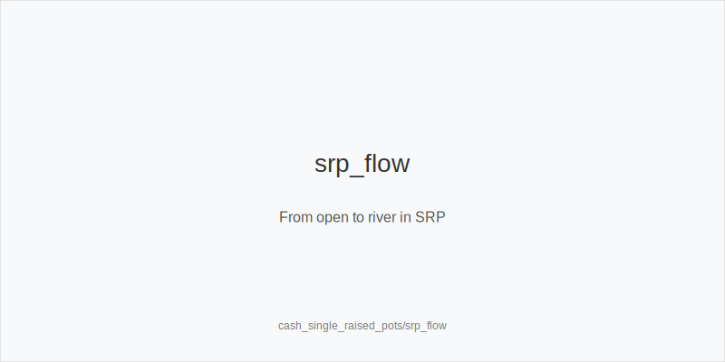
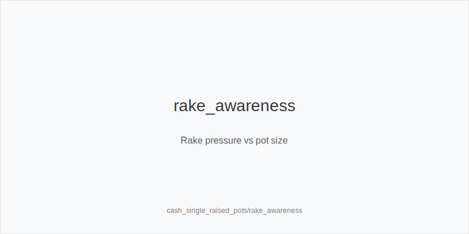
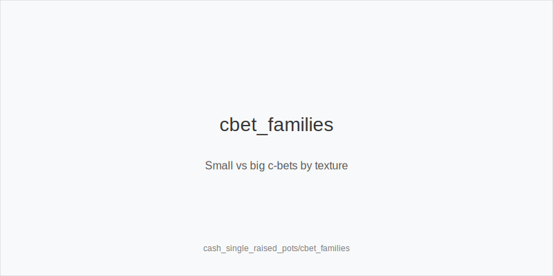

What it is
This module covers single-raised pots (SRP) in cash games: preflop plans by position, c-bet size families, and rake-aware lines. You will learn which hands open or defend, when to c-bet small vs big, and how rake shifts value between thin stabs and checks. The goal is a repeatable plan that converts small, frequent spots into steady EV.

[[IMAGE: srp_flow | From open to river in SRP]]

[[IMAGE: rake_awareness | Rake pressure vs pot size]]

[[IMAGE: cbet_families | Small vs big c-bets by texture]]

Why it matters
SRPs are the most common pots and rake hits them hardest. A solid plan in SRP improves winrate because small edges repeat often. Knowing how position, texture, and rake interact stops automatic bets, loose calls, and bloated marginal pots.

Rules of thumb
- Open tighter early, wider late. UTG/MP emphasize high-card strength; CO/BTN add suited connectors and suited gappers. Why: later position improves realization and fold equity versus blinds.
- C-bet small on dry boards, big on wet boards. Why: dry boards favor the raiser's range so a small size folds air cheaply; wet boards carry more draws and need larger bets to deny equity and extract value.
- Check back more in position with medium hands. Why: you control the turn, protect checking ranges, and avoid inflating pots that shrink versus check-raises or bad turns.
- Probe after missed cbets from capped ranges. Why: when the raiser checks back, their range is capped; probe_turns good turn cards denies equity and seizes initiative.
- Respect rake at micros. Why: many small pots pay high effective rake, so prefer value-leaning lines and avoid marginal peel-offs out of position.

Quick math
Rake pressure is highest before the cap. Value of thin stabs falls when effective rake is large; value of thick bets rises once pots approach the cap.

Mini example
UTG opens to 2.2 bb, MP folds, CO calls, BTN folds, SB folds, BB calls.
Flop K72 rainbow: BB checks, UTG c-bets small; CO folds, BB calls.
Turn 5 offsuit: BB checks, UTG bets small again to deny overcards; BB folds.
In a percent-with-cap game the pot never hit the cap, so rake stayed a noticeable percent. UTG chose a low-cost, value-leaning plan; in looser pools that reach the cap often, UTG can value-bet thicker.

Common mistakes
- Auto-cbet on any flop. Why it is a mistake: monotone, paired, or low connected boards may favor the caller; Why it happens: success on dry boards gets overgeneralized.
- Calling too wide out of position. Why it is a mistake: poor equity realization plus rake tax crush thin defends; Why it happens: overvaluing suitedness and underestimating position.
- Ignoring turn cards. Why it is a mistake: equity shifts determine second barrels or checks; Why it happens: deciding on the flop and failing to re-evaluate on the turn.

Mini-glossary
Single-raised pot (SRP): a pot with one preflop raise and no 3-bet.
Range advantage: when one side connects better with a board, often the PFR on high-card dry boards.
Probe bet: a probe_turns from the caller on a later street after the aggressor checked the prior street.
Realization: how much equity a hand converts given position and play.

Contrast
Unlike cash_rake_and_stakes, which selects games by fee structure, this module applies rake-aware tactics inside SRPs to turn small, frequent edges into steady profit.

_This module uses the fixed families and sizes: size_down_dry, size_up_wet; small_cbet_33, half_pot_50, big_bet_75._

See also
- cash_3bet_oop_playbook (score 17) → ../../cash_3bet_oop_playbook/v1/theory.md
- cash_blind_defense_vs_btn_co (score 17) → ../../cash_blind_defense_vs_btn_co/v1/theory.md
- cash_population_exploits (score 17) → ../../cash_population_exploits/v1/theory.md
- cash_turn_river_barreling (score 17) → ../../cash_turn_river_barreling/v1/theory.md
- donk_bets_and_leads (score 17) → ../../donk_bets_and_leads/v1/theory.md