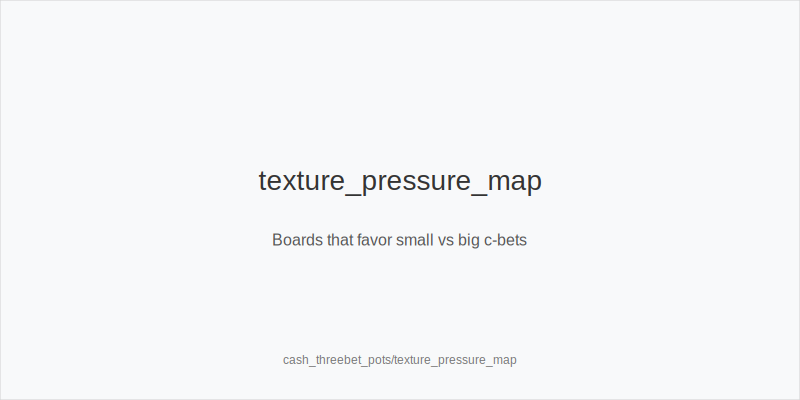

What it is
This module explains strategy for 3-bet pots in 6-max NLHE cash. You will build preflop ranges in and out of position, choose standard 3-bet sizes (IP ~9bb, OOP ~11bb vs 2.2-2.5bb opens, typical online), set 4-bet baselines (~22bb), and pick postflop c-bet sizes (33/50/75/125). Decisions are tied to range advantage, equity denial, pot geometry, and SPR.

[[IMAGE: threebet_sizing_ladders | 3-bet and 4-bet size ladder]]

[[IMAGE: spr_after_threebet | Typical SPR after 3-bet lines]]

[[IMAGE: texture_pressure_map | Boards that favor small vs big c-bets]]

Why it matters
3-bet pots start larger with lower SPR, so mistakes cost more. Rake is proportionally smaller once the pot grows, making value extraction and clean folds more impactful. Sound size baselines and texture-driven plans prevent overcommitting with marginal hands or missing folds when capped.

Rules of thumb
- Preflop sizes: 3bet_ip_9bb vs 2.2-2.5bb opens; 3bet_oop_11bb from blinds. Versus steals, widen value/bluff mixes on BTN; from SB vs BTN, stay tighter but keep 11bb for leverage.
- 4-bets small: 4bet_small_22bb is a solid default. It keeps dominated hands in with value and preserves fold equity with bluffs while not overbloating SPR.
- SPR planning: after call-call, SPR is often 3.5-4.5; after 4-bet call, SPR compresses to 1.5-2.5. With SPR <= 1.5 by the turn, shove_spr_lt_1_5 with strong value and best bluffs.
- Texture sizing: size_down_dry with small_cbet_33 on Axx/Kxx dry; size_up_wet with big_bet_75 on T98/QJT two-tone. Use half_pot_50 on middling boards where ranges are closer.
- Position leverage: IP can check_back_marginal more and delay_cbet_ip; OOP should simplify with tighter value and more checks on dicey textures.

Mini example
BTN opens 2.5bb (typical online). SB 3-bets to 11bb. BB folds. BTN calls. Pot ~23bb, stacks ~89bb, SPR ~3.9. Flop K72r. SB small_cbet_33 for 7.5bb to pressure broadways and deny equity. BTN calls. Turn A. This is a scare card for BTN's Kx; SB size_up_wet to big_bet_75 (about 27bb) as range advantage shifts further. Many Kx fold; Ax continues. On brick rivers with SPR near 1, SB can polarize again or check depending on blockers.

Common mistakes
- Using SRP sizes in 3-bet pots. Too-small flop bets fail to pressure condensed ranges on wet boards; too-large on dry boards fold out everything worse.
- Calling 4-bets OOP too wide. fold_vs_4bet_oop more; you will hate flops and realize poorly at low SPR.
- Auto-c-betting everything. Give_up_low_equity on bad boards for your range; defend_vs_small_cbet and stab_turn_scare selectively when the scare card favors you.
- Ignoring stack depth. Deeper than 120bb, increase 3-bet value density and avoid low-equity 4-bet bluffs; shallow stacks favor linear 3-bets and clear jam trees.

Mini-glossary
3-bet: A re-raise preflop. In this module, IP ~9bb, OOP ~11bb versus 2.2-2.5bb opens. 
4-bet: Re-raise of a 3-bet, baseline ~22bb; often induces shove/fold decisions pre or creates low SPR post. 
SPR: Stack-to-pot ratio; lower SPR simplifies commitment with strong hands and reduces maneuverability with marginal ones. 
Polar vs linear: Polar mixes strong value and bluffs; linear adds the next strongest hands for value against wide opens.

Contrast
Unlike single-raised pots, 3-bet pots have lower SPR and more condensed ranges, so sizes must pressure correctly by texture. Unlike postflop jam modules, here jams are planned via SPR bands created by preflop size choices.

See also
- cash_population_exploits (score 23) -> ../../cash_population_exploits/v1/theory.md
- hand_review_and_annotation_standards (score 23) -> ../../hand_review_and_annotation_standards/v1/theory.md
- cash_short_handed (score 21) -> ../../cash_short_handed/v1/theory.md
- database_leakfinder_playbook (score 21) -> ../../database_leakfinder_playbook/v1/theory.md
- donk_bets_and_leads (score 21) -> ../../donk_bets_and_leads/v1/theory.md