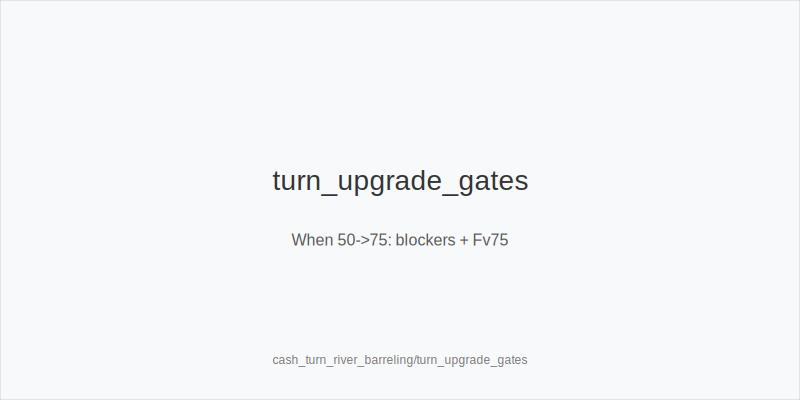
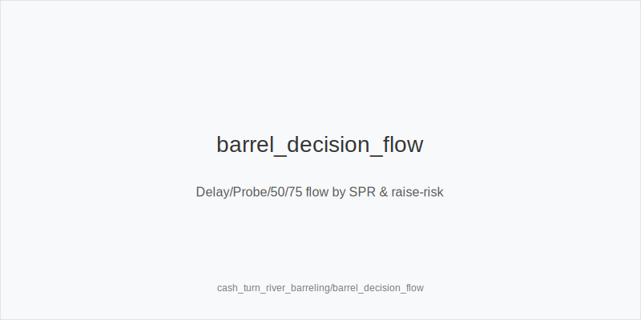
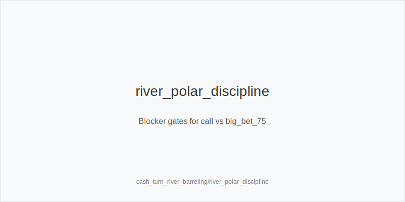

What it is
A turn and river barreling playbook for SRP and 3-bet pots, both IP and OOP. We keep families and sizes fixed: size_down_dry vs size_up_wet, then small_cbet_33, half_pot_50, or big_bet_75. Each decision maps to exactly one token: delay_turn, probe_turns, double_barrel_good, triple_barrel_scare, call, or fold. No off-tree sizes or mixes in notes.

Why it matters
3-bet pots have lower SPR, but position and raise risk still decide whether to press or pause. You leverage capped ranges and scare cards while avoiding spew with blocker gates and evidence like Fv50 and Fv75. A fixed 33/50/75 system keeps errors low and plans reproducible under pressure.

Rules of thumb
- Family first by texture. Dry flops/turns → size_down_dry; wet/dynamic → size_up_wet. Why: raising risk and equity flow differ by board.
- Default sizes by family. Dry → small_cbet_33; wet → half_pot_50. Upgrade to big_bet_75 only with strong blockers and Fv75 up. Why: large bets need removal of continues plus data.
- Versus raise-prone villains at mid SPR, prefer delay_turn and mix protect_check_range on stabby textures. Why: avoid getting blown off equity and keep options for good turns.
- Sequence rule. Flop chk-chk → probe_turns on favorable turns; never probe after bet/call. Why: initiative is earned by the check-through.
- River discipline. Facing polar big_bet_75 without blockers → fold; with scare + top blockers and a prebuilt plan → triple_barrel_scare or call. Why: don't pay dominated bluff-catches; exploit real overfolds.
- Commitment gate. If a turn big_bet_75 leaves a trivial river behind, ensure blockers/equity justify the commitment; otherwise keep half_pot_50 or delay_turn. Why: clean, planned stacks.

Mini example
Line 1 (OOP 3BP): SB 3-bets, BTN calls. Flop A83r → size_down_dry with small_cbet_33; turn 2♣ versus raise-prone IP → delay_turn; river IP fires big_bet_75 while you lack blockers → fold.
Line 2 (IP SRP as PFA): CO opens, BTN calls; you c-bet T98ss with half_pot_50 from size_up_wet. Turn Q♠ adds nut spade blocker and Fv75 up → upgrade to big_bet_75 → double_barrel_good. River K scare with plan → triple_barrel_scare.
Line 3 (SRP OOP as caller): UTG opens, BB calls. Flop K72r checks through. Sequence: chk-chk → probe_turns on safe turn; river facing polar 75 without blockers → fold.

Common mistakes
- Using big_bet_75 without blockers or Fv75 evidence. Error: overbluffs into sticky ranges; burns equity when called. Why players do it: momentum after "good" turns and misread population folds.
- Probing without the chk-chk sequence. Error: turns thin ranges into spew versus uncapped IP. Why players do it: urge to take initiative regardless of eligibility.
- Calling polar 75% rivers without blockers. Error: pays off value in under-bluffed nodes. Why players do it: curiosity and fear of being bluffed.

Mini-glossary
Fv50/Fv75: observed fold rates versus 50% and 75% bets; used to justify upgrades and calls.
Blocker gates: specific cards that remove opponent continues and unlock big_bet_75 or call lines.
Raise risk: likelihood of getting raised; pushes toward delay_turn or protect_check_range.
Commitment gate: check that a 75% turn barrel will not force a bad river; requires equity/blockers before committing.

Contrast
This module plugs into cash_3bet_ip/oop and SRP modules by standardizing turn/river actions while sizes stay 33/50/75 and families remain size_down_dry vs size_up_wet.

[[IMAGE: turn_upgrade_gates | When 50->75: blockers + Fv75]]

[[IMAGE: barrel_decision_flow | Delay/Probe/50/75 flow by SPR & raise-risk]]

[[IMAGE: river_polar_discipline | Blocker gates for call vs big_bet_75]]

See also
- cash_3bet_oop_playbook (score 27) → ../../cash_3bet_oop_playbook/v1/theory.md
- cash_blind_defense_vs_btn_co (score 27) → ../../cash_blind_defense_vs_btn_co/v1/theory.md
- donk_bets_and_leads (score 27) → ../../donk_bets_and_leads/v1/theory.md
- hu_postflop_play (score 27) → ../../hu_postflop_play/v1/theory.md
- live_chip_handling_and_bet_declares (score 27) → ../../live_chip_handling_and_bet_declares/v1/theory.md