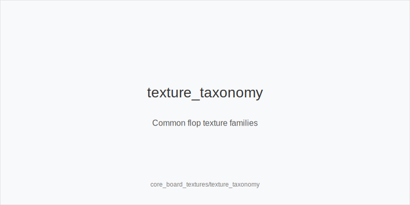
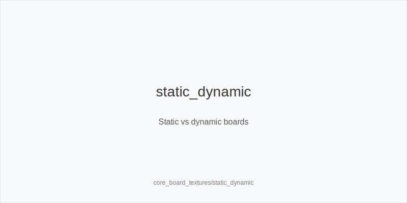
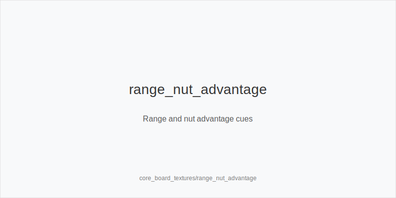

What it is
This module explains board textures: dry_board vs wet_board, paired_board vs unpaired, and suit patterns like monotone and two_tone. You will also learn static vs dynamic boards and how range_advantage and nut_advantage can shift between players.

[[IMAGE: texture_taxonomy | Common flop texture families]]

[[IMAGE: static_dynamic | Static vs dynamic boards]]

[[IMAGE: range_nut_advantage | Range and nut advantage cues]]

Why it matters
Texture predicts how often ranges connect and how fast hand strength can change. Reading the board correctly improves your c-bet frequencies, sizes, and reaction lines. Texture awareness reduces guesswork and stops you from overvaluing thin hands on dangerous runouts.

Rules of thumb
- Dry_board favors small, frequent cbets. On A72 rainbow or K62 rainbow, the preflop raiser often owns range_advantage, so cbet_small pressures ace-high dominance and folds out overcards.
- Wet_board favors bigger sizes or checks. On T98 two_tone or QJT two_tone, equity runs close and many draws exist; use cbet_big to tax draws or check more to protect your range.
- Paired_board compresses value. On 772r or 994r there are fewer very strong combos; small sizes target ace-high and underpairs and deny overcards efficiently.
- Monotone reduces value gaps. Without a high flush card, top pair shrinks; check_back more medium strength and choose bluffs only when you hold key blockers to the nut flush.
- Dynamic vs static. Dynamic boards change a lot on the turn (872 two_tone, T98 two_tone), so prefer larger bets and clearer plans. Static boards change little (A72 rainbow), so smaller bets work and you can value thinly.

Mini example
UTG opens, BTN calls, blinds fold. Flop K72 rainbow (dry_board). UTG has range_advantage and bets small; BTN calls with backdoors. Turn 5 two_tone keeps top pair ahead and adds few nutted hands; UTG can apply a second small bet or mix checks for balance. River bricks; BTN folds to a final small value bet. Action order remains correct and no out-of-turn play occurs.

Common mistakes
- Treating all high-card flops the same. Why it is a mistake: K72r is static while KQTr is dynamic. Why it happens: players look at the top card only, not the straight and flush structure.
- Auto-betting monotone boards. Why it is a mistake: medium hands get called by better and fold out worse. Why it happens: habit of auto-cbetting ace-high boards without considering suit texture.
- Overprotecting on paired_board. Why it is a mistake: big sizes isolate against better and fold out bluffs. Why it happens: fear of trips and ignoring combo math.

Mini-glossary
Dry_board: Few draws and slow equity shifts (example: A72 rainbow).
Wet_board: Many strong draws (example: T98 two_tone).
Range_advantage: One range holds more top pairs and overall equity on a board.
Nut_advantage: One range holds more nut or near-nut combos on a board.

Contrast
Unlike core_flop_fundamentals, which focuses on actions and sizes, this module classifies textures so you can pick the right frequency and sizing plan across streets.

_This module uses the fixed families and sizes: size_down_dry, size_up_wet; small_cbet_33, half_pot_50, big_bet_75._

See also
- cash_3bet_oop_playbook (score 16) → ../../cash_3bet_oop_playbook/v1/theory.md
- cash_blind_defense_vs_btn_co (score 16) → ../../cash_blind_defense_vs_btn_co/v1/theory.md
- cash_population_exploits (score 16) → ../../cash_population_exploits/v1/theory.md
- cash_turn_river_barreling (score 16) → ../../cash_turn_river_barreling/v1/theory.md
- donk_bets_and_leads (score 16) → ../../donk_bets_and_leads/v1/theory.md