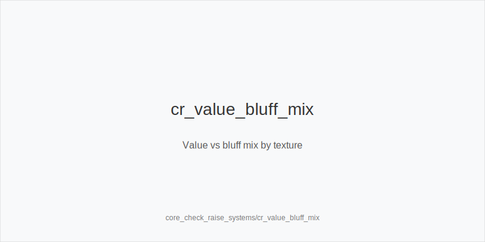
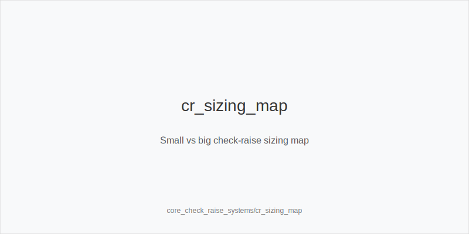
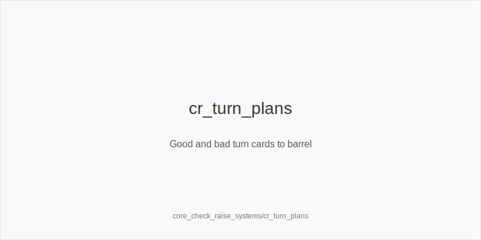

What it is
This module explains check-raise systems: when to check-raise for value or as a bluff, how to choose sizing on dry vs wet boards, and how to keep coherent frequencies. You will learn which combos to pick, how to plan turn barrels, and when to slow down to protect EV.

[[IMAGE: cr_value_bluff_mix | Value vs bluff mix by texture]]

[[IMAGE: cr_sizing_map | Small vs big check-raise sizing map]]

[[IMAGE: cr_turn_plans | Good and bad turn cards to barrel]]

Why it matters
A good check-raise denies equity, wins folds from high-card hands, and builds pots with strong value. It also protects your checking range so aggressive opponents cannot auto c-bet. Poorly timed check-raises donate chips, face expensive 3-bets, and create tough turns with capped ranges.

Rules of thumb
- Value on dynamic boards. Check-raise big with two pair+, sets, and robust draws when many turns change equities. Why: big size taxes equity and sets up clean turn jams.
- Bluff with backdoors and blockers. Prefer hands that can improve on many turns (backdoor flush or straight draws) and that block top pairs or strong draws. Why: more turn cards to continue and fewer calls.
- Size to texture. Use small check-raises on dry boards to fold out air and keep worse pairs in; go big on wet boards to charge equity. Why: the board dictates price pressure.
- Respect position and range. Versus early-position c-bets, use fewer bluff check-raises; versus late-position steals, add more. Why: EP ranges are stronger and under-bluffed.
- Plan the turn. Barrel good turn cards that improve you or hurt them; slow on bricks that favor the bettor's range. Why: a flop raise without a turn plan leaks EV.

Mini example
CO opens 2.3 bb (typical online), BTN calls, SB calls, BB folds. Flop K72 rainbow. SB checks. CO bets 33% pot, BTN folds, action returns to SB. SB check-raises small with K7s for value, keeping worse Kx in and denying overcards. Turn is 5 two_tone, adding draws. SB now uses a larger size to charge new equity and simplify rivers. River bricks; SB value bets again and gets called by KQ. Action order is legal and no out-of-turn play occurs.

Common mistakes
- Check-raising merged medium strength on wet boards. Why it is a mistake: you isolate against better and get shoved on. Why it happens: fear of bad turns triggers protection urges.
- Bluffing without turn plans. Why it is a mistake: you arrive on the turn with no good barrels and give up. Why it happens: focusing on the flop only.
- Using one size everywhere. Why it is a mistake: small on wet boards gives great prices; huge on dry boards burns value. Why it happens: habit and speed over structure.

Mini-glossary
Check-raise: Checking then raising the bettor on the same street.
Polarized: Range of strong value and bluffs that fits larger sizes.
Merged: Range of many medium-strength value hands that fits smaller sizes.
Blocker: A card that reduces opponent strong holdings or calling combos.

Contrast
Unlike core_bet_sizing_fe, which is about sizing families in general, this module applies those sizes to the specific mechanic of check-raising and its value-bluff mix.

_This module uses the fixed families and sizes: size_down_dry, size_up_wet; small_cbet_33, half_pot_50, big_bet_75._

See also
- cash_3bet_oop_playbook (score 9) → ../../cash_3bet_oop_playbook/v1/theory.md
- cash_blind_defense (score 9) → ../../cash_blind_defense/v1/theory.md
- cash_blind_defense_vs_btn_co (score 9) → ../../cash_blind_defense_vs_btn_co/v1/theory.md
- cash_blind_vs_blind (score 9) → ../../cash_blind_vs_blind/v1/theory.md
- cash_fourbet_pots (score 9) → ../../cash_fourbet_pots/v1/theory.md