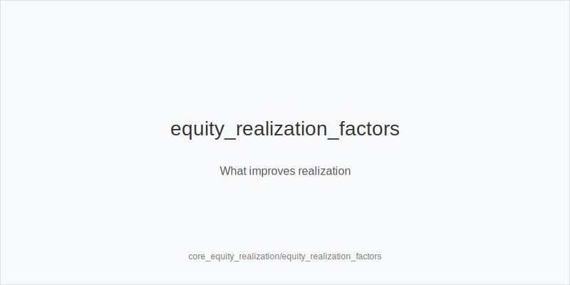
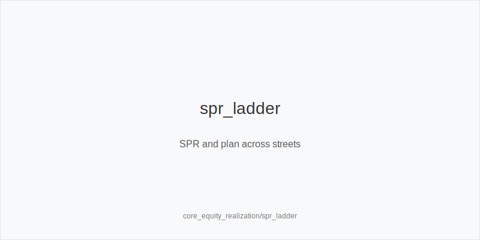
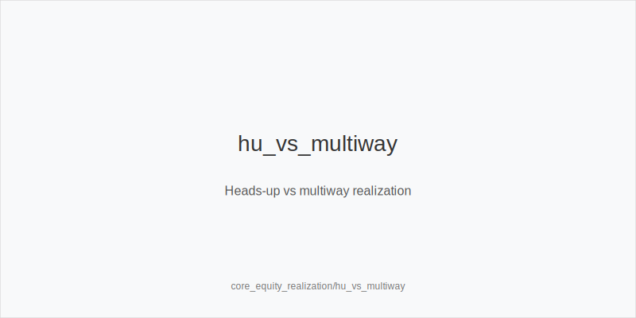

What it is
Equity realization is how much of your raw equity actually turns into chips by the river. It is driven by position and initiative, SPR (stack-to-pot ratio), board texture, bet sizing, and whether the pot is heads-up or multiway.

[[IMAGE: equity_realization_factors | What improves realization]]

[[IMAGE: spr_ladder | SPR and plan across streets]]

[[IMAGE: hu_vs_multiway | Heads-up vs multiway realization]]

Why it matters
Two hands with equal raw equity can win very different amounts. In position you see more information and control pot size, so you realize more. With poor position or awkward SPR, you fold too often before getting to your outs or value, and your realized equity drops.

Rules of thumb
- Position and initiative boost realization. When you act last and have the betting probe_turns, you can bet, check, or take a free card, so you miss fewer wins.
- Lower SPR simplifies value. With small SPR, top pair and overpairs commit cleanly; with high SPR, medium hands face more pressure and fold more, reducing realization.
- Texture and sizing interact. Dry boards let the aggressor cbet small and realize easily; wet boards need bigger bets to deny equity and protect your share.
- Heads-up > multiway for draws. Extra players reduce fold equity and showdown frequency, so draws realize less in multiway pots.
- Deny equity when ahead. Sizes that fold out overcards or weak draws increase your realized share immediately.

Mini example
UTG opens to 2.3 bb (typical online), CO calls, others fold. Flop K72 rainbow. UTG has initiative and cbets small; CO calls with QJs backdoors. Turn 5 offsuit. UTG bets small again, denying CO's overcards; CO folds. UTG realized well by having position preflop more often across ranges, choosing small sizes on a dry texture, and keeping SPR low to avoid tough rivers.

SPR mini-math
Flop pot 20 bb, stacks 80 bb (SPR 4). You bet 6 bb, call: pot 32, stacks 74. Turn bet 22 bb (about 70%), call: pot 76, stacks 52. River SPR 0.68, so a 52 bb shove into 76 bb is clean. If instead you bet tiny on turn, you may arrive with SPR 1.5 and lose pressure, hurting value and bluff realization.

Common mistakes
- Calling OOP with hands that realize poorly. Why it is a mistake: you fold later and donate bets. Why it happens: overrating suited/connected cards without position.
- Ignoring SPR when choosing sizes. Why it is a mistake: you reach rivers with stacks that cannot value bet or bluff credibly. Why it happens: planning one street at a time.
- Treating multiway like heads-up. Why it is a mistake: more players mean less fold equity and more domination. Why it happens: copying heads-up lines by habit.

Mini-glossary
Equity realization: The fraction of your raw equity that turns into chips by the end of the hand.
SPR: Stack-to-pot ratio; lower SPR simplifies commitment with medium-strong value.
Initiative: The last aggressor on the prior street; initiative increases fold equity and control.
Multiway: Pots with 3+ players; realization and bluff success both decrease.

Contrast
Unlike core_pot_odds_equity, which prices a single call, this module shows how position, initiative, SPR, texture, and player count change how much of that equity you actually realize.

_This module uses the fixed families and sizes: size_down_dry, size_up_wet; small_cbet_33, half_pot_50, big_bet_75._

See also
- cash_3bet_oop_playbook (score 14) -> ../../cash_3bet_oop_playbook/v1/theory.md
- cash_blind_defense_vs_btn_co (score 14) -> ../../cash_blind_defense_vs_btn_co/v1/theory.md
- cash_population_exploits (score 14) -> ../../cash_population_exploits/v1/theory.md
- cash_turn_river_barreling (score 14) -> ../../cash_turn_river_barreling/v1/theory.md
- donk_bets_and_leads (score 14) -> ../../donk_bets_and_leads/v1/theory.md