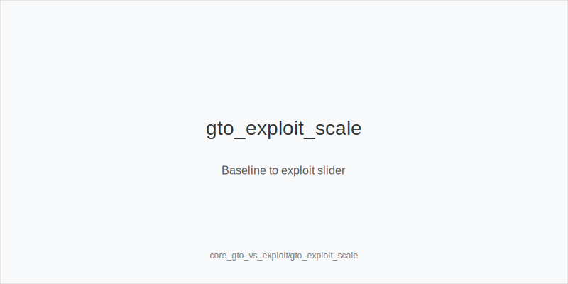
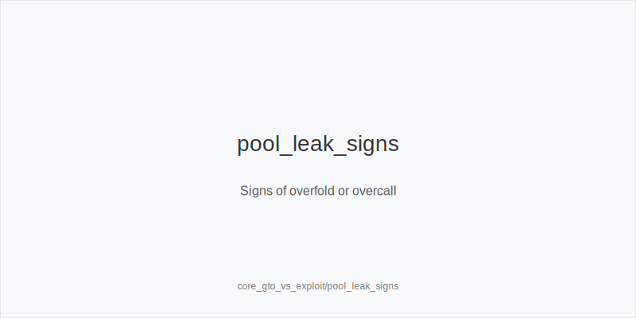
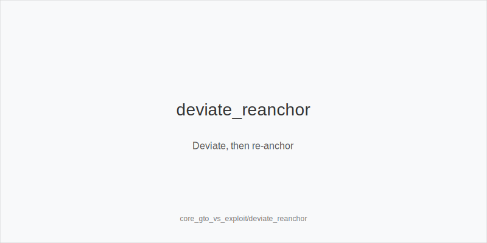

What it is
This module defines GTO baselines and exploit adjustments. A GTO baseline is a balanced plan that stays tough to exploit. An exploit is a deliberate deviation when opponents or the pool show consistent leaks such as overfolding, overcalling, or underbluffing.

[[IMAGE: gto_exploit_scale | Baseline to exploit slider]]

[[IMAGE: pool_leak_signs | Signs of overfold or overcall]]

[[IMAGE: deviate_reanchor | Deviate, then re-anchor]]

Why it matters
A solid baseline protects you when reads are wrong. Exploits raise profit when reads are right. The skill is to start from baseline, spot reliable leaks fast, adjust with sizing or frequency, and re-anchor when the table changes.

Rules of thumb
- Start from baseline. Use sound default ranges and sizes until evidence appears. Why: you avoid guessing into strong players and keep coverage across textures.
- Deviate only with evidence. Use history, pool stats, HUD notes, or clear showdowns. Why: small samples call for small shifts; big samples allow bolder moves.
- Match lever to leak. If they overfold, add polar big bets and more bluffs; if they overcall, add thin value and cut bluffs. Why: push where their range is weakest.
- Exploit with sizes, not only hands. Versus capped ranges, size up polar; versus stations, use smaller merged bets that get called by worse. Why: price targets the mistake.
- Re-anchor often. When a player leaves or adapts, return toward baseline and rebuild reads. Why: yesterday's leak may be gone.

Mini example
CO opens to 2.2 bb (typical online), BTN calls, blinds fold. Flop K72 rainbow. Baseline: CO could c-bet small with a merged range. Read: BTN has been overfolding to larger flop bets. Adjustment: CO uses a polar 80% pot bet with strong Kx and natural bluffs; BTN overfolds and mucks. Note: CO logs the read and will re-anchor if BTN starts defending.

Common mistakes
- Exploiting without proof. Why it is a mistake: you donate into players who lack that leak. Why it happens: one dramatic hand feels like a pattern.
- Over-adjusting the whole tree. Why it is a mistake: changing every node creates new holes. Why it happens: excitement after a read probe_turns to system-wide changes.
- Staying in exploit mode too long. Why it is a mistake: opponents adapt and you become predictable. Why it happens: sunk-cost thinking after early success.

Mini-glossary
GTO baseline: A balanced strategy that resists counter-play; a safe default.
Exploit: A targeted deviation that punishes a specific leak for extra profit.
Capped range: A range missing the strongest combos because of prior actions.
Merged vs polar: Merged targets calls with many medium values; polar mixes very strong hands and bluffs.

Note: Keep a short log of leaks and your adjustments; re-read it each orbit so shifts stay disciplined.

Contrast
Unlike core_bet_sizing_fe, which teaches what sizes do, this module explains when to shift frequencies and sizes away from baseline to punish pool or player leaks, then re-anchor when conditions change.

_This module uses the fixed families and sizes: size_down_dry, size_up_wet; small_cbet_33, half_pot_50, big_bet_75._

See also
- hand_review_and_annotation_standards (score 18) -> ../../hand_review_and_annotation_standards/v1/theory.md
- hu_exploit_adv (score 18) -> ../../hu_exploit_adv/v1/theory.md
- icm_mid_ladder_decisions (score 18) -> ../../icm_mid_ladder_decisions/v1/theory.md
- live_etiquette_and_procedures (score 18) -> ../../live_etiquette_and_procedures/v1/theory.md
- live_full_ring_adjustments (score 18) -> ../../live_full_ring_adjustments/v1/theory.md