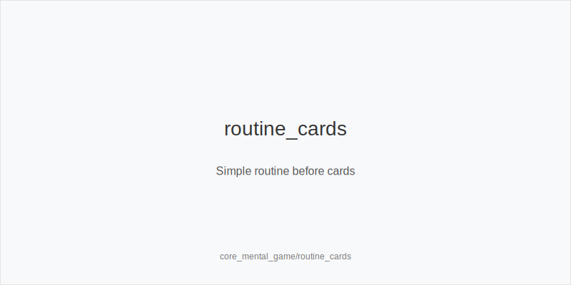
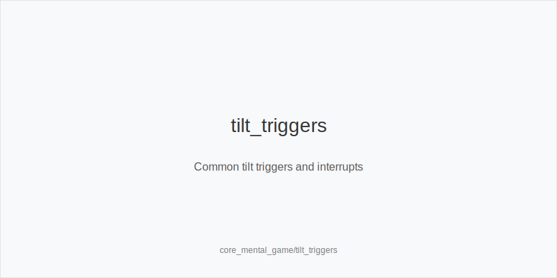
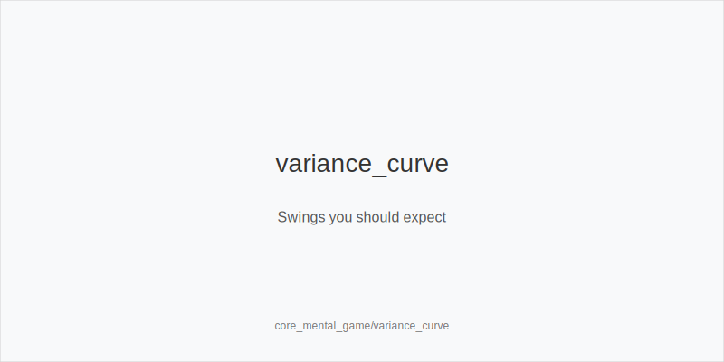

What it is
This module builds a simple, repeatable mental game system: focus routines, tilt control, and variance literacy. You will set pre-session and in-session checklists that keep decisions clear when cards run bad or good, and you will practice short resets that recover judgment fast.

[[IMAGE: routine_cards | Simple routine before cards]]

[[IMAGE: tilt_triggers | Common tilt triggers and interrupts]]

[[IMAGE: variance_curve | Swings you should expect]]

Why it matters
Strong strategy collapses when attention slips or emotions steer choices. A routine lowers error rate, protects bankroll decisions, and helps you quit on time. Understanding variance prevents panic after bad beats and overconfidence after heaters, so you avoid chase mode and protect win rate.

Rules of thumb
- Run a pre-session checklist. Sleep, food, hydration, clear goal, time box, stop-loss, end-on-time, and one A-game cue; why: readiness removes easy leaks and anchors you to a plan you can follow under stress.
- Define stop-loss and end-on-time. Pick a max loss and a firm session length; why: caps prevent chase-tilt and curb decision quality decay late in sessions.
- Use fast interrupts. When tilted, breathe-reset for 10 seconds, stand up, or walk for 2 minutes; why: brief physical resets lower arousal and restore pace without turning the session into a study break.
- Note it, do not relive it. Tag hands for review and move on; why: rumination steals attention from the next decision and multiplies errors.
- Protect attention. Reduce tables when tired, silence notifications, mute toxic chat, and table-change away from needling opponents; why: fewer distractions mean cleaner reads and better timing.
- Normalize swings. Expect downswings and heaters even with solid play; why: variance literacy shrinks emotional spikes so you keep executing the plan.

Mini example
UTG opens, MP folds, CO calls, BTN 3-bets, SB folds, BB calls. CO feels tilt after folding on K72 5 2 when BTN barrels and BB calls and wins a later pot; breathing quickens. CO hits the 10-second breathe-reset, writes a one-line tag on the earlier hand, reduces tables from 4 to 3, and walks for water. Next orbit, CO faces UTG pressure and folds a marginal spot per plan, then resumes A-game pace.

Common mistakes
- Chasing losses with longer sessions. Why it is a mistake: fatigue and emotion increase errors and variance; Why it happens: urge to get even today overrides rules you set while calm.
- Reviewing mid-session. Why it is a mistake: deep analysis drains focus and snowballs time-bank; Why it happens: need for closure after a bad beat.
- Ignoring environment. Why it is a mistake: distractions and hostile tables raise tilt frequency; Why it happens: convenience and inertia keep you in bad conditions.

Mini-glossary
Tilt: A shift toward emotion-driven decisions after wins or losses.
Time box: A fixed session length that ends play when the timer hits zero.
Stop-loss: A pre-set maximum session loss that triggers a quit or long break.
A-game cue: A short phrase or action that reminds you how your best decisions feel.

Contrast
Unlike core_bankroll_management, which sets financial cushions and stake rules, this module builds daily routines that keep decision quality high inside each session.

_This module uses the fixed families and sizes: size_down_dry, size_up_wet; small_cbet_33, half_pot_50, big_bet_75._

See also
- cash_3bet_oop_playbook (score 5) -> ../../cash_3bet_oop_playbook/v1/theory.md
- cash_blind_defense (score 5) -> ../../cash_blind_defense/v1/theory.md
- cash_blind_defense_vs_btn_co (score 5) -> ../../cash_blind_defense_vs_btn_co/v1/theory.md
- cash_blind_vs_blind (score 5) -> ../../cash_blind_vs_blind/v1/theory.md
- cash_delayed_cbet_and_probe_systems (score 5) -> ../../cash_delayed_cbet_and_probe_systems/v1/theory.md