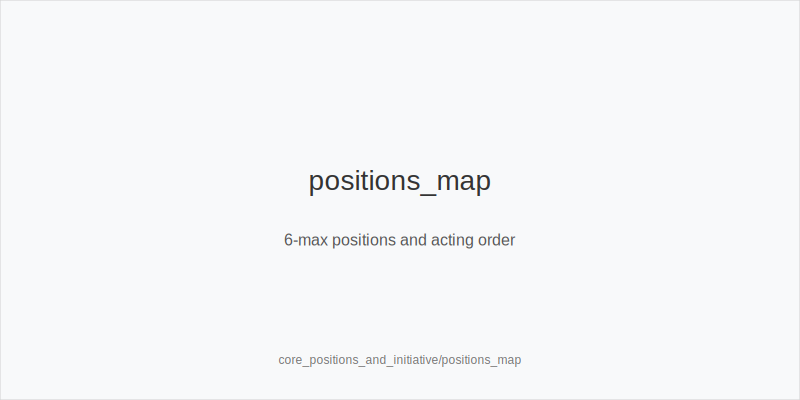
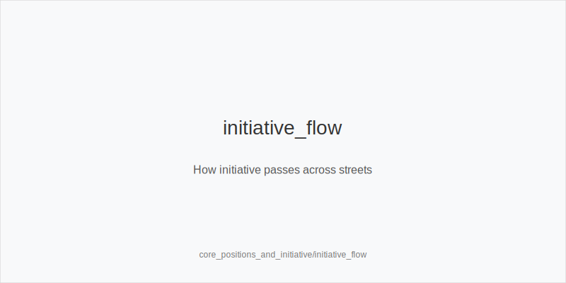
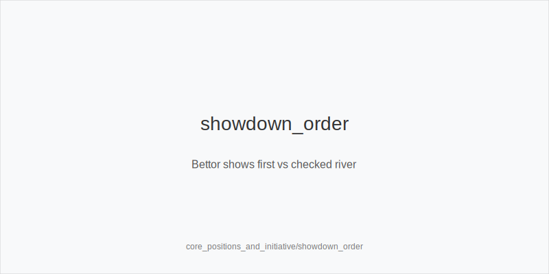

What it is
This module defines table positions in 6-max Hold'em - UTG, MP, CO, BTN, SB, BB - and shows how opening ranges and postflop leverage change by seat. It also introduces initiative: the last aggressor on the prior street has initiative and can credibly represent strength with a continuation bet. You will learn when to press this edge and when to yield.

[[IMAGE: positions_map | 6-max positions and acting order]]

[[IMAGE: initiative_flow | How initiative passes across streets]]

[[IMAGE: showdown_order | Bettor shows first vs checked river]]

Why it matters
Position provides information and cheaper decisions because others act first. Acting later improves equity realization, pot control, and value extraction. Initiative lets you win many pots with a single bet and shapes how opponents defend, so you steal more when you have it and lose less when you do not.

Rules of thumb
- UTG and MP open tight; CO wider; BTN widest. SB prefers raise-or-fold; BB defends wider vs small opens and tighter vs large. Why: later seats face fewer players and act in position more often, so more hands become profitable.
- With initiative, favor small c-bets heads up on dry boards and pressure scare turns; without initiative, defend more selectively and attack when texture shifts in your favor. Why: the last aggressor owns the story and can realize fold equity efficiently.
- SB strategy: raise-or-fold by default. Completing invites tough OOP spots against BB. If you open small (typical online), do it with a plan for 3-bets and postflop play. Why: OOP without the probe_turns burns EV.
- Basic raise legality. A minimum raise is legal only if new_total - current_bet >= last_raise_size. If not, the raise is insufficient and may not reopen action. Why: correct arithmetic prevents angle-shoots and rules disputes.
- Showdown order rule of thumb. After a called river bet, bettor_shows_first; if river checks through, first_active_left_of_btn_shows. Why: consistent order avoids slowroll gamesmanship and keeps hands moving.

Mini example
UTG opens to 2.2 bb (typical online), MP folds, CO calls, BTN calls, SB folds, BB calls.
Flop K72 rainbow: action checks to UTG, who retains initiative from the preflop raise and makes a small continuation bet; BTN folds, BB calls.
Turn 5 offsuit: BB checks; UTG often bets again on improving or neutral cards, or checks back to control pot and realize equity.
Key takeaways: UTG leveraged position against MP/CO/BTN preflop, then used initiative to pressure capped ranges postflop.

Common mistakes
- Opening too loose UTG/MP. Mistake: too many dominated hands create reverse implied odds; Why it happens: players copy BTN ranges everywhere and undervalue position.
- Limping SB by habit. Mistake: you give BB a cheap look and cede initiative; Why it happens: fear of opening and getting 3-bet or a desire to see flops cheaply.
- Ignoring initiative postflop. Mistake: auto-betting without it or auto-folding with it; Why it happens: focusing on hand strength only and not on who told the last convincing story.

Mini-glossary
Initiative: Right to represent strength because you were the last aggressor on the previous street.
first_active_left_of_btn: The first player to act to the left of the button when action checks; used to decide show order on a checked river.
bettor_shows_first: After a called river bet, the bettor exposes first.
first_active_left_of_btn_shows: If river checks through, that player shows first according to order.
Open size: First-raise amount preflop; 2.0-2.5 bb is common online.

Contrast
Unlike core_rules_and_setup, which covers mechanics and procedures, this module shows how seat and initiative convert the same cards into different EV by changing ranges, leverage, and show order discipline.

_This module uses the fixed families and sizes: size_down_dry, size_up_wet; small_cbet_33, half_pot_50, big_bet_75._

See also
- cash_3bet_oop_playbook (score 5) → ../../cash_3bet_oop_playbook/v1/theory.md
- cash_blind_defense (score 5) → ../../cash_blind_defense/v1/theory.md
- cash_blind_defense_vs_btn_co (score 5) → ../../cash_blind_defense_vs_btn_co/v1/theory.md
- cash_blind_vs_blind (score 5) → ../../cash_blind_vs_blind/v1/theory.md
- cash_delayed_cbet_and_probe_systems (score 5) → ../../cash_delayed_cbet_and_probe_systems/v1/theory.md