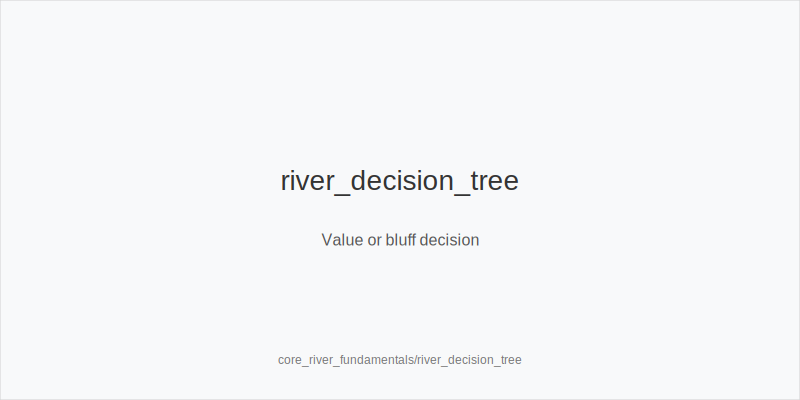
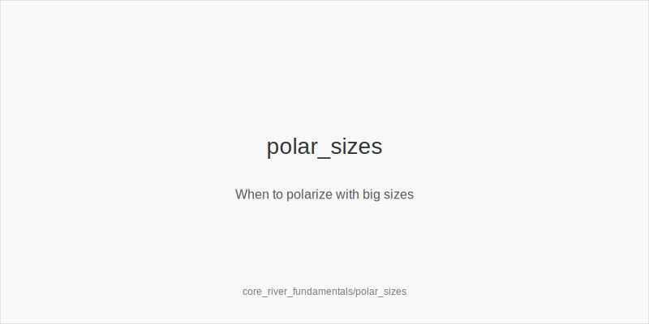
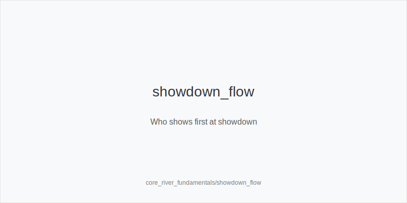

What it is
This module explains river strategy: when to value_bet or bluff, how to choose bet_small_river, bet_big_river, or overbet_river, how blockers shape a blocker_bluff, when to bluffcatch, and the correct showdown flow.

[[IMAGE: river_decision_tree | Value or bluff decision]]

[[IMAGE: polar_sizes | When to polarize with big sizes]]

[[IMAGE: showdown_flow | Who shows first at showdown]]

Why it matters
The river locks equities and concentrates chips. One sizing or one call decides sessions. Clear rules for polarize vs thin_value reduce fear-based choices and turn close spots into repeatable, profitable decisions.

Rules of thumb
- Polarize on blanks. When draws miss and you own nut advantage, prefer bet_big_river or overbet_river with your best value and best bluffs; middling hands fold and strong ones pay. Why: big sizes pressure bluffcatchers.
- Thin value in position. Versus wide caller pools, use bet_small_river with top pair or second pair that can be called by worse. Why: small sizing widens the call range.
- Choose bluffs with blockers. Favor blocker_bluff when you block their calls (e.g., ace of the flush suit) and do not block their folds. Why: better card removal raises fold equity.
- Default checks with marginal showdown. If worse rarely calls and better rarely folds, check_back IP or check OOP. Why: thin bet gets called too strong; you realize equity by checking.
- Bluffcatch selectively. Call when price is good and villain is polarized with enough missed draws; otherwise check_fold. Why: calling without outs is pure frequency math.
- Showdown flow. After a called river bet, bettor_shows_first. If the river checks through, first_active_left_of_btn_shows. Why: action determines reveal order.

Mini example
CO opens, BTN calls, blinds fold. Flop and turn: CO bets, BTN calls. River bricks the front-door draw. CO holds top set; BTN's range holds many missed draws and some one-pair. CO polarizes with overbet_river; BTN tank-calls as a bluffcatch and loses. Because the river bet was called, bettor_shows_first, then the caller may muck or show. If both had checked, first_active_left_of_btn_shows.

Common mistakes
- Betting medium strength too large. Why it is a mistake: worse folds and better calls, losing value. Why it happens: desire to "end it" with a big bet.
- Bluffing without good blockers. Why it is a mistake: you block folds and leave in calls. Why it happens: focusing on your hand, not their calling range.
- Passing thin_value. Why it is a mistake: small pots add up; automatic check_back surrenders equity. Why it happens: fear of a check_raise and overestimating villain strength.

Mini-glossary
Polarize: Play a range of very strong value and air with large sizes that pressure bluffcatchers.
Thin_value: A small value_bet intended to be called by slightly worse hands.
Blocker_bluff: A bluff chosen because your cards block calls and do not block folds.
Bluffcatch: A call with a medium-strength hand that aims only to beat bluffs.

Contrast
Unlike core_turn_fundamentals, which plans geometry and second barrels, this module focuses on final-street sizing, value vs bluff decisions, blocker-driven bluffs, disciplined bluffcatching, and correct showdown flow.

_This module uses the fixed families and sizes: size_down_dry, size_up_wet; small_cbet_33, half_pot_50, big_bet_75._

See also
- cash_3bet_oop_playbook (score 12) → ../../cash_3bet_oop_playbook/v1/theory.md
- cash_blind_defense_vs_btn_co (score 12) → ../../cash_blind_defense_vs_btn_co/v1/theory.md
- cash_blind_vs_blind (score 12) → ../../cash_blind_vs_blind/v1/theory.md
- cash_fourbet_pots (score 12) → ../../cash_fourbet_pots/v1/theory.md
- cash_population_exploits (score 12) → ../../cash_population_exploits/v1/theory.md