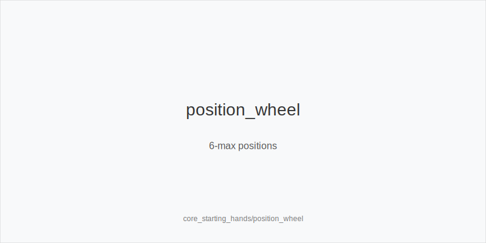
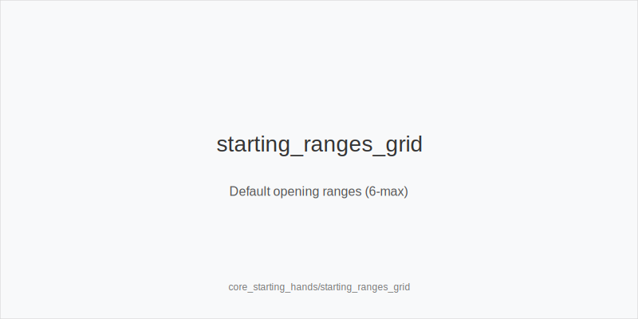
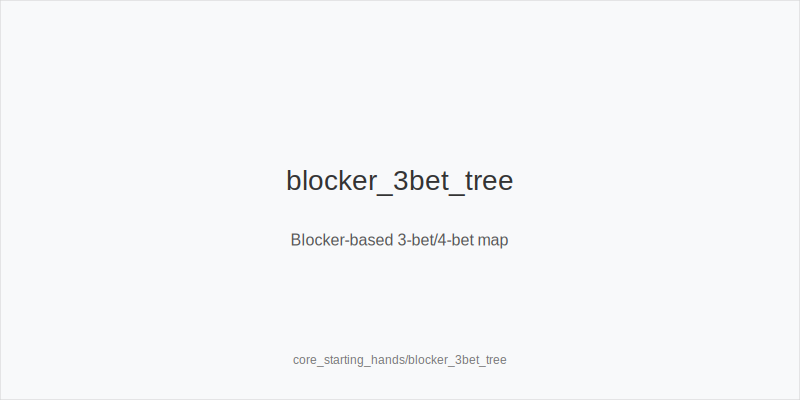

[[IMAGE: position_wheel | 6-max positions]]

[[IMAGE: starting_ranges_grid | Default opening ranges (6-max)]]

[[IMAGE: blocker_3bet_tree | Blocker-based 3-bet/4-bet map]]

What it is
This module defines strong and playable starting hands in 6-max Hold'em and how to use them by seat. You will learn sensible opening ranges by position, the difference between value 3-bets and blocker 3-bet/4-bet bluffs, when suited connectors and small pairs earn value, and how blockers shape bluff frequency (e.g., A5s removing AA/AK).

Why it matters
Preflop choices shape every later decision. Good starting-hand discipline avoids dominated spots, wins more with position, and makes postflop simpler. Clear ranges reduce guesswork, keep you consistent under pressure, and make your results less streaky.

Rules of thumb
- Tight early, wider late. UTG and MP open tight; CO widens; BTN widest. Fewer players left means more steals and better postflop position.
- Typical online open sizes are 2.0-2.5 bb. Smaller opens steal wider and fold cheaper when played back at.
- 3-bet value vs 3-bet bluff. Value (vs most opens): QQ+, AK. Bluffs: choose blockers (A5s, A4s, sometimes KQo vs late opens) to remove opponent premiums.
- 4-bet plan. Value 4-bet with KK+, AK sometimes; mix a few blocker 4-bet bluffs (A5s) mainly in late-position battles. Out of position, use a tighter, more value-heavy 4-bet range.
- Small pairs and suited connectors. Open these more from CO/BTN; call in position when stacks are deep enough to realize equity (sets/strong draws). Avoid flatting them out of position versus large 3-bets.
- SB prefer raise-or-fold. Completing invites BB to realize equity and attack. Polarize 3-bets from SB; fold the bottom.
- BB defend wider vs small opens. You close action and get a discount; fold more vs larger (common live) sizes.

Mini example
UTG opens 2.2 bb (typical online). MP folds. CO 3-bets to 7 bb with A5s as a blocker bluff. BTN folds, SB folds, BB folds. UTG holds KK and 4-bets to 18 bb; CO folds. Key points: UTG uses a strong early range; CO selects a blocker 3-bet from later position; the value 4-bet punishes the bluff. Versus a BTN open, SB would play more polar: 3-bet QQ+/AK/A5s-type bluffs, fold weak offsuit broadways, and avoid flats that play poorly OOP.

Common mistakes
- Copying BTN opens from UTG. Mistake: too many dominated hands face 3-bets and tough runouts. Why it happens: overrating suitedness without position.
- Calling 3-bets OOP with marginal offsuit broadways. Mistake: you are dominated and capped; reverse implied odds hurt. Why it happens: fear of folding the best hand preflop.
- Never 4-betting as a bluff. Mistake: opponents 3-bet too freely if your 4-bets are only value. Why it happens: discomfort using blockers and counting fold equity.

Mini-glossary
Blocker: A card you hold that reduces opponent premium combos (e.g., an Ace blocks AA/AK), improving bluff success.
Suited connectors (SCs): Sequential suited hands (98s, T9s) that make strong draws; best opened/defended in position with depth.
3-bet: The next raise after an open (CO raises, BTN 3-bets).
4-bet: A raise over a 3-bet; often strong value, with a few blocker bluffs in late-position battles.

Contrast
Unlike core_positions_and_initiative, which centers on seat and who has the betting probe_turns, this module focuses on which hands to open, 3-bet, or 4-bet from each seat and why.

_This module uses the fixed families and sizes: size_down_dry, size_up_wet; small_cbet_33, half_pot_50, big_bet_75._

See also
- cash_short_handed (score 8) → ../../cash_short_handed/v1/theory.md
- core_rules_and_setup (score 8) → ../../core_rules_and_setup/v1/theory.md
- core_turn_fundamentals (score 8) → ../../core_turn_fundamentals/v1/theory.md
- hand_review_and_annotation_standards (score 8) → ../../hand_review_and_annotation_standards/v1/theory.md
- hu_exploit_adv (score 8) → ../../hu_exploit_adv/v1/theory.md