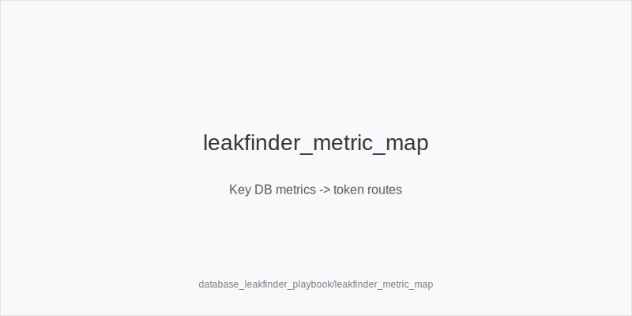
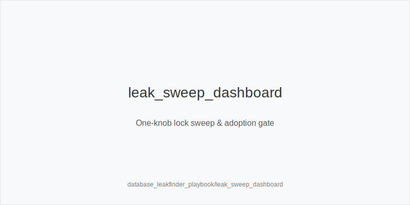
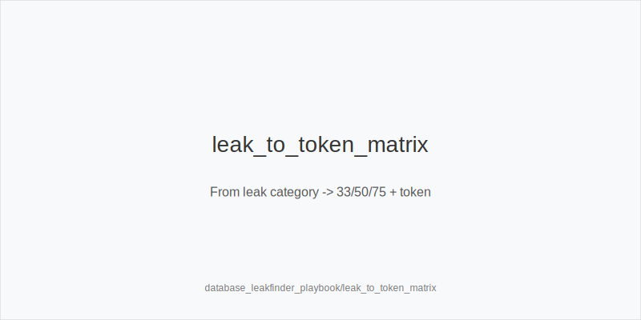

What it is
A practical leakfinding workflow that turns database/HUD aggregates into tokenized actions using fixed ladders and size families. You read population and opponent stats (e.g., Fold vs 3Bet, 4Bet, cbet-by-size, Fold vs Turn 75%, Fold vs Probe, x/r, AFq, WTSD, WSD, WWSF), validate with a single variable lock sweep when needed, and then shift frequencies with one action token. Sizes never change: preflop ladders are 3bet_ip_9bb / 3bet_oop_12bb / 4bet_ip_21bb / 4bet_oop_24bb; postflop families are small_cbet_33, half_pot_50, big_bet_75 selected by size_down_dry or size_up_wet.

Why it matters
Population level leaks move EV/hour more than micro mix tweaks. Overfolds to 3 bets, under 4 bets, turn Fv75 spikes on dynamic cards, surrender after check check, and under bluffed polar rivers are repeatable edges. Converting those patterns into the token set keeps execution simple and fast at scale.

Rules of thumb

* Sample tiers: weak (<=500 spots), medium (~500-1k), strong (>=1k+). Require multi stat agreement before tagging overfold_exploit. Why: protects against noise.
* Fold vs 3Bet up + 4Bet down: widen 3bet_oop_12bb / 3bet_ip_9bb with blockers; upgrade premiums to 4bet_ip_21bb. Why: pressure prints when 5 bets are rare.
* Under 4 bet fields OOP/IP: add thin value 3 bets; choose 4bet_ip_21bb or 4bet_oop_24bb with premiums. Why: reverse SPR cleanly.
* Turn Fv75 high on dynamic boards: double_barrel_good; use big_bet_75 with blockers, default half_pot_50 otherwise. Why: exploit fold vs size split.
* Fold vs Probe up after chk chk: probe_turns. Why: opponents surrender at high SPR after missing flop stab.
* Flop x/r low on static: size_down_dry and small_cbet_33 at higher frequency. Why: range bet is safe when raise risk is low.
* River polar under bluffed: fold vs big_bet_75 without blockers; with top blockers as PFA consider triple_barrel_scare. Why: respect population under bluff.
* Stations (WTSD up, WSD down): prefer merged value with half_pot_50; on static rivers pick size_down_dry thin value. Why: they call too much, size accordingly.
* Raise prone turns at mid SPR: delay_turn and keep protect_check_range. Why: avoid getting blown off equity.
* RFI wide + BB defend tight: expand 3bet_oop_12bb. Why: preflop price pressure prints immediate folds.
* Physics first: texture picks family (size_down_dry static; size_up_wet dynamic); stats only shift frequency inside the family. Why: keep the tree stable.
* Lock sweeps: change one knob (e.g., Fv75) to confirm persistence; adopt only if EV gain holds, then tag overfold_exploit. Why: prevent overfitting.

[[IMAGE: leakfinder_metric_map | Key DB metrics -> token routes]]

[[IMAGE: leak_sweep_dashboard | One-knob lock sweep & adoption gate]]

[[IMAGE: leak_to_token_matrix | From leak category -> 33/50/75 + token]]

Mini example
Profile: Fold vs 3Bet 60, 4Bet 2-3, Turn Fv75 on wet 58, Fold vs Probe 57, x/r 5, River AFq 15. Preflop: widen 3bet_oop_12bb with A5s and consider 4bet_ip_21bb with AKo; tag overfold_exploit only after persistence. Flop static A83r with x/r low: size_down_dry + small_cbet_33. Turn on JT9ss 8x with blockers and elevated Fv75: double_barrel_good with big_bet_75. River on A94r 6s Kd facing big_bet_75 with poor blockers: fold.

Common mistakes
Overfitting tiny samples. Chasing off tree sizes. Ignoring texture when choosing family. Reading heatmaps without EV validation. Tagging overfold_exploit after one orbit. Skipping blocker checks on rivers.

Mini-glossary
VPIP/PFR/RFI: preflop participation and open ranges; route wide RFI + tight BB defend to 3bet_oop_12bb.
Fold vs 3Bet: higher means widen 3 bets; combine with low 4Bet.
4Bet: low frequencies justify value heavy 3 bets and 4bet_ip_21bb / 4bet_oop_24bb.
cbet by size: how often opponents continue vs 33/50/75; informs small_cbet_33 or bigger turns.
Fold vs Probe: high after chk chk -> probe_turns.
x/r: low on static -> small_cbet_33.
AFq/WTSD/WSD/WWSF: aggression and showdown mix; stations -> half_pot_50 and size_down_dry; nits -> overfold_exploit with proof.

Contrast
online_hud_and_db_review applies stats in play; study_review_handlab is the spot loop. This module scans whole databases for persistent leaks and converts them into the same tokenized actions, with single knob validation and no size changes.

See also
- icm_final_table_hu (score 31) -> ../../icm_final_table_hu/v1/theory.md
- live_session_log_and_review (score 31) -> ../../live_session_log_and_review/v1/theory.md
- online_economics_rakeback_promos (score 31) -> ../../online_economics_rakeback_promos/v1/theory.md
- online_hudless_strategy_and_note_coding (score 31) -> ../../online_hudless_strategy_and_note_coding/v1/theory.md
- online_tells_and_dynamics (score 31) -> ../../online_tells_and_dynamics/v1/theory.md