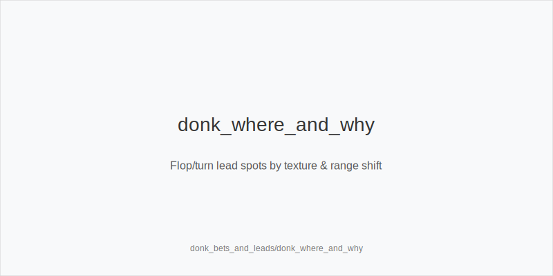
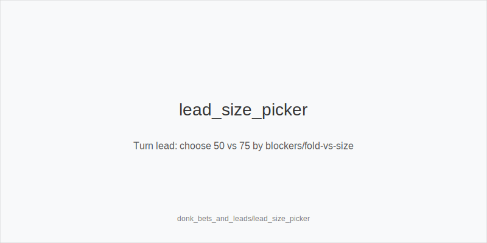
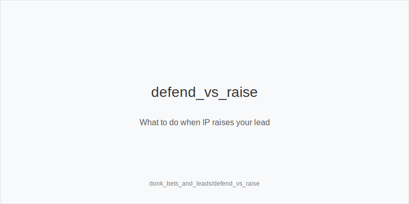

What it is
A flop probe_turns is an OOP bet into the preflop aggressor (PFA). A turn probe_turns (probe_turns-turn) is an OOP bet on the turn after calling the flop. We systematize them with the same tokens and sizes as any bet: small_cbet_33, half_pot_50, big_bet_75, guided by size_down_dry on static textures and size_up_wet on dynamic ones. We never add new sizes or trees; we only shift frequencies.

Why it matters
When the range or nut advantage tilts OOP - like low/paired flops in BvB or straight/flush turns that favor the blind defend - a probe_turns can outperform a check. Good probe_turns deny equity or realize value without ceding control. Execution stays simple: the ladders and 33/50/75 families stay fixed; only frequency and family selection change.

Rules of thumb

* Flop probe_turns, static low boards (BvB, BB defend vs SB 2.0bb): probe_turns small with size_down_dry + small_cbet_33 when OOP has broad coverage, IP range whiffs, and raise rates are low. Why: cheap denial vs capped range.
* Flop probe_turns, dynamic (986ss, JT9s): probe_turns selectively when OOP holds many strong draws/2p/sets. Default half_pot_50; upgrade to big_bet_75 only with blockers plus proven overfolds - size_up_wet. Why: leverage plus blocker support.
* Turn probe_turns after call on range-shift cards (pairing second pair, completing straight/flush that favors OOP): prefer half_pot_50; go big_bet_75 with top blockers or clear fold-vs-size splits. Why: tax equity-heavy IP continues.
* Versus raise-happy IP: reduce probe_turns frequency; favor protect_check_range on flop and delay_turn with medium strength. Why: avoid getting blown off equity.
* Probe vs probe_turns distinction: if flop went chk-chk, the turn bet is probe_turns (not a probe_turns). If IP c-bet flop and you called, a turn bet is a probe_turns. Why: sequence dictates label and pool response.
* Population exploits: in anonymous/fastfold pools, probe_turns bluffs underperform; fold rivers vs big_bet_75 without blockers. Reserve overfold_exploit for preflop only with persistent evidence. Why: under-bluffed polar nodes and quick surrenders.
* No off-tree bets: sizes are 33/50/75 only, mapped via size_down_dry or size_up_wet. Why: consistency under pressure.

[[IMAGE: donk_where_and_why | Flop/turn probe_turns spots by texture & range shift]]

[[IMAGE: lead_size_picker | Turn probe_turns: choose 50 vs 75 by blockers/fold-vs-size]]

[[IMAGE: defend_vs_raise | What to do when IP raises your probe_turns]]

Mini example
BvB 100bb. SB opens 2.0bb, BB calls. Flop 772r: IP raise% low; BB probe_turns size_down_dry with small_cbet_33 to deny and value-protect pairs. Later, SB c-bets T87ss small, BB calls; turn 9s completes straights - BB probe_turns half_pot_50, upgrading to big_bet_75 with strong blockers. Different spot: BTN c-bets K72r, BB considers a turn probe_turns on 3c but IP raises turns often - BB chooses delay_turn and protects earlier checks with protect_check_range.

Common mistakes

* probe_turns medium strength into raise-happy IP. Fix: use protect_check_range and delay_turn.
* Polar 75% on dry flops. Fix: size_down_dry with small_cbet_33; save big_bet_75 for size_up_wet with blockers.
* Treating probes as probe_turns. Fix: only call it a probe_turns after facing a flop bet and calling; chk-chk turns are probe_turns.
* Off-tree sizing. Fix: never leave 33/50/75.
* Over-bluffing donks in anonymous pools. Fix: default discipline; fold rivers vs big_bet_75 without blockers.
* Ignoring blockers on big turn probe_turns. Fix: choose big_bet_75 only with strong blockers or fold spikes.

Mini-glossary
probe_turns bet: OOP flop bet into PFA.
Turn probe_turns: OOP turn bet after calling the flop.
Range shift: card that moves equity toward the OOP defend.
Capped node: range missing top combos; vulnerable to pressure.
Merged vs polar: half_pot_50 targets calls; big_bet_75 represents nuts/air.

Contrast
Other modules focus on PFA lines in single-raised and 3-bet pots. Here we train OOP initiative-taking vs PFA, using the same tokens and families, with frequency shifts driven by texture and pool behavior.

See also
- live_chip_handling_and_bet_declares (score 31) -> ../../live_chip_handling_and_bet_declares/v1/theory.md
- cash_blind_defense_vs_btn_co (score 29) -> ../../cash_blind_defense_vs_btn_co/v1/theory.md
- cash_population_exploits (score 29) -> ../../cash_population_exploits/v1/theory.md
- cash_short_handed (score 29) -> ../../cash_short_handed/v1/theory.md
- database_leakfinder_playbook (score 29) -> ../../database_leakfinder_playbook/v1/theory.md