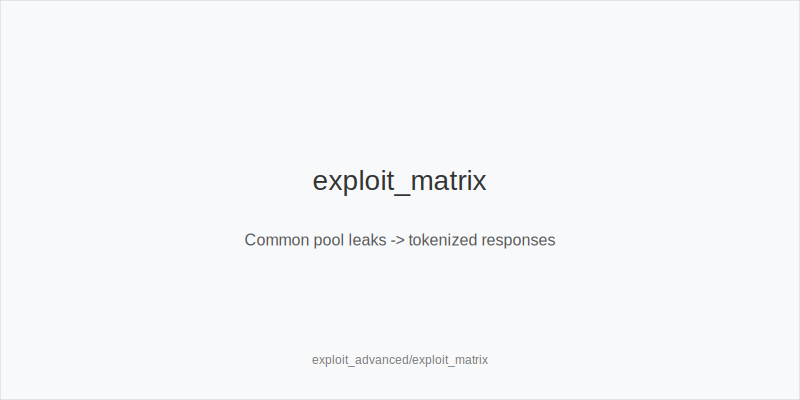
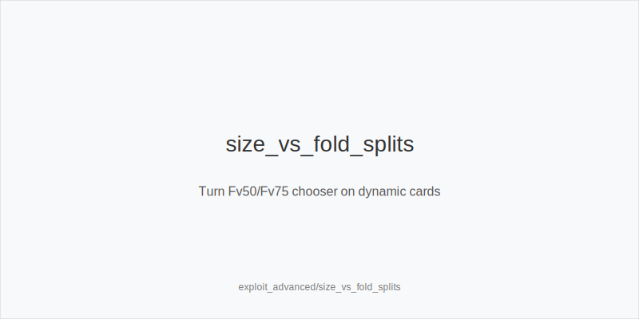
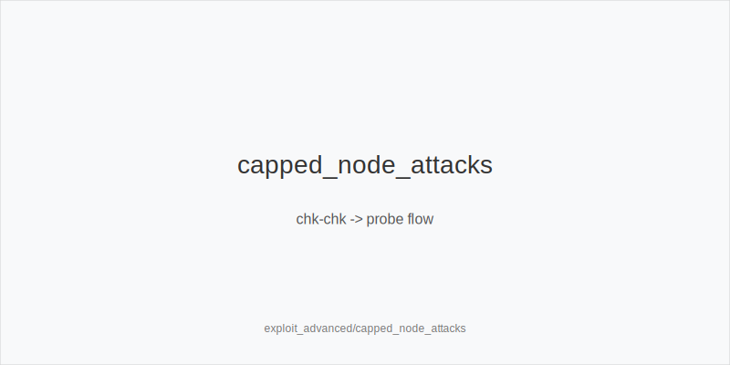

What it is
Advanced exploits are multi-node, evidence-based deviations layered on top of your baseline trees and fixed size families. You never invent sizes or ladders. You translate persistent pool leaks into frequency shifts using only: 3bet_ip_9bb, 3bet_oop_12bb, 4bet_ip_21bb, 4bet_oop_24bb, small_cbet_33, half_pot_50, big_bet_75, size_up_wet, size_down_dry, protect_check_range, delay_turn, probe_turns, double_barrel_good, triple_barrel_scare, call, fold, overfold_exploit.

Why it matters
Population imbalances are large: overfolds to 3-bets and turn 75%, under-bluffed polar rivers, low 4-bet frequencies, and autopilot range-bets. Exploits that map these trends to tokens drive EV/hour more than tiny solver deltas, while keeping execution simple and stable.

Rules of thumb

* Preflop overfolds and under-4-bets -> widen 3bet_oop_12bb and 3bet_ip_9bb with blockers; upgrade premiums to 4bet_ip_21bb or 4bet_oop_24bb. Why: folds + low 5-bet risk raise value and blocker pressure.
* Turn fold-vs-size splits on wet cards -> double_barrel_good with half_pot_50 by default; move to big_bet_75 when blockers + proven overfolds (size_up_wet). Why: larger size taxes draw-heavy ranges.
* Under-bluffed polar rivers -> fold to big_bet_75 without blockers; with strong blockers consider triple_barrel_scare when you are the aggressor. Why: protect vs low bluff rates; attack when you block value.
* Autopilot range-bets (snap 33 on static) -> defend correctly now, then plan probe_turns after chk-chk lines. Why: many give up turns.
* Capped nodes (missed c-bet or check-back) -> probe_turns; versus stabby pools earlier street add protect_check_range. Why: capture surrender, prevent auto-profit stabs.
* Merged stations (WTSD up, WSD down) -> choose half_pot_50 for value; on static rivers use size_down_dry. Why: merged calls pay medium sizes.
* Raise-prone turns -> delay_turn with medium strength to realize equity. Why: avoid spew vs aggressive raises.
* Short-behind pressure (MTT contexts) -> prefer flats over marginal 3/4-bet wars; ladders stay fixed. Why: payout leverage punishes thin brinkmanship.
* Tagging for exploits -> apply overfold_exploit only after persistent evidence and texture fit. Why: avoid overfitting; keep exploits disciplined.

[[IMAGE: exploit_matrix | Common pool leaks -> tokenized responses]]

[[IMAGE: size_vs_fold_splits | Turn Fv50/Fv75 chooser on dynamic cards]]

[[IMAGE: capped_node_attacks | chk-chk -> probe flow]]

Mini example
HU 100bb. Preflop: pool under-4-bets; BB widens 3bet_oop_12bb with A5s. Flop A83r (static): small_cbet_33 (size_down_dry). Turn 9s on JT9ss-type boards in this pool shows higher Fv75, you hold blockers -> double_barrel_good with big_bet_75 (size_up_wet). River A94r-6s-Kd vs big_bet_75 with no blockers -> fold.

Common mistakes

* Overfitting tiny samples.
* Off-tree sizing outside 33/50/75.
* Ignoring texture; physics first.
* Calling polar river bets without blockers.
* Failing to protect checks in stabby pools.

Mini-glossary
Fold-vs-size split: different fold rates to 50% vs 75% bets; drives size choice.
Capped node: range lacks top hands after check; vulnerable to probes.
Merged vs polar: half_pot_50 targets middling calls; big_bet_75 represents nuts/air.
Blocker quality: blocking value and unblocking missed combos improves bluff EV and bluff-catch EV.
overfold_exploit tag: label to widen pressure only after persistent folding evidence.

Contrast
solver_node_locking_basics is lab work to test assumptions; online_* modules gather data. This is the table-ready playbook that converts persistent reads into tokenized, frequency-shifted actions without changing sizes or trees.

See also
- icm_final_table_hu (score 31) -> ../../icm_final_table_hu/v1/theory.md
- live_etiquette_and_procedures (score 31) -> ../../live_etiquette_and_procedures/v1/theory.md
- live_full_ring_adjustments (score 31) -> ../../live_full_ring_adjustments/v1/theory.md
- live_session_log_and_review (score 31) -> ../../live_session_log_and_review/v1/theory.md
- live_speech_timing_basics (score 31) -> ../../live_speech_timing_basics/v1/theory.md