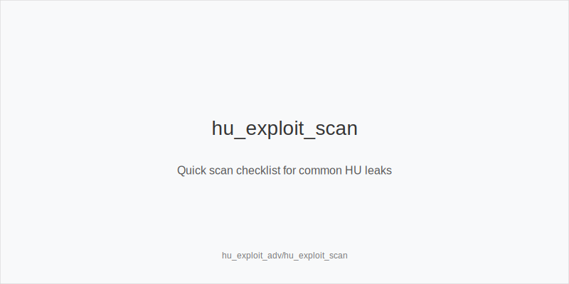
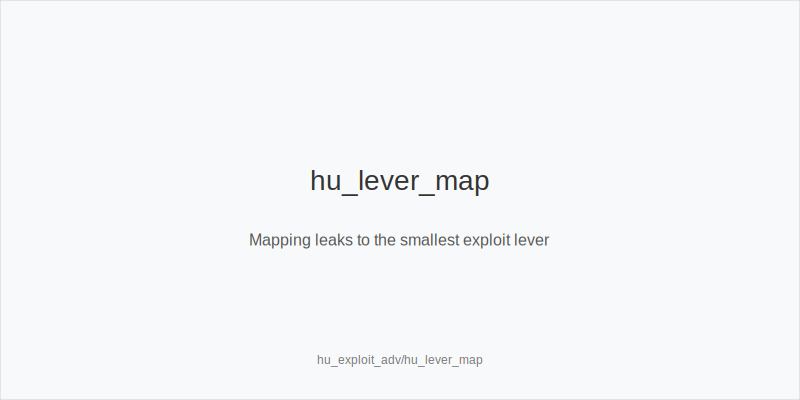
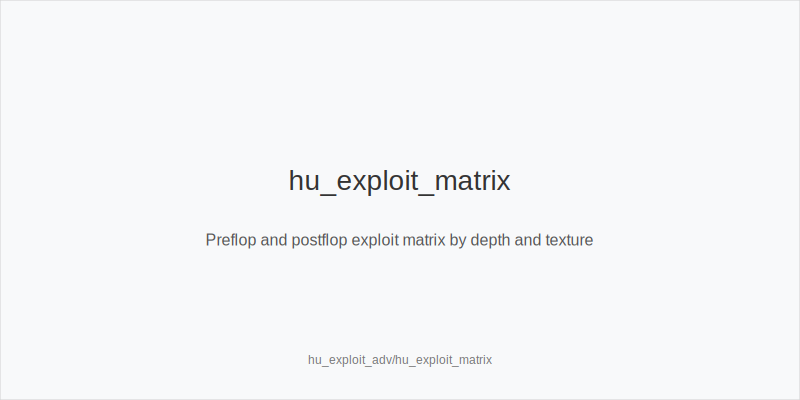

What it is
This module is an advanced exploit framework for Heads-Up. Positions are SB/Button (IP) and BB (OOP). Stacks 25-100bb. You will spot common pool leaks fast and convert them using one compact set of levers: 3bet_ip_9bb, 3bet_oop_12bb, 4bet_ip_21bb, 4bet_oop_24bb, small_cbet_33, half_pot_50, big_bet_75, size_up_wet, size_down_dry, protect_check_range, delay_turn, probe_turns, double_barrel_good, triple_barrel_scare, call, fold, overfold_exploit.

[[IMAGE: hu_exploit_scan | Quick scan checklist for common HU leaks]]

Why it matters
HU edges come from repeatable opponent mistakes. Pools often overfold to 3-bets, under-4-bet, overfold to big_bet_75 on wet or scare turns, under-defend versus probe_turns after missed c-bets, and under-bluff rivers. A fixed set of actions prevents FPS, speeds execution, and keeps risk in line with the read strength.

[[IMAGE: hu_lever_map | Mapping leaks to the smallest exploit lever]]

Rules of thumb
- Preflop overfolds: when SB folds too much versus 3-bets at 60-100bb, widen 3bet_oop_12bb with blocker bluffs; why: immediate EV from folds and cleaner postflop SPRs.
- Under-4-betting: when SB rarely 4-bets, expand value 3bet_oop_12bb and add thin 4bet_ip_21bb with blockers; why: you get folds or dominated calls.
- Limp and iso wars at 25-40bb: punish loose isos by 3bet_ip_9bb with suited Ax and pairs; why: fold equity plus solid equity when called.
- Dry textures: size_down_dry with small_cbet_33 for thin value and cheap bluffs; why: static boards reward range bets and control variance.
- Wet or scare textures: size_up_wet with big_bet_75 for strong hands and high-equity bluffs; why: deny equity, polarize, and raise fold equity on volatile turns and rivers.

[[IMAGE: hu_exploit_matrix | Preflop and postflop exploit matrix by depth and texture]]

Mini example
UTG, MP, CO not seated. BTN is SB. BB posts 1bb. 100bb effective. 
Pool note: overfolds to 3-bets. SB opens 2.0bb. BB widens 3bet_oop_12bb with A5s (overfold_exploit). 
Flop K72r after call. IP uses small_cbet_33 or checks back medium strength. 
Turn on JT9ss lines, IP prefers size_up_wet and big_bet_75 with strong draws. 
If flop checks through and turn 9s favors BB, OOP fires probe_turns for half_pot_50. On scare rivers, triple_barrel_scare with blockers; versus under-bluff big bets, fold marginal bluff-catchers.

Common mistakes
- Using big_bet_75 on dry boards. Mistake: burns value and over-bluffs; why players do it: copy a wet-board plan everywhere seeking quick folds. 
- 3-betting without a read or ladder. Mistake: random sizes and hands; why players do it: confuse aggression with EV and ignore overfold_exploit or under-4-bet data. 
- Never protecting checks. Mistake: capped checks get farmed by barrels; why players do it: fear free cards rather than mixing protect_check_range.

Mini-glossary
overfold_exploit: increase aggression where the pool folds too much. 
size_down_dry: smaller bets on static boards for thin value and cheap bluffs. 
size_up_wet: larger bets on dynamic boards to protect and polarize. 
probe_turns: OOP turn bet after flop checks through on a favorable card.

Contrast
HU preflop and postflop modules set defaults; this module overrides them with targeted exploits using the same levers.

See also
- math_intro_basics (score 31) → ../../math_intro_basics/v1/theory.md
- cash_short_handed (score 29) → ../../cash_short_handed/v1/theory.md
- hand_review_and_annotation_standards (score 29) → ../../hand_review_and_annotation_standards/v1/theory.md
- icm_final_table_hu (score 29) → ../../icm_final_table_hu/v1/theory.md
- icm_mid_ladder_decisions (score 29) → ../../icm_mid_ladder_decisions/v1/theory.md