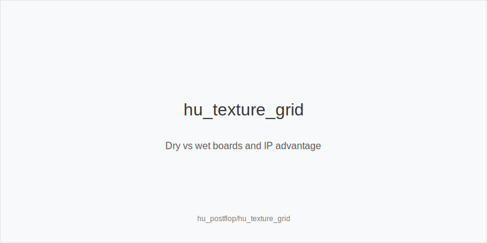
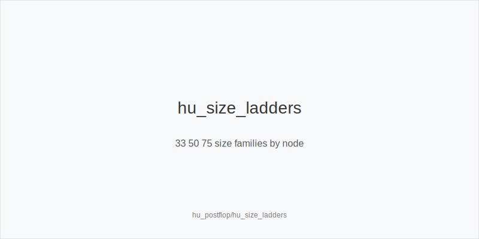
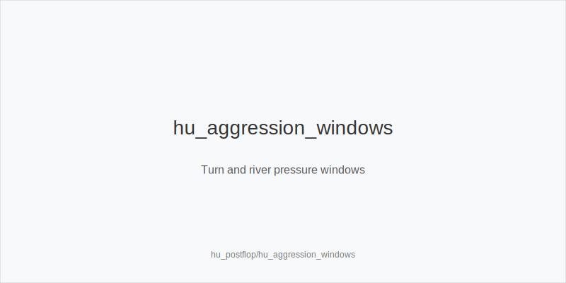

What it is
Heads-Up postflop is the plan after preflop action ends with one player IP (usually SB/Button) and one OOP (BB). Ranges are wide and uncapped, so texture, position, blockers, and stack depth drive sizing and aggression. You will mix small_cbet_33 on static boards, size_up_wet on volatile ones, protect_check_range when capped OOP, and add delay_turn or probe_turns when a new card shifts the range edge.

[[IMAGE: hu_texture_grid | Dry vs wet boards and IP advantage]]

[[IMAGE: hu_size_ladders | 33 50 75 size families by node]]

[[IMAGE: hu_aggression_windows | Turn and river pressure windows]]

Why it matters
In HU, every pot is blind-vs-blind and equities run closer, so small edges compound. Many rooms rake HU less or not at all, which makes thin stabs and disciplined pressure worth more. Pools often overfold to large turn pressure and under-bluff rivers; a consistent sizing and timing system converts those leaks into EV without torching stacks.

Rules of thumb
- IP on dry Axx or Kxx rainbow: small_cbet_33 with size_down_dry. Why: cheap denial versus high-card floats keeps dominated pairs and ace-highs in, while protecting your checking range for traps.
- IP on middling or low connected two-tone: default to half_pot_50, or check back; reserve big_bet_75 only with size_up_wet and real equity or nut advantage. Why: medium size adds fold equity where ranges are close, while large size needs equity to avoid getting raised off.
- OOP on middling textures: protect_check_range often; avoid thin stabs that face raises. Probe with probe_turns when the flop checks through and the turn favors you (paired middle, low overcard, straight completer you cover). Why: you reduce exposure when capped and attack when raise risk is lower.
- Turn play: use double_barrel_good when the turn is a range card for you (A on Kxx as PFR, front-door spade when you hold a spade). Otherwise delay_turn with medium strength to realize equity and keep rivers manageable. Why: your fold equity spikes on range turns but drops on bricks.
- River play: triple_barrel_scare only with credible blockers and a coherent story; otherwise check or take thin value small. Against big_bet_75, call when you block value and unblock bluffs, and fold more when capped and blocker poor. Why: population rivers are under-bluffed outside obvious scare cards.

Mini example
UTG, MP, CO not seated in HU. BTN/SB opens preflop, BB calls. Pot ~5bb, stacks 60bb. Board K72r. IP bets 1.7bb small_cbet_33, size_down_dry. BB calls with 7x and backdoors. Turn 5x. IP bets 4.2bb half_pot_50 as double_barrel_good to fold ace-highs and gutters while charging 7x. If called, many rivers check with medium Kx; triple_barrel_scare only when an A arrives and IP holds Ax or key blockers.

Common mistakes
- Auto-betting wet flops small. Why it is a mistake: you donate equity and get raised. Why players do it: habit of range-betting without texture filters.
- Firing turn bricks after a small flop stab. Why it is a mistake: fold equity is low and you bloat the pot. Why players do it: momentum bias after winning the flop.
- Calling polar rivers without blockers. Why it is a mistake: population overbluffs less than assumed. Why players do it: curiosity and fear of being bluffed.

Mini-glossary
small_cbet_33 and size_down_dry: low-cost denial on static boards that keeps dominated hands in.
size_up_wet and big_bet_75: larger sizing on dynamic textures only with equity or nut advantage.
protect_check_range: structured checks OOP to avoid exploitation and retain strong hands.
delay_turn, probe_turns, double_barrel_good, triple_barrel_scare: timed aggression tools on turn and river.

Contrast
6-max postflop has narrower ranges and more multiway risk; HU keeps ranges wide and uncapped, so small bets, disciplined protection, and well-timed turn pressure matter more than flashy river bluffs.

See also
- cash_3bet_oop_playbook (score 23) → ../../cash_3bet_oop_playbook/v1/theory.md
- cash_blind_defense_vs_btn_co (score 23) → ../../cash_blind_defense_vs_btn_co/v1/theory.md
- cash_turn_river_barreling (score 23) → ../../cash_turn_river_barreling/v1/theory.md
- donk_bets_and_leads (score 23) → ../../donk_bets_and_leads/v1/theory.md
- hand_review_and_annotation_standards (score 23) → ../../hand_review_and_annotation_standards/v1/theory.md