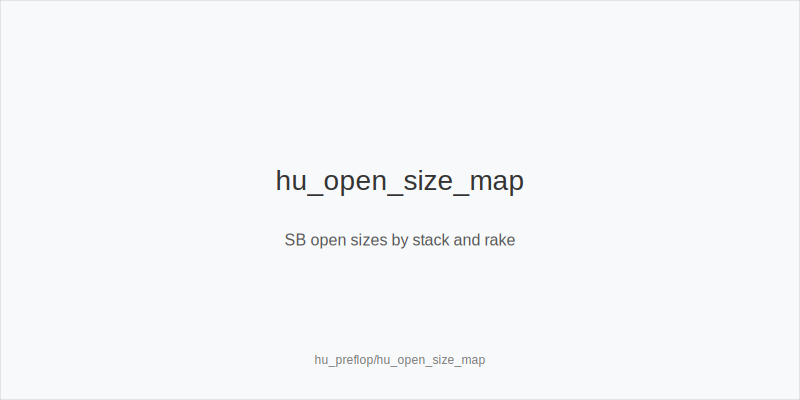
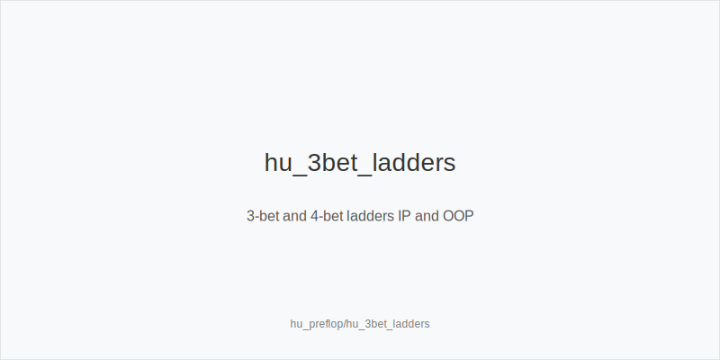
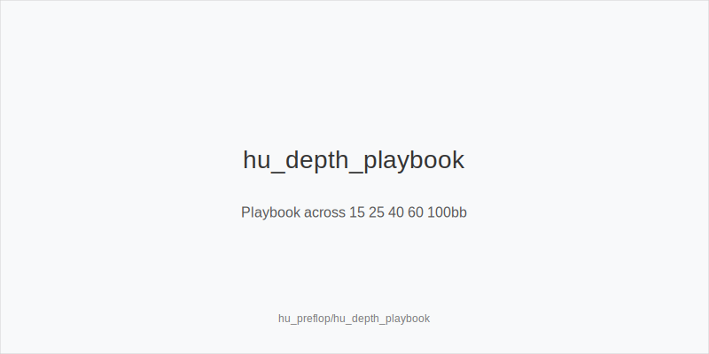

What it is
Heads-Up preflop is the opening, 3-betting, and 4-betting game between SB (Button, IP postflop) and BB (OOP). Every pot is blind-vs-blind. Ranges are wide, so position, blockers, and stack depth drive sizing and frequency. Your goal is to set clean trees that keep initiative when it matters and avoid giving BB cheap equity realization.

[[IMAGE: hu_open_size_map | SB open sizes by stack and rake]]

[[IMAGE: hu_3bet_ladders | 3-bet and 4-bet ladders IP and OOP]]

[[IMAGE: hu_depth_playbook | Playbook across 15 25 40 60 100bb]]

Why it matters
In HU, each hand is a fight for the blinds, so preflop precision prints EV across hundreds of spots per hour. Many rooms rake HU less or even zero, some add antes. Low rake and antes shift incentives toward smaller opens and more 3-bets. Populations often overfold to 3-bets and under-4-bet. A disciplined ladder aligned to stack depth turns these leaks into steady profit without bloating variance.

Rules of thumb
- SB opens: use 2.0bb at 60-100bb; 2.2-2.5bb at 25-40bb; mix limps at 15-25bb with weak hands and some traps. Smaller deep keeps your range wide and reduces loss when facing 3-bets. Slightly larger mid-stacks deny BB realization and improve steal EV.
- BB vs SB open: default 3bet_oop_12bb. At 60-100bb, build a mostly linear core with offsuit broadways and suited blockers. At 25-40bb, trim offsuit trash and keep suited wheel and Ax pressure. The size creates leverage and an SPR where the preflop aggressor performs well.
- IP 3-bets after SB limp or in ante formats with rare BB opens: use 3bet_ip_9bb and treat it as a raise or jam proxy when shallow. Consistent sizing simplifies decisions and maximizes fold equity while protecting your limp-raise range.
- 4-bets: 4bet_ip_21bb and 4bet_oop_24bb are baseline small 4-bets. Stay value-lean at 25-40bb. Add a few blocker 4-bet bluffs only deep when pools under-5-bet. Mid-stacks punish loose 4-bet bluffs; deep stacks reward selective blocker pressure.
- Exploits and environment: in low-rake or ante games, skew toward more min-raises and slightly higher 3-bet frequency. Versus overfolds to 3-bets, widen both 3bet_oop_12bb and 3bet_ip_9bb. Versus under-4-betting, add blocker 4bet_ip_21bb. Versus jam-happy regs, tighten 4-bet bluffs.

Mini example
There is no UTG/MP/CO in HU. SB 80bb opens 2.0bb; BB 3-bets to 12bb. SB holds A5s. Options: call to realize IP with pot ~24bb and stacks ~68bb behind, or 4bet_ip_21bb as a blocker bluff versus a tight 3-bettor. With AQ or TT+, SB 4bet_ip_21bb for value; with 76s, SB prefers call. If the room is ante-less and the pool overfolds, BB expands 3-bets slightly and gains folds versus min-raises.

Common mistakes
- Importing 6-max sizes. Opens too big deep waste EV, while opens too small at 25-40bb give BB cheap realization. The fix: adopt HU-specific sizes by depth.
- Over-limping deep as SB. You surrender initiative and let BB isolate with hands that play well OOP at high SPR. The fix: prefer raising deep and keep limps for shallow mixes and traps.
- Flatting OOP too much as BB. Realization is poor; 3bet_oop_12bb performs better vs wide SB ranges. The fix: 3-bet more of the offsuit broadway and suited blocker set, fold the trash, and call the playable suited connectors at deeper depth.

Mini-glossary
Min-raise: SB opens to 2.0bb, the smallest legal raise size.
3bet_oop_12bb and 3bet_ip_9bb: standard sizes that create leverage and act as jam proxies when shallow.
Blocker 4-bet: 4bet_ip_21bb or 4bet_oop_24bb chosen partly for A or K blockers to reduce 5-bet frequency.

Contrast
Compared to 6-max, HU preflop uses wider ranges, smaller opens deep, more 3-bets, and more blocker-driven 4-bets. Choices prioritize retaining initiative and clean geometry over narrow value-only ranges.

_This module uses the fixed families and sizes: size_down_dry, size_up_wet; small_cbet_33, half_pot_50, big_bet_75._

See also
- cash_short_handed (score 15) -> ../../cash_short_handed/v1/theory.md
- hand_review_and_annotation_standards (score 15) -> ../../hand_review_and_annotation_standards/v1/theory.md
- hu_exploit_adv (score 15) -> ../../hu_exploit_adv/v1/theory.md
- hu_preflop_strategy (score 15) -> ../../hu_preflop_strategy/v1/theory.md
- icm_mid_ladder_decisions (score 15) -> ../../icm_mid_ladder_decisions/v1/theory.md