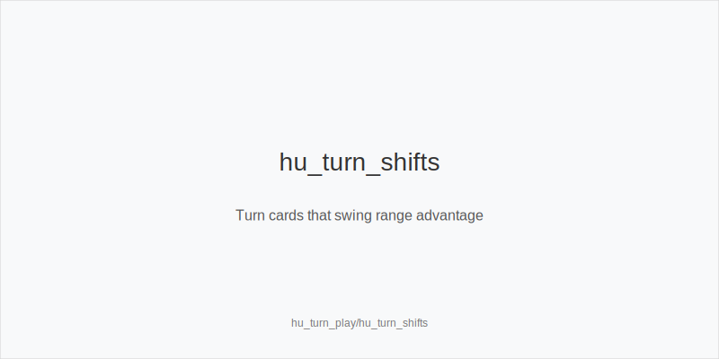
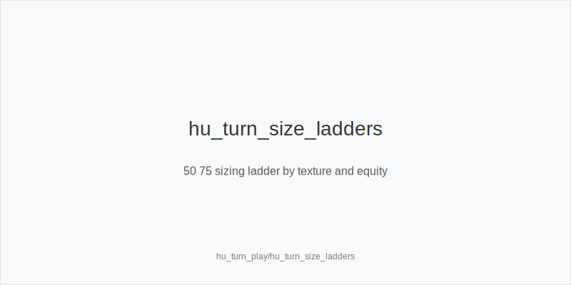
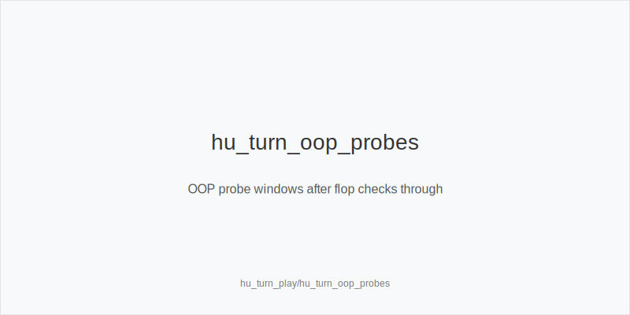

What it is
Heads-Up turn play is the plan after the flop action finishes and a new card shifts equities. You choose between double_barrel_good or delay_turn as IP, and between passive control or probe_turns as OOP after flop checks through. You size with half_pot_50 as a sturdy default, big_bet_75 when size_up_wet and leverage are justified, and size_down_dry on static runouts while keeping protect_check_range so your checks are not auto-punted.

[[IMAGE: hu_turn_shifts | Turn cards that swing range advantage]]

[[IMAGE: hu_turn_size_ladders | 50 75 sizing ladder by texture and equity]]

[[IMAGE: hu_turn_oop_probes | OOP probe windows after flop checks through]]

Why it matters
The turn is the biggest EV fork in HU pots. Ranges narrow, pots grow, and the next bet sets river geometry. Pools overfold scary turns and under-bluff rivers; a clear turn system converts small edges into steady profit and avoids lighting chips on fire with automatic barrels.

Rules of thumb

* IP on static turns A or K highs, paired lows: use half_pot_50 only when the card favors you or adds equity; otherwise delay_turn with medium pairs and ace-highs that do not need protection. Why: you maintain showdown value and avoid bloating pots on bricks.
* IP on dynamic turns new straight or flush cards: use big_bet_75 only with strong equity, prime blockers, or clear nut advantage; otherwise check to protect_check_range and realize. Why: large sizing needs leverage plus equity to withstand raises.
* OOP after flop checks through: probe_turns when the turn favors your coverage paired middle, wheel completers you have more of, or a suit that gives backdoor equity. Start with half_pot_50; use big_bet_75 only with equity plus fold equity. Why: you attack when raise risk is low and fold equity is high.
* Double barrel logic: double_barrel_good if the turn is a range card for the aggressor, you add equity overcard plus backdoor, or blockers reduce villain continues. Why: fold equity jumps on range turns and with blocker coverage.
* River planning: decide before betting turn. With thin value, plan small or check rivers; with polar bluffs and blockers, reserve triple_barrel_scare for clean scare rivers. Why: preplanned geometry prevents guessing-game rivers.

Mini example
UTG, MP, CO not seated in HU. BTN SB opens, BB calls. Pot ~5bb, stacks 60bb. Flop K72r, IP bets 1.7bb small_cbet_33; BB calls. Pot ~8.4bb. Turn 5x brings gutters to IP broadways and helps 65s, a range-improving card for IP. IP bets 4.2bb half_pot_50 as double_barrel_good to fold ace-highs and gutters while charging 7x. Versus a sticky call, many rivers check with medium Kx; triple_barrel_scare only when an Ace hits and IP holds Ax that blocks AK while unblocking missed draws. If the turn were a brick K72r-2x and hand is KJ with no backdoors, choose delay_turn to control pot and bluff-catch rivers.

Common mistakes

* Always betting turn after a flop stab. Why it is a mistake: on bricks you value-own or bloat the pot with low fold equity; Why players do it: momentum bias after winning the flop.
* Sizing big without equity on dynamic turns. Why it is a mistake: you get raised or called by draws and face bad rivers; Why players do it: copying solver polar lines without equity checks.
* Skipping OOP probes after flop checks. Why it is a mistake: you miss range flips on paired middles and wheel cards; Why players do it: fear of getting raised and underestimating fold equity.

Mini-glossary
double_barrel_good: a turn bet chosen because the turn helps your range or equity, not habit.
delay_turn: IP checks flop, then bets turn when the card improves range or reduces check-raise risk.
probe_turns: OOP bets turn after both check flop on cards favoring OOP coverage.
half_pot_50, big_bet_75, size_up_wet, size_down_dry, protect_check_range: turn size and line families to set clean river geometry.

Contrast
In 6-max, multiway risk often limits turn aggression; in HU, wide uncapped ranges make small stabs and well-timed probes print, while careless big barrels without equity get punished.

See also
- bankroll_and_variance_management (score 21) → ../../bankroll_and_variance_management/v1/theory.md
- cash_3bet_oop_playbook (score 21) → ../../cash_3bet_oop_playbook/v1/theory.md
- cash_blind_defense_vs_btn_co (score 21) → ../../cash_blind_defense_vs_btn_co/v1/theory.md
- cash_turn_river_barreling (score 21) → ../../cash_turn_river_barreling/v1/theory.md
- database_leakfinder_playbook (score 21) → ../../database_leakfinder_playbook/v1/theory.md