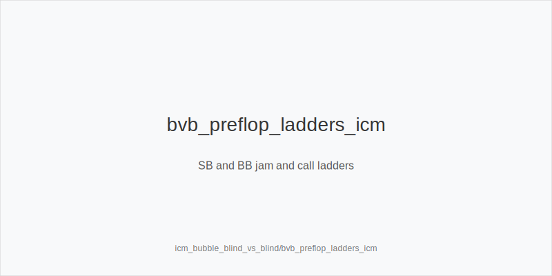

What it is
This module covers blind-vs-blind SB vs BB play on the money bubble in 9-max MTTs. Coverage - who can bust whom - and risk premium change incentives: the covered player must avoid stack-offs without strong equity, while the cover applies targeted pressure. Chip-EV takes a back seat to cash-EV.

[[IMAGE: icm_bubble_bvb_pressure_map | Coverage and risk by stacks SB vs BB]]

[[IMAGE: bvb_preflop_ladders_icm | SB and BB jam and call ladders]]

[[IMAGE: bvb_postflop_risk_control | Postflop pressure vs control windows]]

Why it matters
BvB is the most frequent confrontation near the bubble. Losing all-ins when covered is disproportionately costly, while winning small pots as the cover is disproportionately valuable. Clear preflop trees and disciplined postflop lines prevent torching equity and convert population tendencies into folds without risking your stack needlessly.

Rules of thumb
- Coverage first: when you cover, widen opens and 3-bets (BB prefers 3bet_oop_12bb over flats); when covered, tighten call-offs and avoid dominated OOP peels. Why: coverage flips risk premium and fold equity in your favor or against you.
- Stack bands: 8-15bb is jam-first (SB maps to 3bet_ip_9bb, BB to 3bet_oop_12bb); 16-25bb mix raise-fold with shove/reshove; 26-40bb add small opens and selective 3-bets with IP flats only when realization is high. Why: lower SPR and ICM penalties punish thin flats and loose defends.
- Value-lean 4-bets: keep 4bet_ip_21bb and 4bet_oop_24bb for strong value; bluff 4-bets are rare under ICM. Why: call-off thresholds rise when covered, so bluffs burn cash equity.
- Postflop defaults: small_cbet_33 on static Axx/Kxx when uncapped; half_pot_50 to set clean two-street commits with value+equity; big_bet_75 only with size_up_wet and nut advantage. OOP on middling textures, protect_check_range. Why: smaller, clear sizes manage exposure and still pressure capped ranges.
- Timing and exploits: delay_turn and probe_turns only when the turn meaningfully shifts ranges and risk is acceptable. As cover, choose double_barrel_good on range turns and reserve triple_barrel_scare for credible rivers with blockers. Tag overfold_exploit where covered mediums fold turns. Why: pools overfold to pressure they cannot profitably call.

Mini example
Hand 1: UTG, MP, CO, BTN fold. SB 32bb covers BB 21bb; SB opens 2.2bb, BB 3bet_oop_12bb to 10-12bb. SB folds KTo, continues AQ/TT+ and some Axs.
Hand 2: CO opens and BTN folds; SB 24bb (covered) completes, BB checks. Flop J95r - SB protect_check_range and BB checks back. Turn Qx improves IP; BB delay_turn half_pot_50.
Hand 3: Next orbit CO folds, BTN opens, SB folds, BB faces SB min-raise; as cover, BB prefers 3bet_oop_12bb over flat. On A72r, BB small_cbet_33; on a safe turn, half_pot_50 as a commit step.

Common mistakes
- Flatting OOP as the covered player and creating low-SPR guesswork. Why it is a mistake: poor realization and high risk premium. Why it happens: fear of folding preflop and missing a cheap flop.
- Calling reshoves too wide when covered. Why it is a mistake: chip-EV habits ignore ICM risk premium. Why it happens: anchoring to pre-bubble charts or feeling "priced in".
- Vanity big_bet_75 on wet boards without equity. Why it is a mistake: you polarize but cannot defend raises when covered. Why it happens: overestimating fold equity and nut share BvB.

Mini-glossary
Coverage: who can bust whom; being covered increases your risk premium.
Risk premium: extra equity required to continue because busting costs payout equity.
Jam proxy: mapping SB shoves to 3bet_ip_9bb and BB reshoves to 3bet_oop_12bb for clarity.

Contrast
Standard BvB without ICM pursues thin chip-EV edges; bubble BvB prioritizes coverage-first pressure, tighter call-offs, and small-cbet plus half-pot commit trees over thin polarization.

_This module uses the fixed families and sizes: size_down_dry, size_up_wet; small_cbet_33, half_pot_50, big_bet_75._

See also
- hand_review_and_annotation_standards (score 27) → ../../hand_review_and_annotation_standards/v1/theory.md
- icm_mid_ladder_decisions (score 27) → ../../icm_mid_ladder_decisions/v1/theory.md
- live_etiquette_and_procedures (score 27) → ../../live_etiquette_and_procedures/v1/theory.md
- live_full_ring_adjustments (score 27) → ../../live_full_ring_adjustments/v1/theory.md
- live_speech_timing_basics (score 27) → ../../live_speech_timing_basics/v1/theory.md