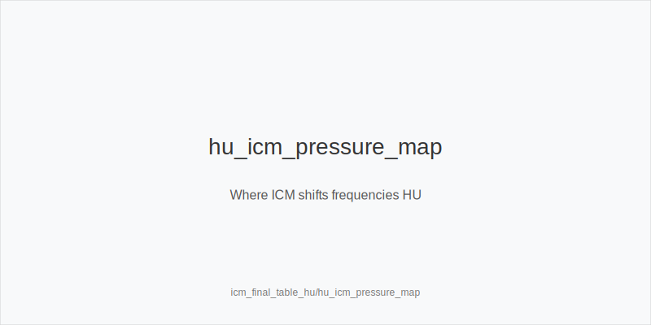
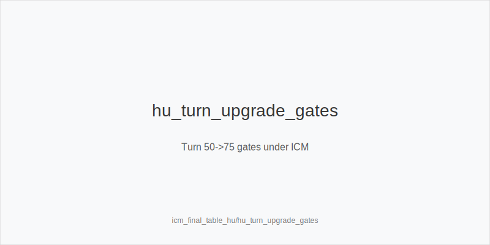
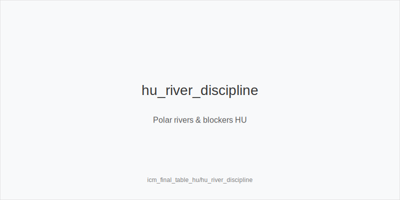

What it is
A heads-up final table (HU FT) playbook that standardizes preflop ladders and turn/river decisions with the exact fixed actions used everywhere else. Preflop: 3bet_ip_9bb, 3bet_oop_12bb, 4bet_ip_21bb, 4bet_oop_24bb. Postflop families: size_down_dry (static) and size_up_wet (dynamic) with sizes small_cbet_33, half_pot_50, big_bet_75. Every node resolves to one token only: protect_check_range, delay_turn, probe_turns, double_barrel_good, triple_barrel_scare, call, fold, or overfold_exploit. No new sizes or trees are introduced-ICM only shifts frequencies.

Why it matters
With only two payouts left, chips convert to finish equity nonlinearly. Errors in big, polar nodes are amplified; thin hero calls and ungated 75% barrels leak more than usual. SB (dealer) has position and opens frequently; BB realizes worse and faces raise risk. Keeping physics-first family selection (dry->33%, wet->50% default) and enforcing blocker/evidence gates makes your HU FT execution stable and repeatable under pressure.

Rules of thumb
- Family by texture. Static -> size_down_dry with small_cbet_33 at a high but controlled frequency. Dynamic -> size_up_wet with half_pot_50 default. Why: physics first reduces raise exposure and decision noise.
- Gates for 75% and calls. Upgrade to big_bet_75 (or call large rivers) only with strong blockers and logged Fv75↑. Why: larger bets need removal of continues plus population evidence.
- OOP protection. On stabby textures, mix protect_check_range and choose delay_turn at mid SPR versus raise‑prone villains. Why: avoid getting blown off equity under ICM pressure.
- Sequence rule. If flop checks through, the turn stab is probe_turns-never probe after bet/call. Why: initiative is earned by the check‑check.
- Commitment gate. If a turn 75% creates a trivial river shove, require equity+blockers beforehand; otherwise stay half_pot_50 or delay_turn. Why: prevent forced rivers with weak protection.
- Preflop ladder stays fixed. Use 3bet_oop_12bb vs frequent steals; widen only with blockers after persistence -> overfold_exploit. Use 4bet_ip_21bb / 4bet_oop_24bb for clear value in low 5‑bet pools. Why: clean SPR without inventing sizes.
- Stack bands guide frequencies (not sizes). 10-20bb: more shove/fold dynamics exist in practice, but here we keep ladders and bias to delay_turn and river discipline. 20-40bb: default patterns apply; upgrade 50->75 only with blockers+Fv75. 40bb+: protect check-backs and plan turn->river lines earlier.
- IP plan on dynamic turns. With top blockers and Fv75↑, double_barrel_good using big_bet_75; without evidence, remain half_pot_50. Why: earn leverage only when folds are there.
- OOP vs polar rivers. Facing big_bet_75 without blockers -> fold by default. With premium blockers and missed draws behind villain, consider call; as PFA with scare+blockers, triple_barrel_scare per plan. Why: population under‑bluffs polar nodes.
- Protect your check‑backs IP. On some static boards, include protect_check_range to prevent OOP auto‑stabs and to keep turn defense robust. Why: range integrity across streets.
- Delay vs raise‑prone BB lines. When BB raises turns often at mid SPR, prefer delay_turn with medium strength hands and capture value later when ranges cap. Why: sidestep raise trees.
- Overfold exploit gate. Only widen preflop pressure with 3bet_ip_9bb / 3bet_oop_12bb after medium+ repetition of fast folds. Why: evidence before exploit.
- Heads‑up is never multiway. If callers pile in due to format quirks, revert to merged lines (half_pot_50) and avoid thin polar bluffs. Why: realization falls fast.
- Plan turn->river. If turn 75% would leave <1 SPR on many rivers, ensure blockers/equity justify the commitment; otherwise stay at 50% or delay. Why: keep river decisions clean.

Mini example
- BB OOP, dry: SB opens; BB 3bet_oop_12bb. Flop A83r -> size_down_dry + small_cbet_33; turn 2♣ vs raise‑prone IP -> delay_turn; river facing polar big_bet_75 without blockers -> fold.
- SB IP, wet: BB calls pre. Flop T98ss -> size_up_wet + half_pot_50; turn Q♠ with A♠ blocker and logged Fv75↑ -> big_bet_75 as double_barrel_good; river K scare per plan -> triple_barrel_scare.

Common mistakes
- Ungated big_bet_75. Upgrading without blockers or Fv75 evidence overbluffs into sticky ranges; ICM magnifies losses.
- Probing without chk‑chk. Probes into uncapped ranges get raised; initiative must be earned.
- Calling polar 75% rivers without blockers. Under‑bluffed nodes punish curiosity; fold by default.
- "Exploit" tags on one orbit. Overfold_exploit requires repetition; otherwise keep baseline frequencies.

Mini-glossary
Fv50/Fv75: Fold rates vs 50%/75% used to justify upgrades and thin calls. 
protect_check_range: Checks that can continue; deny auto‑stabs and keep range uncapped. 
delay_turn: Intentional pass at mid SPR vs raise‑prone lines to preserve equity. 
Commitment gate: If 75% on turn forces many river jams, demand equity/blockers or remain at 50%/delay.

Contrast
Same tokens and 33/50/75 sizes as cash_3bet_ip/oop. HU FT ICM shifts only frequencies: more delay_turn OOP, stricter blocker gates for big_bet_75, tighter river folds without blockers, and evidence‑gated preflop exploits-never new sizes.

[[IMAGE: hu_icm_pressure_map | Where ICM shifts frequencies HU]]

[[IMAGE: hu_turn_upgrade_gates | Turn 50->75 gates under ICM]]

[[IMAGE: hu_river_discipline | Polar rivers & blockers HU]]

See also
- live_session_log_and_review (score 33) -> ../../live_session_log_and_review/v1/theory.md
- online_economics_rakeback_promos (score 33) -> ../../online_economics_rakeback_promos/v1/theory.md
- online_hudless_strategy_and_note_coding (score 33) -> ../../online_hudless_strategy_and_note_coding/v1/theory.md
- online_tells_and_dynamics (score 33) -> ../../online_tells_and_dynamics/v1/theory.md
- spr_advanced (score 33) -> ../../spr_advanced/v1/theory.md