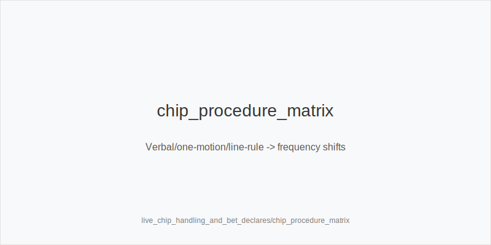
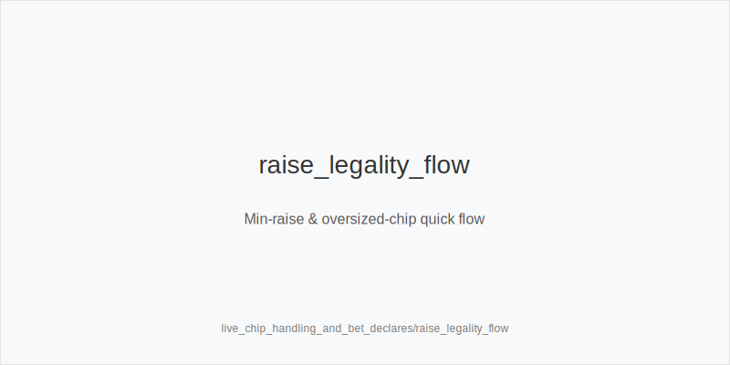
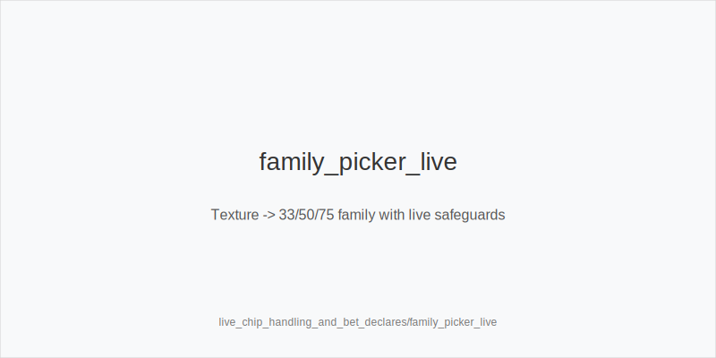

What it is
Live chip handling and bet declarations translated into reliable execution and tokenized frequency shifts. Procedures keep us inside the fixed ladders and size families: preflop 3bet_ip_9bb, 3bet_oop_12bb, 4bet_ip_21bb, 4bet_oop_24bb; postflop small_cbet_33, half_pot_50, big_bet_75; concepts size_up_wet, size_down_dry, protect_check_range, delay_turn, probe_turns, double_barrel_good, triple_barrel_scare, call, fold, overfold_exploit. Physics first: size_down_dry on static boards (A83r/K72r); size_up_wet on dynamic boards (JT9ss/986ss). Chip-handling cues only shift frequencies.

Why it matters
Clean declarations prevent illegal or mis-sized bets that create off-tree chaos and tilt. Staying within 33/50/75 keeps cognition free for texture-driven plans and river discipline, lowering variance and error rate while keeping the same trees.

Rules of thumb

* Verbal first, one motion. Announce the amount, then push chips once. Why: avoids string_bet issues and locks 33/50/75 choices.
* Oversized chip rule. One big chip without clear "raise" is a call; say "raise" first. Why: prevents unintended off-tree sizing; when in doubt, favor protect_check_range or delay_turn over spur-of-the-moment raises.
* Cut stacks, count, then bet. Pre-choose small_cbet_33 / half_pot_50 / big_bet_75; never splash-the-pot. Why: precise family adherence.
* Line rule and forward motion. Know if chips crossing the line are binding. In strict single_motion_raise_legal rooms, bluff-raise less and add protect_check_range / delay_turn. Why: reduce accidental raise traps.
* Incomplete raise / minimum raise. Understand thresholds so your intent matches a legal raise; otherwise default to the closest family size. Why: no invented sizes.
* out_of_turn happens. Freeze, let action back up, re-evaluate texture, keep the family, do not escalate sizing. Why: preserve plan integrity.
* Side pot setup. When all-ins create side pots, confirm amounts verbally. Postflop, stick to the chosen family. Why: clarity enables half_pot_50 merged value or small_cbet_33 denial as intended.
* Pot size requests. Ask at the right time; decide the family first to avoid anchoring into off-tree sizes. Why: keeps 33/50/75 discipline.
* Show-order. Use bettor_shows_first / first_active_left_of_btn_shows to bank info; later, probe_turns when ranges cap after chk-chk. Why: converts procedure into token edges.
* River discipline. Tank->big is often under-bluffed live; fold without blockers. As the aggressor on scare rivers with blockers, use triple_barrel_scare. Why: population tendency.
* Multiway etiquette. In limp-heavy pots, favor half_pot_50 merged value and size_down_dry thin value; cut pure bluffs. Why: multiway realization.
* Verbal_binding protects intent. Say "half" or "seventy-five" clearly; then execute the family. Why: eliminates mis-sizes and rulings.

Live overlay integration

* Strict enforcement (string_bet, line_rule): increase protect_check_range and delay_turn in raise-prone nodes; families unchanged.
* Loose enforcement: expect more stabs; protect_check_range more, default half_pot_50 over thin polar lines.
* table_speed low or fatigue high: simplify to small_cbet_33 / half_pot_50, add delay_turn; reduce triple_barrel_scare.
* avg_stack_bb low: lower SPR favors half_pot_50; upgrade to big_bet_75 only with blockers + fold trend.

Mini example
You face a strict single_motion_raise_legal room. Flop K72r OOP, raise-prone IP: you verbalize "thirty-three" and place chips cleanly -> small_cbet_33 (size_down_dry). Turn brings 5x and IP has shown raise eagerness; you choose delay_turn.
Another hand: villain tosses one oversized chip without saying "raise." You confirm it is a call, keep plan on dynamic T98ss, then with blockers on the 7x turn choose double_barrel_good using half_pot_50; river tank->big from tight reg without blockers -> fold.

Common mistakes
Splashing chips and getting ruled into unintended sizes; forgetting oversized-chip = call; mislabeling probe vs probe_turns; arguing line_rule instead of asking the floor; hero-calling polar rivers; skipping protect_check_range in loose rooms; changing sizes mid-hand after an out_of_turn reset.

Mini-glossary
String bet: multiple chip pushes without clear declaration.
Single-motion raise: one continuous forward motion; required in many rooms.
Line rule: chips crossing the line may be binding.
Verbal binding: words define the bet if clear.
Oversized chip: one big chip counts as call unless "raise" is declared.
Incomplete raise: insufficient increase; may be forced to minimum raise or ruled a call.
Side pot: pot created when one or more players are all-in.
Splash the pot: messy chip throw; discouraged/illegal; avoid.

Contrast
Live_etiquette_and_procedures covers broader room conduct; live_tells_and_dynamics covers reads. This module is mechanics and declarations that stabilize frequencies inside the fixed 33/50/75 families and 9/12/21/24 ladders.

[[IMAGE: chip_procedure_matrix | Verbal/one-motion/line-rule -> frequency shifts]]

[[IMAGE: raise_legality_flow | Min-raise & oversized-chip quick flow]]

[[IMAGE: family_picker_live | Texture -> 33/50/75 family with live safeguards]]

See also
- cash_short_handed (score 31) -> ../../cash_short_handed/v1/theory.md
- donk_bets_and_leads (score 31) -> ../../donk_bets_and_leads/v1/theory.md
- hand_review_and_annotation_standards (score 31) -> ../../hand_review_and_annotation_standards/v1/theory.md
- icm_final_table_hu (score 31) -> ../../icm_final_table_hu/v1/theory.md
- icm_mid_ladder_decisions (score 31) -> ../../icm_mid_ladder_decisions/v1/theory.md