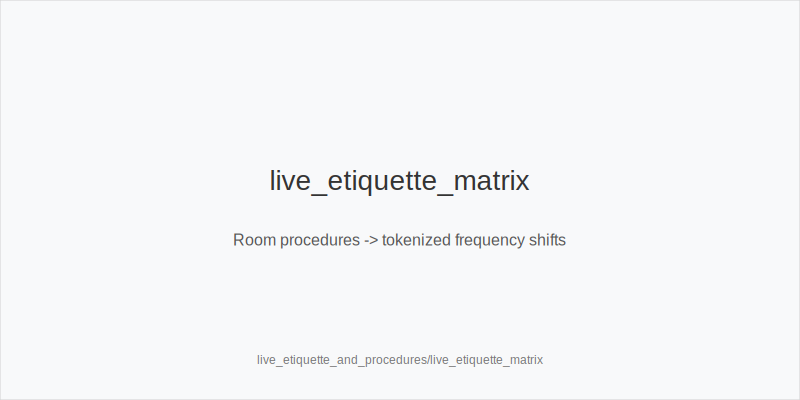
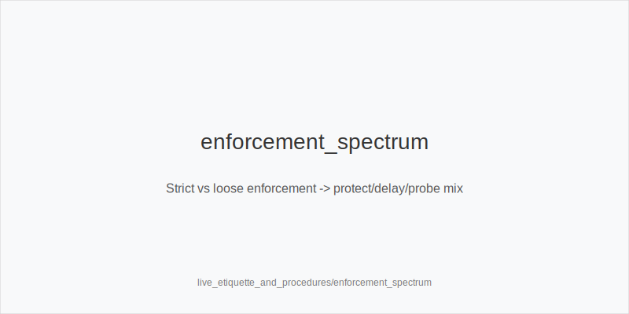
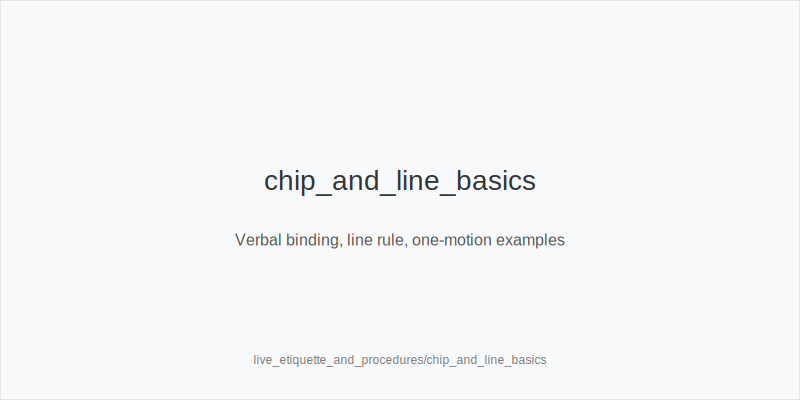

What it is
This module turns live-room etiquette and procedures into stable frequency shifts using the fixed token set. You keep the same preflop ladders (3bet_ip_9bb, 3bet_oop_12bb, 4bet_ip_21bb, 4bet_oop_24bb) and postflop families (small_cbet_33, half_pot_50, big_bet_75). Texture still rules the family - size_down_dry on static boards like A83r/K72r, size_up_wet on dynamic boards like JT9ss/986ss. Etiquette and procedures only adjust how often you bet, protect_check_range, delay_turn, probe_turns, double_barrel_good, triple_barrel_scare, call, fold, or tag overfold_exploit.

Why it matters
Live pitfalls - string_bet, unclear verbal declarations, out-of-turn action, line_rule confusion, show-order disputes, and sloppy chip handling - create mis-sized or illegal bets and tilt. Clear procedures reduce angle-risk and mental load so you execute the same tokens reliably. No off-tree bets; error control beats thin edges.

Rules of thumb

* Loose enforcement: expect stabby raises. Increase protect_check_range; reduce thin bluffs; default half_pot_50. Why: control variance when lines get noisy.
* Multi-limpers: realization falls. Prefer half_pot_50 for merged value; thin value with size_down_dry; fewer pure bluffs. Why: multiway EV is lower.
* has_straddle / bomb_ante: dead money improves price. Slightly widen 3bet_ip_9bb / 3bet_oop_12bb; tag overfold_exploit only after repetition. Why: risk-reward improves but evidence still matters.
* Table_speed down or fatigue up: simplify. Bias to small_cbet_33, half_pot_50, delay_turn, protect_check_range; cut triple_barrel_scare unless blockers are strong. Why: APM and accuracy.
* Tank -> big on river from tight players: under-bluffed polar. Fold more to big_bet_75 without blockers. Why: population tendency.
* Snap small on static: merged/range bet. Defend now and plan probe_turns after chk-chk nodes. Why: autopilot behavior.
* Avg_stack_bb low: lower SPR. Prefer half_pot_50 over big_bet_75 unless blockers plus fold trend. Why: cleaner commitment.
* Show-order clarity: use bettor_shows_first / first_active_left_of_btn_shows to capture info and plan future probe_turns or folds. Why: information fuels tokens.
* Line_rule and verbal_binding: when ambiguous, declare clearly and confirm. Keep sizes in-family. Why: protect EV and avoid floor calls.
* Out-of-turn freezes: when action backs up, reset calmly and stick to family pick by texture. Why: prevent reactive off-tree bets.

Live overlay integration

* has_straddle, bomb_ante: widen selective steals and 3-bets; sizes unchanged; consider overfold_exploit only after persistent fast folds.
* rake_type(time|drop): economics affect table selection, not sizes; in slower rooms simplify to small_cbet_33 / half_pot_50.
* avg_stack_bb: shorter averages shift to more half_pot_50; longer averages allow more delay_turn and probe_turns.
* table_speed: slower pace -> simplify and protect_check_range; faster pace -> standard lines, fewer thin river bluff-catches.

[[IMAGE: live_etiquette_matrix | Room procedures -> tokenized frequency shifts]]

[[IMAGE: enforcement_spectrum | Strict vs loose enforcement -> protect/delay/probe mix]]

[[IMAGE: chip_and_line_basics | Verbal binding, line rule, one-motion examples]]

Mini example
BvB, has_straddle. Room enforces single_motion_raise_legal strictly. SB opens 2.0bb, BB calls. Flop K72r (static). You choose size_down_dry and small_cbet_33. Turn brings 6x and raise-prone IP; you select delay_turn with medium strength. River tank -> big from tight reg, you hold no key blockers: fold to big_bet_75. Later, a pot checks through on flop; next orbit you exploit the same opponent with probe_turns on a favorable turn.

Common mistakes
Off-tree chip splashes probe_turns to illegal sizes. Mislabeling probe_turns vs turn probe_turns. Hero-calling tank -> big rivers without blockers. Arguing with the dealer instead of using verbal_binding and calling the floor. Skipping protect_check_range in stabby rooms. Treating bomb_ante as license to over-bluff.

Mini-glossary
string bet: multiple chip motions that can invalidate a raise; avoid with one motion.
single-motion raise: one clean push that makes raises legal and clear.
line rule: chips past a line are binding; clarify before acting.
verbal binding: declared action stands; use it to lock 33/50/75 sizes.
out-of-turn: premature action; action backs up; reset calmly.
bettor shows first: the aggressor reveals first at showdown.
first_active_left_of_btn_shows: when river checks through, first live player left of button shows first.
forward motion: decisive chip push often read as strength; treat as medium-reliability cue.

Contrast
live_tells_and_dynamics focuses on reads; this module focuses on procedures and etiquette that stabilize execution. Same ladders and size families; only frequency shifts through the tokens.

See also
- live_full_ring_adjustments (score 33) -> ../../live_full_ring_adjustments/v1/theory.md
- live_speech_timing_basics (score 33) -> ../../live_speech_timing_basics/v1/theory.md
- online_hud_and_db_review (score 33) -> ../../online_hud_and_db_review/v1/theory.md
- online_table_selection_and_multitabling (score 33) -> ../../online_table_selection_and_multitabling/v1/theory.md
- cash_short_handed (score 31) -> ../../cash_short_handed/v1/theory.md