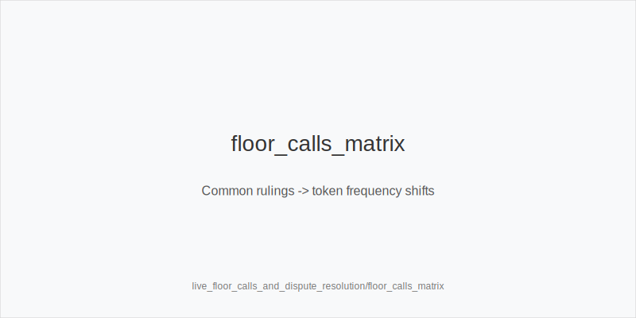
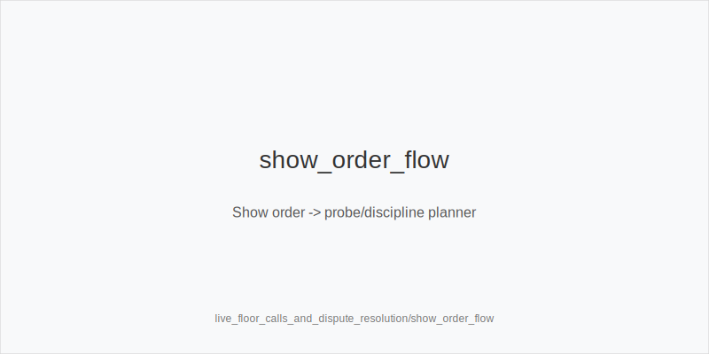
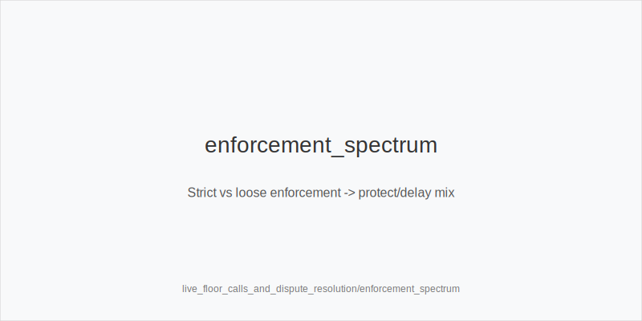

What it is
Procedural playbook for live floor calls and dispute resolution. We convert common rulings and enforcement styles into frequency shifts using the fixed tokens only: 3bet_ip_9bb, 3bet_oop_12bb, 4bet_ip_21bb, 4bet_oop_24bb, small_cbet_33, half_pot_50, big_bet_75, size_up_wet, size_down_dry, protect_check_range, delay_turn, probe_turns, double_barrel_good, triple_barrel_scare, call, fold, overfold_exploit. Postflop sizes remain 33/50/75. Physics first: size_down_dry on static (A83r/K72r); size_up_wet on dynamic (JT9ss/986ss). Floor outcomes shift frequencies only.

Why it matters
Clear rulings reduce angle-risk, avoid mis-sized bets, and preserve mental bandwidth. Staying inside 33/50/75 and 9/12/21/24 while adjusting frequencies prevents costly tilt lines and keeps EV centered on texture and population tendencies.

Rules of thumb
- String_bet & single_motion_raise_legal enforced strictly -> use protect_check_range earlier and delay_turn at mid SPR. Why: fewer multi-raise trees; realize equity safely. 
- Loose line_rule rooms (ambiguous forward motion) -> protect_check_range more; trim thin turn bluffs. Why: raise-prone environments punish marginal barrels. 
- announce_required / verbal_binding -> say amounts first; keep 33/50/75 intact; favor small_cbet_33 on static, half_pot_50 merged on many-way nodes. Why: prevents accidental off-tree sizes. 
- Out_of_turn action ruled dead / reset -> re-center on texture; keep family (size_down_dry vs size_up_wet); prefer delay_turn over impulsive stabs. Why: avoid reactionary errors. 
- bettor_shows_first / first_active_left_of_btn_shows clarity -> capture showdown info; after flop chk-chk, plan probe_turns. Why: reliable surrender reads convert to probes. 
- Incomplete raise / minimum raise ruling -> do not "fix" with new sizes; maintain family and sequence; default to half_pot_50 on turns when merged. Why: legality != strategy change. 
- River dispute nodes (speech/timing ambiguous) -> live pools under-bluff polar; versus big_bet_75 without blockers prefer fold. Why: protect against thin hero calls. 
- Multi_limpers and enforcement laxity -> more protect_check_range, half_pot_50 for merged value; thin value via size_down_dry; avoid pure bluff probe_turns. Why: multiway plus disputes reduce bluff EV. 
- Rake_type(time) floors keep the game moving -> standardize small_cbet_33 / half_pot_50; fewer triple_barrel_scare. Why: volume > thin mix edges. 
- Rake_type(drop) with strict enforcement -> fewer thin OOP calls; prefer 3bet_oop_12bb for value; on static flops small_cbet_33. Why: drop taxes small, dragged pots. 
- has_straddle / bomb_ante rulings (position clarified) -> selectively widen 3bet_ip_9bb / 3bet_oop_12bb with blockers; postflop merged. Why: dead money improves steals; sizes unchanged. 
- Documentation mindset: when disputes repeat, adopt overfold_exploit only after persistence; never on one ruling. Why: evidence-gated exploits.

Live overlay integration
Use flags to nudge frequencies, not sizes: has_straddle, bomb_ante, multi_limpers, rake_type(time|drop), avg_stack_bb, table_speed. Validate legality lenses: string_bet, single_motion_raise_legal, line_rule, announce_required, bettor_shows_first, first_active_left_of_btn_shows. Keep texture-first family; adjust tokens for protection, delay, probes, discipline.

[[IMAGE: floor_calls_matrix | Common rulings -> token frequency shifts]]

[[IMAGE: show_order_flow | Show order -> probe/discipline planner]]

[[IMAGE: enforcement_spectrum | Strict vs loose enforcement -> protect/delay mix]]

Mini example
- Strict single_motion_raise_legal; SRP IP on K72r (static). Family: size_down_dry. With raise-prone villains, choose small_cbet_33, then delay_turn when raise frequencies spike; river big_bet_75 from tight reg without blockers -> fold. 
- Out_of_turn action reset in a straddled pot; dynamic turn appears after flop checks through. Family stays size_up_wet; because sequence was check-chk, take probe_turns; if enforcement is loose next orbit, add protect_check_range earlier.

Common mistakes
Overreacting to rulings with off-tree sizes; confusing probe_turns (chk-chk) with turn probe_turns; hero-calling big_bet_75 without blockers in disputed rivers; ignoring announce_required and creating illegal sizes; failing to protect_check_range in loose-enforcement rooms; tagging overfold_exploit on a single incident.

Mini-glossary
String bet: multiple forward motions that invalidate a raise in strict rooms. 
Single-motion raise: one continuous push for a legal raise. 
Line rule: chips past a line are committed; enforcement varies. 
Verbal binding: clear declarations stand over chips. 
Out-of-turn: acting before your turn; actions may be binding or reset. 
Incomplete raise: raise amount less than minimum allowed; corrected to legal minimum. 
Announce required: room asks for verbal amounts before motion. 
Show order: bettor_shows_first or first_active_left_of_btn_shows determines reveal sequence.

Contrast
live_etiquette_and_procedures covers broader conduct; live_chip_handling_and_bet_declares covers mechanics. This module focuses on floor rulings and disputes and how they modulate frequencies inside the same tokens and 33/50/75 families.

See also
- cash_short_handed (score 29) -> ../../cash_short_handed/v1/theory.md
- hand_review_and_annotation_standards (score 29) -> ../../hand_review_and_annotation_standards/v1/theory.md
- icm_final_table_hu (score 29) -> ../../icm_final_table_hu/v1/theory.md
- live_session_log_and_review (score 29) -> ../../live_session_log_and_review/v1/theory.md