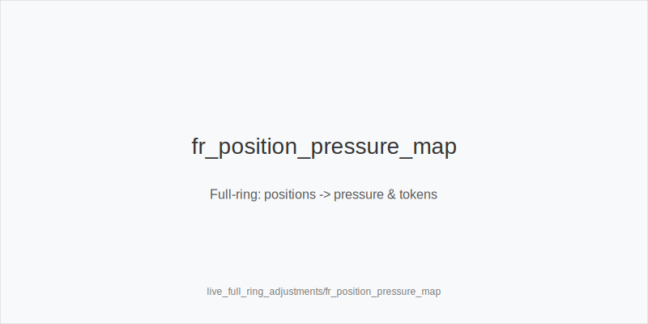
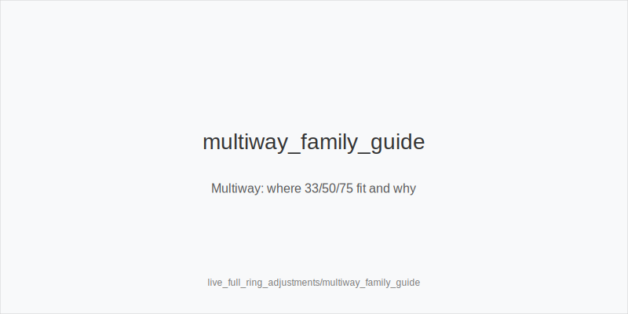

What it is
Full-ring means 9-10 players, tighter EP ranges, more multiway pots, fewer 4-bets, and disciplined rivers. This module converts those dynamics into frequency shifts using the fixed tokens only: 3bet_ip_9bb, 3bet_oop_12bb, 4bet_ip_21bb, 4bet_oop_24bb, small_cbet_33, half_pot_50, big_bet_75, size_up_wet, size_down_dry, protect_check_range, delay_turn, probe_turns, double_barrel_good, triple_barrel_scare, call, fold, overfold_exploit. We never change sizes or trees. Physics first: static boards -> size_down_dry; dynamic boards -> size_up_wet. Reads then shift frequencies inside the same families.

Why it matters
More players reduce realization and increase multiway caps. EV/hour improves when you pick the right family and emphasize merged value, protection, and river discipline. Advanced lines still map to the same tokens; you simply deploy them at different frequencies.

Rules of thumb

* EP/MP tight and low 4-bet: value-weight IP responses. Use 4bet_ip_21bb or 4bet_oop_24bb with premiums. Why: fewer 5-bets, clearer value capture.
* LP steals vs blinds: pressure with blockers. Use 3bet_ip_9bb and 3bet_oop_12bb; tag overfold_exploit only after persistent folds. Why: late positions widen first.
* Multiway pots: favor merged value. Choose half_pot_50; thin value on static via size_down_dry and small_cbet_33; increase protect_check_range. Why: bluff EV drops multiway.
* Lower SPR from 3/4-bets: simplify plans. On static flops small_cbet_33; on dynamic flops half_pot_50; upgrade to big_bet_75 only with strong blockers and fold spikes. Why: cleaner commitment.
* SRP checks through often: take back initiative. Use probe_turns. Why: surrender rates rise in full ring.
* Polar rivers under-bluffed: respect size. Fold vs big_bet_75 without blockers; as PFA, choose triple_barrel_scare only with scare card + blockers. Why: population.
* Raise-prone turns at mid-SPR: slow down OOP. Choose delay_turn and earlier protect_check_range. Why: avoid getting blown off equity.
* BvB and limped pots: keep it merged. Prefer half_pot_50; thin value via size_down_dry; reduce polar bluffs. Why: ranges are wide but realization is low multiway.
* Table speed / load: standardize execution. Bias to small_cbet_33, half_pot_50, delay_turn, protect_check_range. Why: accuracy over thin edges.
* Economics/rake/ante: let them shift frequencies (e.g., tighter flats OOP in rakey games); sizes stay 33/50/75. Why: consistency.

Full-ring specifics
EP vs 3-bet: Default to value defense; IP 3-bets narrower. With premiums, prefer 4bet_ip_21bb.
CO/BTN vs blinds: Widen selectively with blockers using 3bet_ip_9bb / 3bet_oop_12bb; adopt overfold_exploit only after repeated fast folds.
Multiway postflop: On static boards, size_down_dry with small_cbet_33 or thin half_pot_50; on dynamic boards, size_up_wet with half_pot_50, upgrade to big_bet_75 only with blockers and clear fold-vs-size evidence; keep protect_check_range.
Blind-vs-Blind: More capped nodes -> probe_turns after chk-chk; stay within families, no new bets.
River discipline: Under-bluffed polar nodes -> fold vs big_bet_75 without blockers; attack only with triple_barrel_scare when blockers + scare.

[[IMAGE: fr_position_pressure_map | Full-ring: positions -> pressure & tokens]]

[[IMAGE: multiway_family_guide | Multiway: where 33/50/75 fit and why]]

[[IMAGE: river_underbluff_lane | Polar rivers: discipline & blockers]]

Mini example
EP raises, you 4bet_ip_21bb with QQ (full ring, low 4-bet field). Heads-up flop K72r (static): size_down_dry -> small_cbet_33. Turn 6x brings raise risk OOP: delay_turn. River big bet from tight reg, no blockers: fold to big_bet_75.
CO steals; blinds overfold shown across orbits. BTN uses 3bet_ip_9bb with A5s (overfold_exploit). Single-raised pot checks through on T83r; on 6x turn vs surrendering field: probe_turns.

Common mistakes
Off-tree sizing in multiway pots; over-bluffing dynamic turns without blockers; hero-calling polar rivers; skipping protect_check_range OOP; confusing probe_turns (after chk-chk) with turn probe_turns (after calling a c-bet).

Mini-glossary
Multiway: 3+ players, bluff EV down, merged value up.
Merged vs polar: mid-strength value vs nuts/air; choose half_pot_50 for merged, big_bet_75 for polar with blockers.
SPR band: stack-to-pot ratio shaping commitment.
Capped range: lacks top combos; probe_turns targets caps.
Population under-bluff: big_bet_75 rivers often value-heavy in full ring.

See also
- live_etiquette_and_procedures (score 33) -> ../../live_etiquette_and_procedures/v1/theory.md
- online_hud_and_db_review (score 33) -> ../../online_hud_and_db_review/v1/theory.md
- online_table_selection_and_multitabling (score 33) -> ../../online_table_selection_and_multitabling/v1/theory.md
- cash_short_handed (score 31) -> ../../cash_short_handed/v1/theory.md
- exploit_advanced (score 31) -> ../../exploit_advanced/v1/theory.md

Contrast