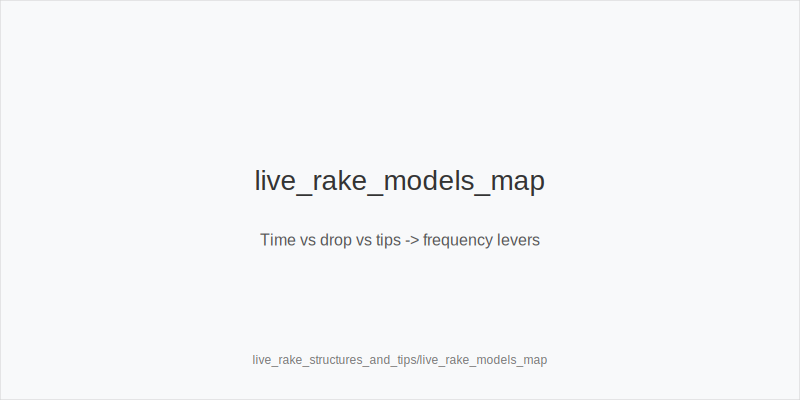
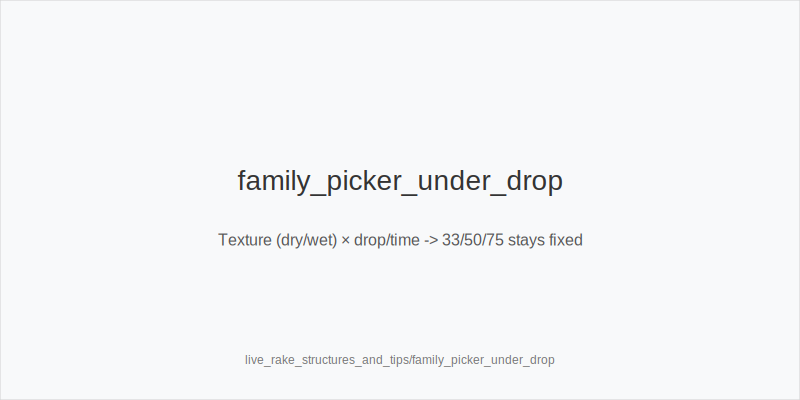
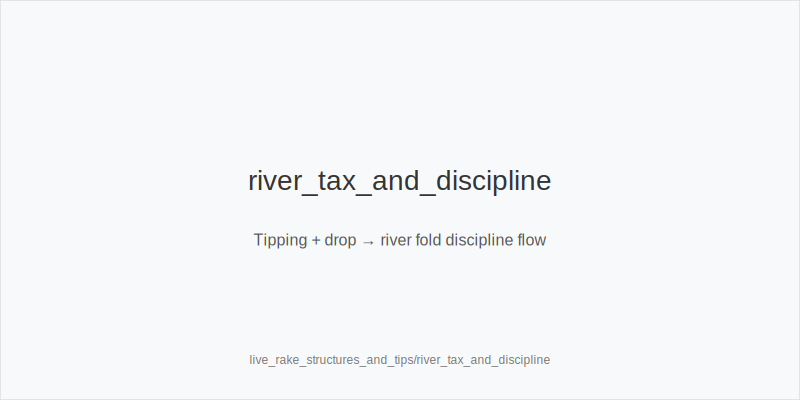

What it is
A practical guide to convert live rake models (time charge vs drop), tipping habits, and game cadence into frequency shifts using the fixed tokens only: 3bet_ip_9bb, 3bet_oop_12bb, 4bet_ip_21bb, 4bet_oop_24bb, small_cbet_33, half_pot_50, big_bet_75, size_up_wet, size_down_dry, protect_check_range, delay_turn, probe_turns, double_barrel_good, triple_barrel_scare, call, fold, overfold_exploit. Postflop sizes remain 33/50/75. Physics first: size_down_dry on static boards (A83r/K72r); size_up_wet on dynamic boards (JT9ss/986ss). Economics and tips only change frequencies, never sizes or trees.

Why it matters
Drop/time plus tips change the EV of small pots and thin edges. Drop punishes many small, dragged pots; time charge rewards volume and clean decisions. Tips tax each win, pushing thresholds for value and bluff-catch. We keep the size family by texture, then adjust how often we bluff, defend, or press preflop and turn/river.

Rules of thumb
- Drop, high cap: avoid thin OOP flats; lean value-heavy 3bet_oop_12bb; on static boards standardize small_cbet_33; trim thin call lines. Why: drop taxes marginal realizations. 
- Time charge (hourly): favor volume-friendly lines-small_cbet_33, half_pot_50, delay_turn, protect_check_range; avoid spewy rivers. Why: more hands/hour beats small mix edges. 
- Heavy tips: raise value thresholds; cut marginal bluffs; prefer half_pot_50 merged value; fold more vs big_bet_75 without blockers. Why: each pot won is taxed. 
- Low tips + fast game: widen blocker 3-bets (evidence-gated overfold_exploit); premiums upgrade to 4bet_ip_21bb / 4bet_oop_24bb in low 5-bet rooms. Why: lower friction boosts aggressive preflop EV. 
- Jackpot/high-hand drop: do not chase; keep 33/50/75 and normal families. Why: promos affect bankroll, not optimal sizing. 
- Straddle/bomb_ante with drop: dead money improves steals but drop taxes small pots; selectively 3bet_ip_9bb / 3bet_oop_12bb with blockers; postflop use half_pot_50 for merged value. Why: better price pre, but keep pots meaningful. 
- Multi-limpers in drop rooms: bluff EV falls; add protect_check_range; use half_pot_50 for merged value; thin value via size_down_dry. Why: multiway realization and drop tax. 
- Mid-SPR raise-prone turns: choose delay_turn with medium strength; protect_check_range on prior street. Why: avoid getting blown off equity where rake/tips reduce comeback EV. 
- chk-chk SRPs: populations surrender often; add probe_turns. Why: low-cost capture of forfeit equity. 
- Under-bluffed polar rivers: default fold vs big_bet_75 without blockers; as PFA, reserve triple_barrel_scare for scare cards with strong blockers. Why: live pools lack enough bluffs and tips/drop punish thin heroing. 
- Seat/table selection tie-in: prefer soft/fast tables in time games; avoid slow/nitty drop games; tokens unchanged. Why: EV/hour driver is cadence and opponent quality. 
- Exploit gates: tag overfold_exploit only after persistent evidence (repetition), not off one orbit. Why: avoid false positives in noisy live data.

Live overlay integration
- rake_type(time): bias to small_cbet_33, half_pot_50, delay_turn; prioritize probe_turns to capture surrenders; reduce thin river calls. 
- rake_type(drop): fewer thin OOP calls; more 3bet_oop_12bb for value; default small_cbet_33 on static to keep control. 
- has_straddle / bomb_ante: widen selective 3bet_ip_9bb / 3bet_oop_12bb with blockers; merged postflop (half_pot_50). 
- avg_stack_bb low: lower SPR-prefer half_pot_50 over big_bet_75 unless blockers + fold-to-75 evidence. 
- table_speed high: standardize decisions-small_cbet_33, half_pot_50, protect_check_range; fewer triple_barrel_scare.

[[IMAGE: live_rake_models_map | Time vs drop vs tips -> frequency levers]]

[[IMAGE: family_picker_under_drop | Texture (dry/wet) x drop/time -> 33/50/75 stays fixed]]

[[IMAGE: river_tax_and_discipline | Tipping + drop → river fold discipline flow]]

Mini example
- Drop room, heavy tips. CO opens, BB defends. Flop K72r (static): size_down_dry → small_cbet_33. Turn 2x, villain sticky: choose half_pot_50 merged value with top pair; river polar big_bet_75 from tight reg and you lack blockers → fold. 
- Time game with single straddle. SB 2.0bb open into straddle; BB observes repeated fast folds → selectively 3bet_oop_12bb with A5s (evidence-gated). SRP later checks through on Q72r; next orbit you add probe_turns on safe turns.

Common mistakes
Chasing promos with off-tree sizes; over-calling thin rivers despite tipping tax; confusing probe_turns (after chk-chk) with probe_turns; refusing to fold to big_bet_75 without blockers; tagging overfold_exploit after one hand; ignoring multiway drop effects and firing thin bluffs.

Mini-glossary
Drop: per-pot rake taken from the pot, usually stepped/capped. 
Time charge: fixed-per-time rake independent of pot size. 
Cap/step: structure of maximum rake and increments in drop. 
Promo drop: extra taken for jackpots/high hands. 
Tipping tax: expected tip per win, reducing value thresholds. 
Reverse SPR: lower SPR created by larger preflop aggression (via 3/4-bets). 
Under-bluffed river: live tendency to lack bluffs on large river bets. 
Merged vs polar: medium-strength value vs nutted/air distributions. 
Table speed: hands/hour affecting EV/hour and line selection. 
Dead money: extra chips from straddles/antes improving steal EV.

Contrast
online_economics_rakeback_promos targets site incentives; rake_and_ante_economics covers general economics. This module is live-room rake/time/tips specific. Sizes stay 33/50/75 and ladders 9/12/21/24; only frequencies move.

See also
- exploit_advanced (score 29) → ../../exploit_advanced/v1/theory.md
- hand_review_and_annotation_standards (score 29) → ../../hand_review_and_annotation_standards/v1/theory.md
- icm_final_table_hu (score 29) → ../../icm_final_table_hu/v1/theory.md
- live_etiquette_and_procedures (score 29) → ../../live_etiquette_and_procedures/v1/theory.md
- live_full_ring_adjustments (score 29) → ../../live_full_ring_adjustments/v1/theory.md