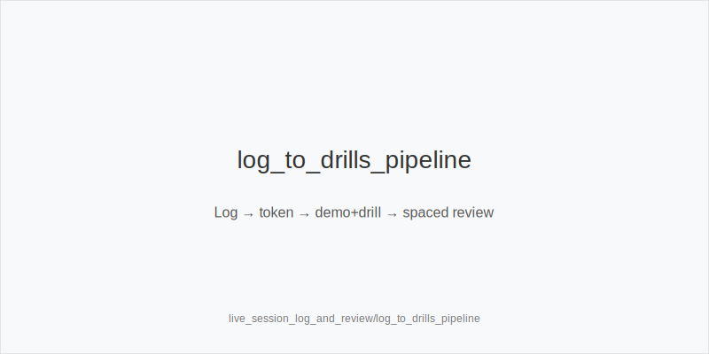

What it is
A practical system for live session logging and post-session review that converts cues into one tokenized action per decision. We keep sizes and ladders fixed: preflop 3bet_ip_9bb, 3bet_oop_12bb, 4bet_ip_21bb, 4bet_oop_24bb; postflop small_cbet_33, half_pot_50, big_bet_75; concepts size_up_wet, size_down_dry, protect_check_range, delay_turn, probe_turns, double_barrel_good, triple_barrel_scare, call, fold, overfold_exploit. Physics first: static boards (A83r/K72r) -> size_down_dry; dynamic boards (JT9ss/986ss) -> size_up_wet. Reads from the log shift frequencies only.

Why it matters
Live sessions are noisy and slow; memory is unreliable. A minimal log lets you act now (one token) and review later without results bias. The post-session loop standardizes improvement: triage -> compact baseline check (no new sizes) -> optional single-knob validation (e.g., Fv75) -> convert to a demo + drill -> schedule spaced review. EV/hour rises when your decisions stay inside 33/50/75 and exploit only with persistent evidence.

Rules of thumb
- Use a lightweight log schema per hand: Price, Texture, Family 33/50/75, Pos (IP/OOP), Init (PFA/Caller), Blockers, Raise risk, Sequence (chk-chk?), Pressure gate (Fv50/Fv75), SPR band, Token. End each street with exactly one token. 
- Sequence rule: if flop checked through, the turn stab is probe_turns (not a probe_turns). Log "chk-chk" explicitly. 
- Texture before read: write "dry/wet" first, then the family (size_down_dry or size_up_wet), then the size (33/50/75). 
- Evidence gates: tag overfold_exploit only at repetition tier medium+ (3-5+) and aligned with context (e.g., blinds fast-fold to 12bb). 
- River discipline tile: live pools under-bluff polar big bets; without blockers vs big_bet_75, prefer fold. Log whether you held key blockers. 
- Turn pressure tile: default half_pot_50; upgrade to big_bet_75 + double_barrel_good only with blockers and a logged Fv75 spike. 
- Protection tile: in stabby rooms or multiway, increase protect_check_range and delay_turn at mid SPR. Log "raise risk: high". 
- Probe KPI: count missed probe_turns after chk-chk; add one spaced drill per miss. 
- Family errors: if you used big_bet_75 on a static board, log "family error" and build a drill for size_down_dry + small_cbet_33. 
- Preflop pressure: log fast folds / low 4-bets; widen 3bet_ip_9bb/3bet_oop_12bb with blockers; upgrade premiums to 4bet_ip_21bb / 4bet_oop_24bb. 
- Economics flags: record rake_type(time|drop), has_straddle, bomb_ante, multi_limpers, avg_stack_bb, table_speed; these nudge frequencies (merged value/discipline), never sizes. 
- Post-session loop: triage top 3 price/family errors -> quick baseline check -> optional single-variable lock sweep -> adopt only persistent EV gains -> mint one demo + one drill per hand -> schedule spacing (fresh->1d->3d->7d).

[[IMAGE: live_log_schema_tiles | Minimal live session log schema]]

[[IMAGE: kpi_dashboard_tiles | KPI tiles and thresholds]]

[[IMAGE: log_to_drills_pipeline | Log -> token -> demo+drill -> spaced review]]

Mini example
- In-session: SRP IP on K72r (static). Log: Texture=dry, Family=33, Sequence=PFA, Raise risk=med, Token=small_cbet_33 (size_down_dry). Turn raise-prone at mid SPR -> Token=delay_turn. 
- Post-session: 3BP on JT9ss, turn Qd; you logged Blockers=A♦K♦, Pressure gate Fv75↑. Family=size_up_wet; Token=double_barrel_good using big_bet_75. Create a drill; schedule 1d.

Common mistakes
- Writing paragraphs. Fix: one-line annotation grammar ending in a single token. 
- Results-oriented notes. Fix: log cues/texture, not outcomes; use repetition tiers. 
- Mixing families or inventing sizes. Fix: choose size_down_dry or size_up_wet, then 33/50/75 only. 
- Mislabeling probes/probe_turns. Fix: probe_turns only after chk-chk. 
- River heroing without blockers. Fix: default fold vs big_bet_75; log blocker status. 
- Premature overfold_exploit. Fix: require medium+ repetition and context fit.

Mini-glossary
Annotation grammar: compact street line ending in one token. 
Family: dry vs wet selector (size_down_dry / size_up_wet). 
Sequence tag: records chk-chk or bet/call patterns for probe/discipline. 
Pressure gate: Fv50/Fv75 read logged for turn sizing. 
Spacing tier: fresh->1d->3d->7d review cadence. 
KPI tile: dashboard counter (e.g., missed probe_turns). 
Evidence gate: repetition tier threshold before exploits. 
Token set: the only allowed actions; no off-tree sizes.

Contrast
This module standardizes live logging and the daily review loop. review_workflow_and_study_routines sets weekly cadence; hand_review_and_annotation_standards defines per-hand grammar; live_* modules supply overlay flags/validators. Here we record cues fast and translate each decision into exactly one token inside 33/50/75.

See also
- icm_final_table_hu (score 33) -> ../../icm_final_table_hu/v1/theory.md
- online_economics_rakeback_promos (score 33) -> ../../online_economics_rakeback_promos/v1/theory.md
- online_hudless_strategy_and_note_coding (score 33) -> ../../online_hudless_strategy_and_note_coding/v1/theory.md
- online_tells_and_dynamics (score 33) -> ../../online_tells_and_dynamics/v1/theory.md
- spr_advanced (score 33) -> ../../spr_advanced/v1/theory.md