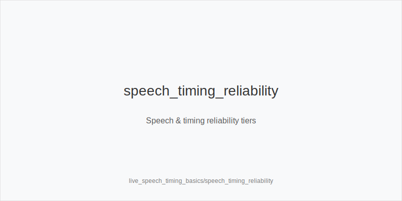
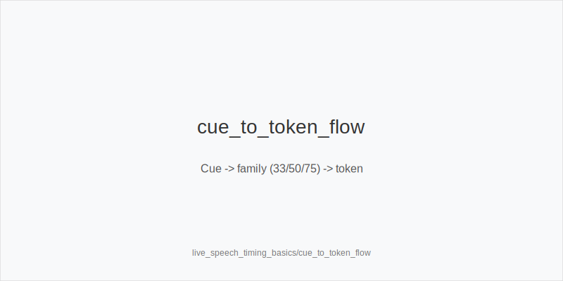
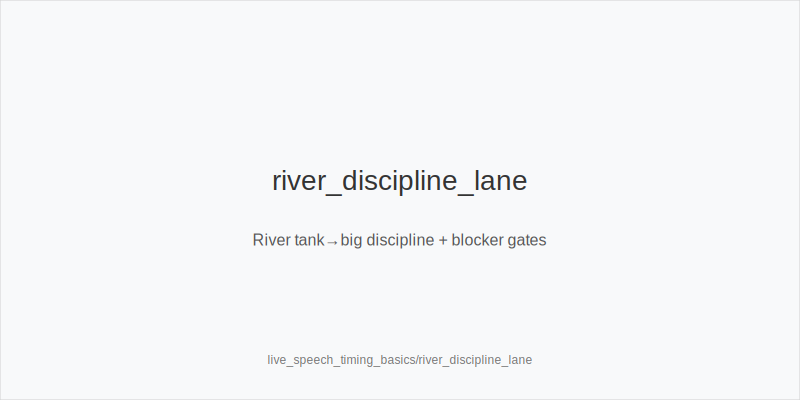

What it is
Live speech and timing cues converted into consistent frequency shifts using a fixed action set. We never change trees or sizes. Preflop ladders: 3bet_ip_9bb, 3bet_oop_12bb, 4bet_ip_21bb, 4bet_oop_24bb. Postflop families: small_cbet_33, half_pot_50, big_bet_75. Concepts and showdown actions: size_up_wet, size_down_dry, protect_check_range, delay_turn, probe_turns, double_barrel_good, triple_barrel_scare, call, fold, overfold_exploit. Physics first: size_down_dry on static boards (A83r/K72r); size_up_wet on dynamic boards (JT9ss/986ss). Cues only shift frequencies inside those families.

Why it matters
Speech and timing compress weak information into actionable tendencies. Used correctly, they nudge how often you take a tokenized line (not which sizes exist). This protects execution under pressure and aligns with population priors (e.g., under-bluffed polar rivers).

Rules of thumb
- Snap small on static flops (range-bet vibe). Treat as merged. Defend now (call) and plan probe_turns after a chk-chk sequence. 
- Tank → small. Often merged/medium. Call more, raise bluffs less; stick to size_down_dry on static when you bet (small_cbet_33). 
- Tank → big. Usually polar and under-bluffed live. Without strong blockers, fold vs big_bet_75. 
- Shaky verbal ("I will just...call"). Weak/merged. Value-target with half_pot_50; avoid thin raises. 
- Confident forward motion on a dynamic turn + your blockers. Apply double_barrel_good; upgrade to big_bet_75 only with persistent fold-to-75 evidence; otherwise half_pot_50. 
- Silence/hollywooding then big. Weight to value; fold more without blockers; as PFA, avoid calling down light. 
- Reverse-tell chatter ("careful, I am weak"). Low reliability. Require repetition before shifting frequencies; overfold_exploit only after persistent evidence. 
- Raise-prone turns at mid SPR. Prefer delay_turn with medium strength; earlier streets add protect_check_range. 
- After snap 33 on static, later street checks through. That is probe_turns (not a probe_turns). 
- Preflop repeated fast folds to your 12bb 3-bets. With blockers, widen 3bet_oop_12bb (or 3bet_ip_9bb) and tag overfold_exploit only after multiple occurrences. 
- Speech or timing confusion → slow down. Keep family by texture; do not invent sizes; when uncertain, default to half_pot_50 merged value or small_cbet_33.

[[IMAGE: speech_timing_reliability | Speech & timing reliability tiers]]

[[IMAGE: cue_to_token_flow | Cue -> family (33/50/75) -> token]]

[[IMAGE: river_discipline_lane | River tank→big discipline + blocker gates]]

Mini example
1) HU SRP K72r (static). IP snaps 33%. You defend (call). Next orbit same villain checks back flop; you tag sequence and fire probe_turns on a good turn. 
2) 3-bet pot JT9ss (dynamic), turn Qx. Villain speaks confidently and you hold key blockers. You choose double_barrel_good with half_pot_50; only upgrade to big_bet_75 if prior data shows higher Fv75. 
3) River A94r-6s-Kd, villain tanks then bets big_bet_75. Without blockers you fold; with top blockers in PFA shoes, you may consider triple_barrel_scare (different hand class).

Common mistakes
Over-trusting single hands; mislabeling probe_turns vs probe_turns; inventing off-tree sizes due to adrenaline; calling polar river bets without blockers; ignoring raise-prone opponents on turns; tagging overfold_exploit from one sample.

Mini-glossary
Snap: near-instant action suggesting autopilot or preplanned range. 
Tank→small: long pause then small bet; commonly merged. 
Tank→big: long pause then large bet; commonly polar. 
Blockers: cards that reduce value combos or unblock bluffs. 
Probe_turns: bet turn after flop chk-chk. 
Merged vs polar: medium-strength value vs nutted/air split. 
Repetition tiers: weak(1-2), medium(3-5), strong(6+) events before exploits. 
Under-bluffed river: population tendency to lack enough bluffs on large river bets.

Contrast
Online_tells_and_dynamics uses digital cadence; live_tells_and_dynamics adds physical handling. Here we focus specifically on speech/timing and map every cue to the same fixed tokens and 33/50/75 families.

See also
- live_etiquette_and_procedures (score 33) → ../../live_etiquette_and_procedures/v1/theory.md
- live_full_ring_adjustments (score 33) → ../../live_full_ring_adjustments/v1/theory.md
- online_hud_and_db_review (score 33) → ../../online_hud_and_db_review/v1/theory.md
- online_table_selection_and_multitabling (score 33) → ../../online_table_selection_and_multitabling/v1/theory.md
- cash_short_handed (score 31) → ../../cash_short_handed/v1/theory.md