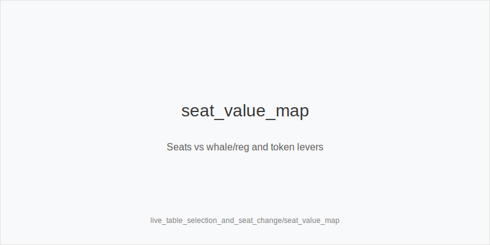
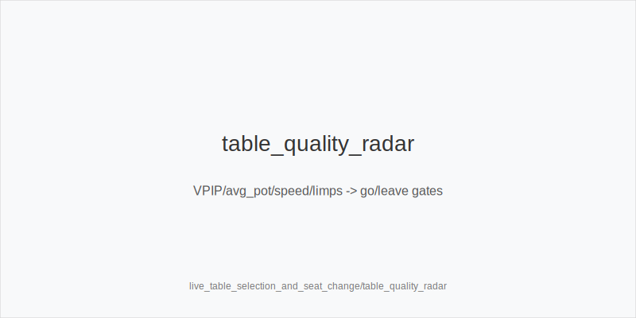
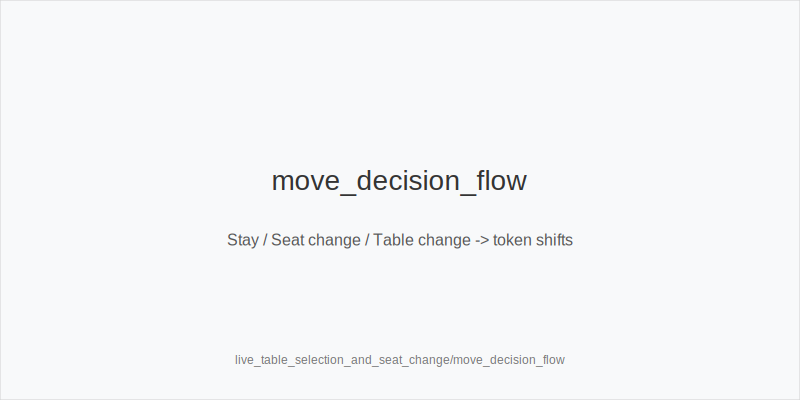

What it is
Live table selection and seat moves translated into frequency shifts using a fixed action set. We never change ladders or sizes: preflop 3bet_ip_9bb, 3bet_oop_12bb, 4bet_ip_21bb, 4bet_oop_24bb; postflop small_cbet_33, half_pot_50, big_bet_75; concepts size_up_wet, size_down_dry, protect_check_range, delay_turn, probe_turns, double_barrel_good, triple_barrel_scare, call, fold, overfold_exploit. Physics first: size_down_dry on static (A83r/K72r); size_up_wet on dynamic (JT9ss/986ss). Selection and seating only change how often we choose each token.

Why it matters
Seat and table quality drive EV/hour more than micro mix tweaks. Getting IP on whales, avoiding tough left seats, and leaving reg wars lets you use the same trees with better frequencies: more blocker 3-bets, more merged value, more protect_check_range, and disciplined rivers.

Rules of thumb

* Whale on your right (you IP more): widen 3bet_ip_9bb with blockers. Why: IP realizes better vs wide calls.
* Whale on your left (you OOP more): add protect_check_range. Why: reduce stab exposure.
* Soft table (high VPIP/avg pot, table_speed slow): favor half_pot_50 merged value. Why: stations call merged bets.
* Tough table (tight VPIP, small avg pot): fold more vs big_bet_75 without blockers. Why: polar nodes under-bluffed.
* Limp-heavy (multi_limpers): choose size_down_dry for thin value and half_pot_50 for merged spots. Why: multiway realization drops.
* Fast folds to 12bb persist: tag overfold_exploit and widen 3bet_oop_12bb with blockers. Why: price + fold equity proven.
* EP tight and low 4-bet room: upgrade premiums to 4bet_ip_21bb. Why: value prints when 5-bets are rare.
* Reg on your left (raise-prone turns): use delay_turn with medium strength. Why: avoid getting blown off equity.
* SRP checks through often: plan probe_turns on good turns. Why: pools surrender after chk-chk.
* Static flops in soft pools: small_cbet_33 (size_down_dry). Why: cheap denial vs wide ranges.
* Dynamic turns with blockers vs caller cap: double_barrel_good; upgrade to big_bet_75 only with evidence. Why: leverage + blocker coverage.
* Load/fatigue rising while waiting for a seat: simplify with small_cbet_33 and half_pot_50. Why: accuracy > thin edges.

Seat heuristics

* Prefer whales on your right (you IP): more 3bet_ip_9bb and half_pot_50 merged value.
* Prefer sticky regs on your right (you IP) rather than left; if stuck OOP to a reg, shift toward protect_check_range and delay_turn.
* If two tough regs on your left, request seat change or table change; until then, fold rivers more vs big_bet_75 without blockers.

Overlay integration

* has_straddle/bomb_ante: dead money -> selectively widen 3bet_ip_9bb / 3bet_oop_12bb; keep families fixed.
* table_speed low: more small_cbet_33, half_pot_50, delay_turn, protect_check_range.
* avg_stack_bb low: lower SPR -> prefer half_pot_50 over big_bet_75 unless strong blockers; river fold discipline.
* rake_type(time|drop): use for table quality filter; tokens unchanged, frequencies follow softness.

Mini example
a) You move to the whale-left seat (you IP). BTN vs whale in BB: preflop widen 3bet_ip_9bb with A5s; flop K72r -> size_down_dry + small_cbet_33; turn 2x vs calls -> half_pot_50 merged value; river faces big_bet_75 from passive whale without blockers -> fold.
b) You leave a tough table (regs on left) and sit soft BvB. SB opens 2.0bb, BB widens 3bet_oop_12bb with blockers (evidence-gated overfold_exploit). Flop A83r -> small_cbet_33; turn checks through next orbit -> probe_turns.

Common mistakes
Taking a worse seat to chase a straddle; inventing off-tree sizes; ignoring texture when the table is soft; hero-calling polar rivers without blockers; refusing seat changes when capped OOP; failing to protect_check_range versus stabby regs; tagging overfold_exploit on one orbit.

Mini-glossary
Whale: very loose caller; target with 3bet_ip_9bb and half_pot_50 value.
Table speed: hands/hour; lower speed favors simpler tokens.
Seat change button: request to move seats; aim for IP on whales.
On the right/left: position relative to a target; right = you IP more.
Limp frequency: how often players limp; pushes toward merged value and protection.
Avg pot / VPIP: softness indicators guiding frequency shifts.
Overfold exploit: evidence-gated widening of pressure using the same ladders.

Contrast
Live_tells_and_dynamics focuses on reads; live_etiquette_and_procedures on process. This module optimizes where you sit and which table you choose so the same tokens earn more, with families fixed at 33/50/75.

[[IMAGE: seat_value_map | Seats vs whale/reg and token levers]]

[[IMAGE: table_quality_radar | VPIP/avg_pot/speed/limps -> go/leave gates]]

[[IMAGE: move_decision_flow | Stay / Seat change / Table change -> token shifts]]

See also
- icm_final_table_hu (score 31) -> ../../icm_final_table_hu/v1/theory.md
- live_session_log_and_review (score 31) -> ../../live_session_log_and_review/v1/theory.md
- online_economics_rakeback_promos (score 31) -> ../../online_economics_rakeback_promos/v1/theory.md
- online_hudless_strategy_and_note_coding (score 31) -> ../../online_hudless_strategy_and_note_coding/v1/theory.md
- online_tells_and_dynamics (score 31) -> ../../online_tells_and_dynamics/v1/theory.md