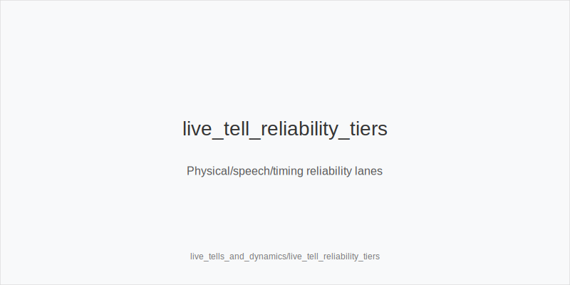
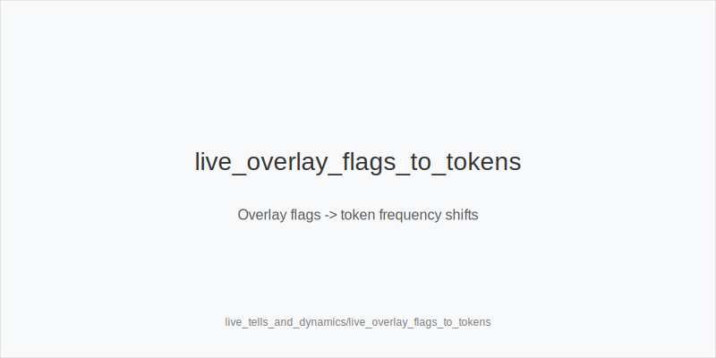
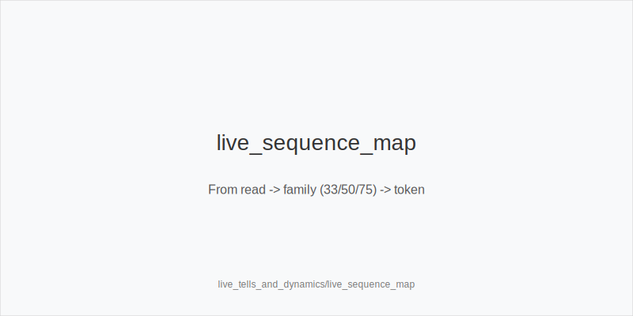

# What it is
Live tells and table dynamics mapped to **frequency shifts** using a fixed token set only: **3bet_ip_9bb, 3bet_oop_12bb, 4bet_ip_21bb, 4bet_oop_24bb, small_cbet_33, half_pot_50, big_bet_75, size_up_wet, size_down_dry, protect_check_range, delay_turn, probe_turns, double_barrel_good, triple_barrel_scare, call, fold, overfold_exploit**. 
You read timing, speech, and handling cues, plus overlay flags like **has_straddle, bomb_ante, multi_limpers, rake_type(time|drop), avg_stack_bb, table_speed**. 
Apply validators such as **string_bet, single_motion_raise_legal, bettor_shows_first, first_active_left_of_btn_shows** to avoid process traps. 
**Never** change ladders or size families; texture selects **size_down_dry** (static) or **size_up_wet** (dynamic). Every decision resolves to **one token**.

# Why it matters
Live pools run slower, with more limps/straddles and uneven enforcement. Ranges skew face-up in limped pots and **river polar bets are under‑bluffed**. A lightweight, repeatable read system stabilizes execution. You keep **33/50/75** families and **9/12/21/24** ladders and only shift **frequencies** via tokens.

# Rules of thumb
- **Reliability tiers:** physical cues > speech/timing > clichés. Use repetition lanes **weak (1-2)**, **medium (3-5)**, **strong (6+)** before exploits. *Why:* reduces false positives.
- **Preflop tight folds to 3-bets + low 4-bets:** widen **3bet_oop_12bb / 3bet_ip_9bb** with blockers; upgrade premiums to **4bet_ip_21bb / 4bet_oop_24bb**. *Why:* live rooms under‑4‑bet.
- **Straddle or bomb_ante on:** more dead money; attempt more steals and selective 3-bets, but **sizes unchanged**. *Why:* better price, same ladders.
- **Multi‑limpers:** favor merged value with **half_pot_50** and thin value using **size_down_dry** on static; fewer pure bluffs; add **protect_check_range**. *Why:* multiway realization drops.
- **Snap small on static from IP:** treat as merged; defend correctly now, plan **probe_turns** after check‑check. *Why:* autopilot range‑bet.
- **Tank -> small:** merged more than bluff; **call** more, raise bluffs less. *Why:* hesitation rarely precedes tiny bluff sizing.
- **Tank -> big:** often under‑bluffed; **fold** more vs **big_bet_75** without blockers. *Why:* polar but value‑heavy live node.
- **Confident forward motion on dynamic turns + good blockers:** green‑light **double_barrel_good**; default **half_pot_50**, upgrade to **big_bet_75** only with evidence (**size_up_wet**). *Why:* leverage plus blockers.
- **Showdown reveals:** after seeing a missed bluff class, tighten river calls next orbit unless you hold **key blockers**. *Why:* adapt to revealed leak.
- **Procedural pressure:** when **single_motion_raise_legal** is strict, random raises drop; when loose, increase **protect_check_range** and **delay_turn**. *Why:* avoid getting blown off equity.
- **River discipline:** populations under‑bluff **big_bet_75**; **fold** more without blockers; consider **triple_barrel_scare** only with scare + blockers. *Why:* exploit under‑bluff.

# Live overlay integration
- **has_straddle / bomb_ante:** widen steal attempts and selective 3-bets; tag **overfold_exploit** only after repetition.
- **rake_type(time) vs drop:** time games favor volume; filter for soft tables; sizes unchanged; **table_speed** informs how much you simplify to **small_cbet_33 / half_pot_50**.
- **avg_stack_bb:** short averages compress SPR; bias to **half_pot_50** over **big_bet_75** unless blockers and clear fold trends.

[[IMAGE: live_tell_reliability_tiers | Physical/speech/timing reliability lanes]]

[[IMAGE: live_overlay_flags_to_tokens | Overlay flags -> token frequency shifts]]

[[IMAGE: live_sequence_map | From read -> family (33/50/75) -> token]]

# Mini example
Live HU, **has_straddle**. SB opens 2.0bb, BB calls. **Flop K72r** (static); IP **snap 33%** is merged -> defend now and note sequence. Turn checks through; on favorable turns later, fire **probe_turns**. 
Another spot: dynamic turn on **JT9ss** improves your blockers -> **double_barrel_good** with **half_pot_50**, upgrading to **big_bet_75** only if fold‑vs‑75 evidence appears. **River tank -> big** from a tight reg and you lack blockers -> **fold** to **big_bet_75**.

# Common mistakes
- Over‑trusting single tells.
- Inventing off‑tree sizes.
- Mislabeling **probes** vs **probe_turns** after check‑check.
- Ignoring validators (**string_bet / single_motion_raise_legal / bettor_shows_first / first_active_left_of_btn_shows**).
- Hero‑calling polar rivers without blockers.
- Skipping **protect_check_range** in stabby rooms.

# Mini‑glossary
- **string bet:** multiple chip motions that may nullify a raise; know enforcement.
- **single‑motion raise:** one clean motion; validator for legal raises.
- **forward motion:** confident, continuous chip push; higher reliability than speech.
- **reverse tell:** performative act; mark low reliability.
- **blockers:** cards that reduce value combos or unblock bluffs; gate big bets.
- **polar / merged:** polar = nuts/air; merged = medium/value‑heavy range pieces.

# Contrast
`online_tells_and_dynamics` runs on anonymity and timing stats; this live module layers physical and procedural reads. Sizes/families remain identical; only **frequencies** move through the same tokens.

See also
- icm_mid_ladder_decisions (score 31) -> ../../icm_mid_ladder_decisions/v1/theory.md
- live_etiquette_and_procedures (score 31) -> ../../live_etiquette_and_procedures/v1/theory.md
- live_full_ring_adjustments (score 31) -> ../../live_full_ring_adjustments/v1/theory.md
- live_speech_timing_basics (score 31) -> ../../live_speech_timing_basics/v1/theory.md
- online_hud_and_db_review (score 31) -> ../../online_hud_and_db_review/v1/theory.md

What it is

Why it matters

Rules of thumb

Mini example

Common mistakes

Mini-glossary

Contrast
