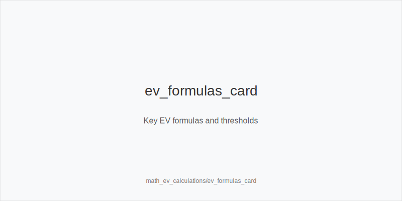
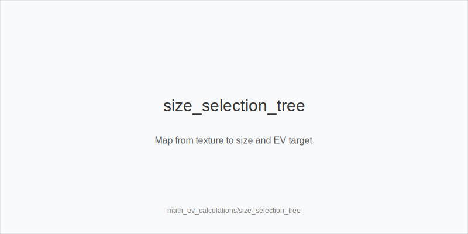
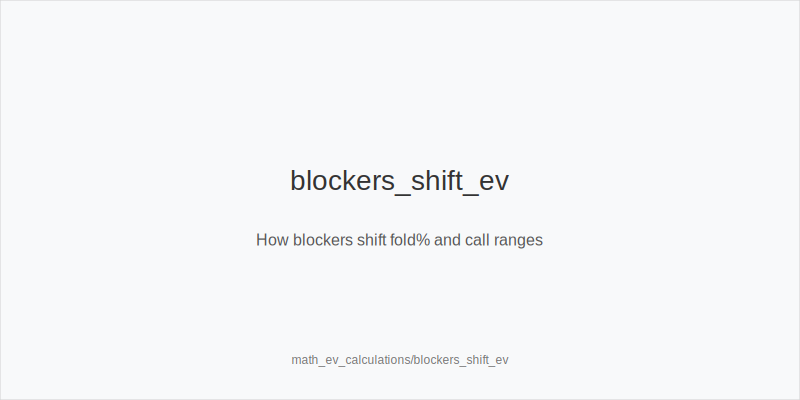

What it is
This module is a deep-dive on EV math for Heads-Up that also works in 6-max. You will compute EV(call) from equity versus price X/(P+X), EV(bluff) = folds*P + calls*(equity*win_value + (1-equity)*lose_value), and the quick bluff breakeven B/(P+B). You will compare half_pot_50 versus big_bet_75, evaluate thin value with size_down_dry, and choose preflop between 3bet_oop_12bb, call, or fold using pool fold% and realization. You will also see when 4bet_ip_21bb and 4bet_oop_24bb change EV, plus how implied and reverse implied odds and blockers move fold% or call ranges.

[[IMAGE: ev_formulas_card | Key EV formulas and thresholds]]

Why it matters
Clear math converts uncertainty into thresholds that travel across spots. When you know required equity to call and the fold% needed for a bluff, you stop guessing sizes and start selecting actions that print. EV framing keeps you solver-aligned by default and exploit-aware when the pool overfolds or under-bluffs, so your decisions remain stable under pressure.

[[IMAGE: size_selection_tree | Map from texture to size and EV target]]

Rules of thumb
- Call price: calling X into pot P needs equity >= X/(P+X). Example: call 5bb into 10bb needs ~33%; why: this is the breakeven equity where EV(call) = 0 before realization.
- Bluff breakeven: folds needed = B/(P+B). half_pot_50 needs ~33% folds; big_bet_75 needs ~43%; why: larger bets win more when called but require more folds now.
- Texture to size: size_down_dry with small_cbet_33 on static boards; size_up_wet with big_bet_75 on dynamic boards; why: equity volatility and protection needs set the optimal risk to reward.
- Preflop baselines: versus SB 2.0bb at 80-100bb, BB prefers 3bet_oop_12bb with blockers; shift to overfold_exploit when folds exceed breakeven; why: blockers cut 4-bet value and folds add immediate EV.
- Realization and position: IP realizes more of raw equity; OOP needs stronger equity to call near thresholds; why: initiative and position convert equity into EV more reliably IP.

[[IMAGE: blockers_shift_ev | How blockers shift fold% and call ranges]]

Mini example
UTG, MP, CO not seated. BTN is SB. BB posts 1bb. 100bb effective. 
Flop T84r, pot ~10bb. BB bets 5bb. SB holds Js9s with 8 clean outs. Flop-to-river equity ~32% by the rule-of-2-and-4. Call needs ~33% by X/(P+X). IP can call given implied odds; OOP folds more often. 
Turn 986ss-3c, pot ~10bb. As aggressor with a strong draw and blockers, big_bet_75 = 7.5bb needs ~43% folds while half_pot_50 = 5bb needs ~33%. On dynamic cards use size_up_wet; on blanks prefer half_pot_50 or delay_turn if leverage drops. 
Preflop: SB opens 2.0bb. With A5s in BB, compare flat versus 3bet_oop_12bb. If pool folds 45%+, choose overfold_exploit. Ace blockers also reduce 4bet_ip_21bb frequency, improving immediate EV.

Common mistakes
- Calling because equity is close while OOP. Mistake: poor realization makes a breakeven call losing; why it happens: players treat raw equity as sufficient and ignore position and initiative.
- Overusing big_bet_75 on dry boards. Mistake: you rarely reach ~43% folds; why it happens: copying wet-board plans and chasing immediate folds with the wrong texture.
- Thin value too large. Mistake: bigger sizes force better hands to continue and fold worse; why it happens: anchoring on pot size instead of who is calling what. Prefer size_down_dry.

Mini-glossary
EV(call): expected value of calling given equity and price X/(P+X). 
EV(bluff): folds*P + calls*(equity*win_value + (1-equity)*lose_value). 
Equity realization: fraction of raw equity captured after position and playability. 
Implied odds: extra chips won when improving; reverse implied odds: extra lost when second best.

Contrast
Math_pot_odds_equity focuses on prices and raw equity; this module turns those inputs into full EV decisions across sizes, streets, and preflop ladders using the same action tokens.

See also
- cash_short_handed (score 27) -> ../../cash_short_handed/v1/theory.md
- hand_review_and_annotation_standards (score 27) -> ../../hand_review_and_annotation_standards/v1/theory.md
- hu_exploit_adv (score 27) -> ../../hu_exploit_adv/v1/theory.md
- icm_final_table_hu (score 27) -> ../../icm_final_table_hu/v1/theory.md
- icm_mid_ladder_decisions (score 27) -> ../../icm_mid_ladder_decisions/v1/theory.md