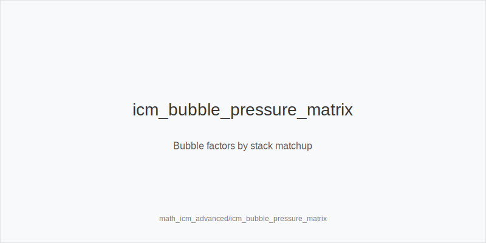
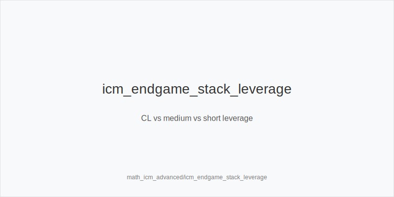
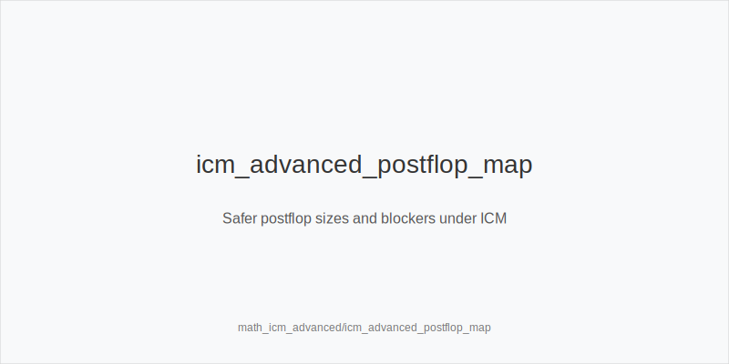

What it is
This module upgrades your ICM game for the MTT endgame from 8 left to Heads-Up. You will translate bubble pressure into concrete preflop ladders and safer postflop sizes. All guidance maps to these actions only: 3bet_ip_9bb, 3bet_oop_12bb, 4bet_ip_21bb, 4bet_oop_24bb, small_cbet_33, half_pot_50, big_bet_75, size_up_wet, size_down_dry, protect_check_range, delay_turn, probe_turns, double_barrel_good, triple_barrel_scare, call, fold, overfold_exploit.

[[IMAGE: icm_bubble_pressure_matrix | Bubble factors by stack matchup]]

Why it matters
Payouts distort chip values. Losing chips near jumps hurts more than winning the same amount helps. Risk premium compounds with shorts in the pot or behind you, so your calling thresholds, 3-bet and 4-bet frequencies, and postflop sizes must tighten. Chip leaders leverage this to pressure mediums; strong defense uses blockers, position, capped-node protection, and variance control so $EV does not leak through avoidable flips.

[[IMAGE: icm_endgame_stack_leverage | CL vs medium vs short leverage]]

Rules of thumb
- Bubble factor by role: CL applies pressure widest; mediums avoid coin flips with CL and protect $EV; shorts avoid thin calls and pick clean push or fold spots. Your call bar rises when covered by bigger stacks; use blockers to offset but do not force it.
- Short behind effect: with an 8-15bb stack behind, open and 3bet_ip_9bb ranges shrink to avoid getting squeezed. Flat more with playable hands, and BB defends less versus SB min-raises when a short can ladder.
- Preflop ladders: tighten 3bet_oop_12bb and 4bet_ip_21bb unless you hold premium blockers (A or K). OOP 4bet_oop_24bb narrows; prefer call or fold without blockers. Overfold_exploit still applies if the field folds too much.
- CL leverage lines: as CL, open wider, 3bet_ip_9bb more versus mediums, and pressure postflop with half_pot_50 on many turns. Use big_bet_75 selectively with top-tier blockers when size_up_wet fits and the pool overfolds.
- Postflop discipline: prefer size_down_dry and small_cbet_33 on static boards. Reduce big_bet_75 bluffs. Use protect_check_range so checks are not capped, delay_turn with medium strength, and probe_turns after missed c-bets on favorable cards. Triple_barrel_scare only with strong blockers and a credible scare card.

[[IMAGE: icm_advanced_postflop_map | Safer postflop sizes and blockers under ICM]]

Mini example
Three-handed FT. BTN is CL 70bb, SB 40bb, BB 12bb. BTN opens 2.0bb. BB jams 12bb. SB needs more equity than in chipEV; ace blockers lower the bar slightly, so AQs is closer than AJo. 
With a short behind in a later 4-handed spot, CO opens 2.0bb. BTN trims 3bet_ip_9bb and flats more. 
In a 3-bet pot on A82r, SB OOP prefers small_cbet_33 or half_pot_50 (size_down_dry). 
Strong Ax sometimes checks to protect_check_range; medium strength can delay_turn to avoid getting raised and to realize $EV.

Common mistakes
- Ignoring the short behind. Mistake: you open or 3-bet and get squeezed, then punt $EV; why players do it: they optimize chipEV lines and underestimate ladder risk. 
- Over-bluffing rivers. Mistake: populations under-bluff big_bet_75 under ICM; why players do it: they chase folds with polar bets on boards that do not scare enough. 
- Fighting the CL light. Mistake: mediums call or 4-bet too wide versus CL pressure; why players do it: ego and fear of getting run over beat sober $EV math.

Mini-glossary
Bubble factor: how much costlier losing chips is than winning them; raises call thresholds. 
Risk premium: extra equity needed to justify entering a pot under ICM pressure. 
Short behind: a short stack yet to act that increases squeeze risk and raises fold frequency. 
CL leverage: pressure created by the chip leader over covered stacks.

Contrast
Math_icm_basics sets conservative defaults; this module applies role- and table-aware pressure and defense, including short-behind adjustments and CL leverage, mapped to the same action set.

See also
- cash_short_handed (score 31) -> ../../cash_short_handed/v1/theory.md
- hand_review_and_annotation_standards (score 29) -> ../../hand_review_and_annotation_standards/v1/theory.md
- icm_final_table_hu (score 29) -> ../../icm_final_table_hu/v1/theory.md
- icm_mid_ladder_decisions (score 29) -> ../../icm_mid_ladder_decisions/v1/theory.md
- live_chip_handling_and_bet_declares (score 29) -> ../../live_chip_handling_and_bet_declares/v1/theory.md