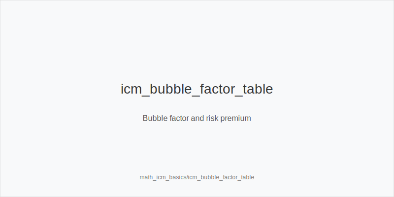
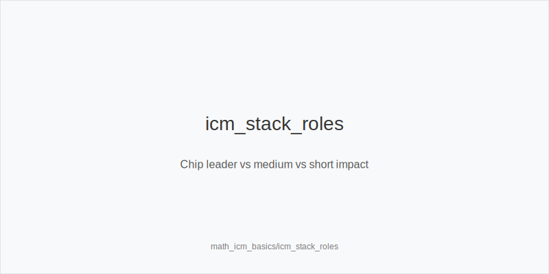
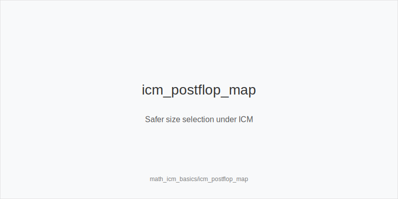

What it is
This module introduces ICM for tournaments and shows how payout pressure changes decisions. You will compare chipEV to $EV, use bubble factor and risk premium to tighten calls and 4-bets, and pick safer postflop sizes. You will map the math to actions using only: 3bet_ip_9bb, 3bet_oop_12bb, 4bet_ip_21bb, 4bet_oop_24bb, small_cbet_33, half_pot_50, big_bet_75, size_up_wet, size_down_dry, protect_check_range, delay_turn, probe_turns, double_barrel_good, triple_barrel_scare, call, fold, overfold_exploit.

[[IMAGE: icm_bubble_factor_table | Bubble factor and risk premium]]

Why it matters
Near a bubble or final table, losing chips hurts more than winning the same number helps. That asymmetry raises calling thresholds, tightens value ranges, and favors smaller, lower-volatility lines. Players who ignore ICM spew stacks; players who respect it print $EV by folding thin, sizing down, and attacking capped ranges with discipline instead of ego.

[[IMAGE: icm_stack_roles | Chip leader vs medium vs short impact]]

Rules of thumb
- ChipEV vs $EV: chipEV maximizes chips, $EV weights survival; why: payout ladders make future chips nonlinear, so fold more in marginal spots and reduce variance.
- Bubble factor: elimination risk raises the equity needed to call; why: your stack's future $EV drops sharply if you bust, so require stronger hands or key blockers before continuing.
- Preflop ladders tighten: 3bet_oop_12bb and 4bet_ip_21bb shrink in frequency while flats rise; why: fewer coins and less variance protect $EV when ranges are already strong.
- Postflop sizing: prefer size_down_dry and half_pot_50, use big_bet_75 sparingly as a bluff, and keep protect_check_range; why: smaller bets keep pots manageable and avoid capped nodes that get punished.
- Exploits: populations overfold to big_bet_75 and under-bluff rivers under ICM; why: fear of busting makes them passive, so overfold_exploit selectively and make disciplined river folds without blockers.

[[IMAGE: icm_postflop_map | Safer size selection under ICM]]

Mini example
UTG folds, MP folds, CO folds. BTN opens 2.2bb at 50bb effective. 
SB jams 28bb. BB holds AQs. Bubble factor raises the call bar; with the ace blocker BB is closer, but many lineups still fold. 
Same table: BTN folds, SB opens 2.0bb at 80bb. BB would 3bet_oop_12bb in cash, but under ICM prefers flat unless pool overfolds, then overfold_exploit. 
On A83r in SRP, BTN favors small_cbet_33 or half_pot_50; big_bet_75 bluffs decline to control variance.

Common mistakes
- Copying cash-game ladders. Mistake: wide 3-bets and loose calls lose $EV; why players do it: they optimize chipEV habits and ignore risk premium near pay jumps.
- Oversizing bluffs. Mistake: big_bet_75 with low fold equity burns stacks; why players do it: they chase immediate folds and forget ICM makes opponents call narrower but raise less.
- Calling jams without blockers. Mistake: bubble factor is ignored and calls are under-equitized; why players do it: they anchor to chipEV charts and overlook how ace or king blockers change $EV.

Mini-glossary
ChipEV: expected chips gained; ignores payouts. 
$EV: expected prize money; includes payout risk. 
Bubble factor: ratio showing how costly losing is versus winning; raises call thresholds. 
Risk premium: extra equity needed to justify playing a pot under ICM.

Contrast
Math_ev_calculations optimizes chips; this module adjusts the same actions and sizes to maximize $EV by tightening ladders and preferring safer lines under payout pressure.

See also
- hand_review_and_annotation_standards (score 25) -> ../../hand_review_and_annotation_standards/v1/theory.md
- live_chip_handling_and_bet_declares (score 25) -> ../../live_chip_handling_and_bet_declares/v1/theory.md
- live_etiquette_and_procedures (score 25) -> ../../live_etiquette_and_procedures/v1/theory.md
- live_full_ring_adjustments (score 25) -> ../../live_full_ring_adjustments/v1/theory.md
- online_hud_and_db_review (score 25) -> ../../online_hud_and_db_review/v1/theory.md