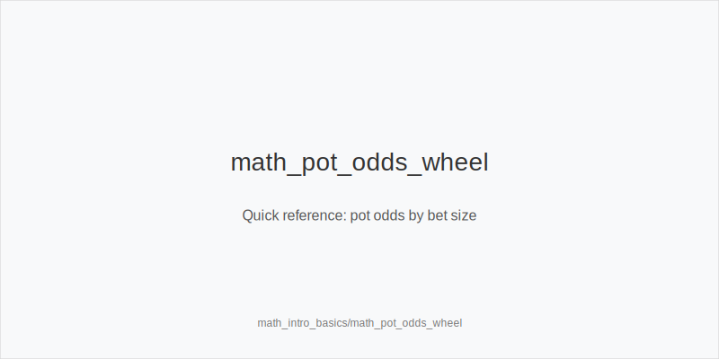
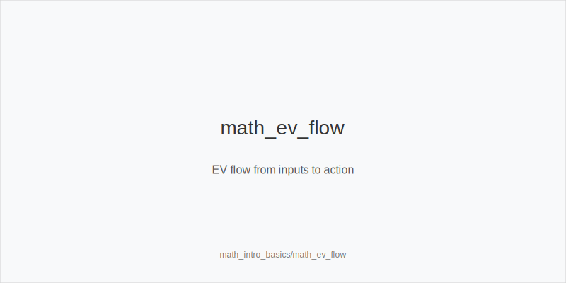
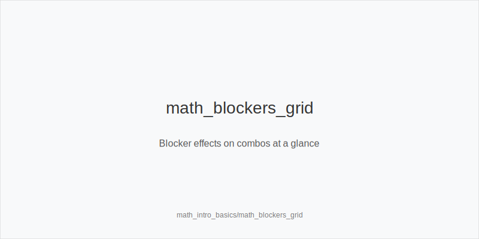

What it is
This module is a practical introduction to poker math for HU and 6-max, tuned for Heads-Up. You will compute pot odds, equity, fold equity, breakeven percentages for bluffs and calls, and simple EV using EV = p*win_value + (1-p)*lose_value. You will also estimate combos with blocker logic and map math to actions using only: 3bet_ip_9bb, 3bet_oop_12bb, 4bet_ip_21bb, 4bet_oop_24bb, small_cbet_33, half_pot_50, big_bet_75, size_up_wet, size_down_dry, protect_check_range, delay_turn, probe_turns, double_barrel_good, triple_barrel_scare, call, fold, overfold_exploit.

[[IMAGE: math_pot_odds_wheel | Quick reference: pot odds by bet size]]

Why it matters
Clear math turns guesses into edges. When you know the price you get and how often a bluff must work, you avoid hero calls, pick better bluffs, and select sizes that maximize EV against both solvers and real pools. A small set of repeatable formulas speeds decisions under pressure.

[[IMAGE: math_ev_flow | EV flow from inputs to action]]

Rules of thumb
- Pot odds: to call X into a pot P, required equity >= X/(P+X). Example: calling 5bb into 10bb needs ~33%.
- Bluff breakeven: for a bet B into pot P, required folds = B/(P+B). Example: half_pot_50 needs ~33%, big_bet_75 needs ~43%.
- Equity realization: IP realizes more, OOP less. Tighten calls OOP and widen calls IP when the price is good; initiative improves realization.
- Size by texture: use size_down_dry with small_cbet_33 on static boards; use size_up_wet with big_bet_75 on dynamic boards.
- Preflop ladders: 3bet_oop_12bb versus SB 2.0bb opens, 3bet_ip_9bb versus iso or opens, 4bet_ip_21bb versus 12bb, 4bet_oop_24bb versus IP 3-bets; blockers improve fold equity.

[[IMAGE: math_blockers_grid | Blocker effects on combos at a glance]]

Mini example
UTG, MP, CO not seated. BTN is SB. BB posts 1bb. 100bb effective. 
SB opens 2.0bb. BB considers 3bet_oop_12bb with A5s. Pool folds ~50% to 12bb, so overfold_exploit increases bluff 3-bets. 
Postflop on K72r, IP can use small_cbet_33 (size_down_dry); on JT9ss, prefer big_bet_75 (size_up_wet). 
Facing a 5bb bet into 10bb with an 8-out draw (~32% equity), pot odds need ~33%: close call IP, fold more OOP. 
For a river bluff into 10bb, betting 7.5bb needs ~43% folds; on scare rivers with blockers, triple_barrel_scare can clear that threshold.

Common mistakes
- Over-calling OOP because the number looks close. Mistake: poor realization lowers true EV; why it happens: players treat raw equity as enough without position or initiative.
- Using big_bet_75 on dry boards without fold equity. Mistake: bad risk-to-reward and value cut; why it happens: copying wet-board sizes everywhere.
- Skipping blockers in preflop bluffs. Mistake: 3-betting hands that do not block 4-bets; why it happens: overlooking combo math and focusing only on suitedness.

Mini-glossary
Pot odds: the price of a call, X/(P+X), compared to your equity. 
Fold equity: chance a bet succeeds immediately, B/(P+B) at breakeven. 
Blocker: a card that reduces opponent combos, improving bluff success or call safety. 
Implied odds: extra future chips won when you hit; reverse implied odds: extra lost when behind.

Contrast
HU exploit and postflop modules tell you what to do; this module shows why the numbers support small_cbet_33, big_bet_75, or 3bet_oop_12bb in the first place.

See also
- hu_exploit_adv (score 31) -> ../../hu_exploit_adv/v1/theory.md
- cash_short_handed (score 29) -> ../../cash_short_handed/v1/theory.md
- hand_review_and_annotation_standards (score 29) -> ../../hand_review_and_annotation_standards/v1/theory.md
- icm_final_table_hu (score 29) -> ../../icm_final_table_hu/v1/theory.md
- icm_mid_ladder_decisions (score 29) -> ../../icm_mid_ladder_decisions/v1/theory.md