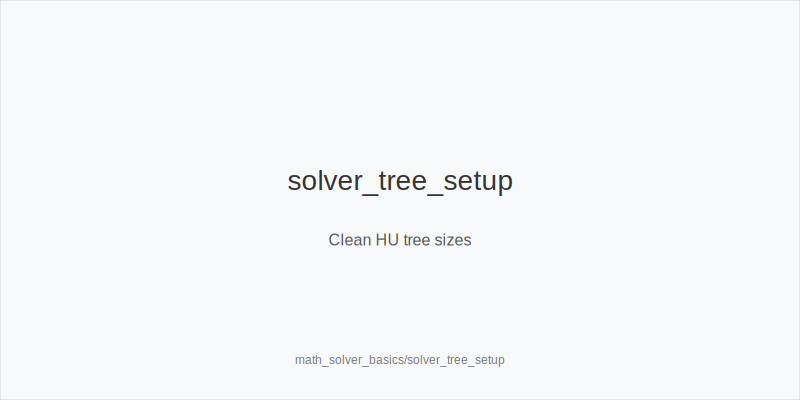
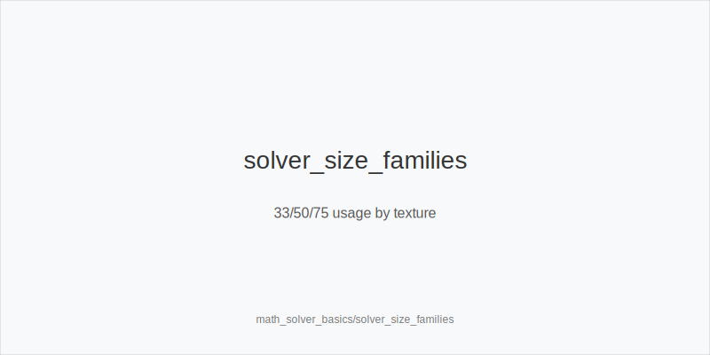
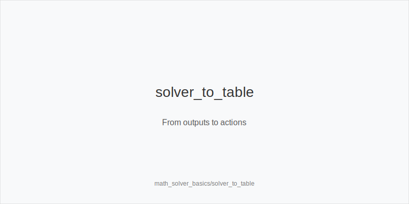

What it is
This module is a practical primer on using a solver with HU focus that also transfers to 6-max. You will build compact trees, pick size families, read frequencies and EVs, and convert outputs into a fixed action set: 3bet_ip_9bb, 3bet_oop_12bb, 4bet_ip_21bb, 4bet_oop_24bb, small_cbet_33, half_pot_50, big_bet_75, size_up_wet, size_down_dry, protect_check_range, delay_turn, probe_turns, double_barrel_good, triple_barrel_scare, call, fold, overfold_exploit. No node-locking here.

[[IMAGE: solver_tree_setup | Clean HU tree sizes]]

Why it matters
Solvers are consistent only if your tree mirrors real choices. Compact, realistic trees produce clear frequencies and small EV deltas you can execute. Mapping outputs to canonical tokens removes guesswork, speeds review, and stabilizes decisions across HU and standard online formats.

[[IMAGE: solver_size_families | 33/50/75 usage by texture]]

Rules of thumb
- Keep trees compact: preflop sizes are 3bet_ip_9bb, 3bet_oop_12bb, 4bet_ip_21bb, 4bet_oop_24bb; postflop sizes are small_cbet_33, half_pot_50, big_bet_75; why: stable ladders reduce noise and make frequencies legible.
- Use size_down_dry on static boards (A83r, K72r) and size_up_wet on dynamic boards (JT9ss, 986ss); why: equity volatility dictates pressure and protection needs.
- Treat tiny EV gaps as mixable: track the highest EV action and one backup; why: execution tolerance matters more than 1 to 2 bb per 100 when EV deltas are small.
- Protect checks with protect_check_range and prefer delay_turn with medium strength; why: avoiding capped nodes increases defense versus probes and raises.
- On turns, double_barrel_good when your range, nut, or equity advantage grows; otherwise pick half_pot_50 or delay_turn; why: add leverage where it exists and conserve when thin.

[[IMAGE: solver_to_table | From outputs to actions]]

Mini example
UTG, MP, CO folded. BTN is SB. BB posts 1bb. 100bb effective. 
Flop K72r in SRP after SB opens and BB calls. Solver prefers small_cbet_33 (size_down_dry) high frequency IP, mixing checks with some Kx to protect_check_range. 
Turn 3h: solver delay_turn with marginal Kx and double_barrel_good with sets, strong Kx, and good backdoors. 
River Qc: solver folds weak Kx to big_bet_75 but calls when holding better blockers to value and unblocking missed draws.

Common mistakes
- Overbuilt trees. Mistake: too many sizes hide clear patterns and fragment EV; why players do it: they try to capture every edge and end up learning nothing actionable. Fix: stick to 33, 50, 75 and the preflop ladders.
- Reading raw frequency without EV. Mistake: chasing the colorful 70% action that is lower EV than a 30% line; why players do it: frequency maps are visually loud. Fix: sort by EV first, then simplify mixes.
- Copying mixes blindly. Mistake: forcing thin multiway mixes you cannot execute; why players do it: fear of deviating from solver output. Fix: bias to the top EV action and one backup mapped to tokens.

Mini-glossary
Compact tree: a reduced action set that still captures optimal structure. 
Frequency map: solver output showing how often each token fires. 
EV delta: the EV gap between candidate actions; small deltas enable practical mixing. 
Exploit tag: intentional deviation like overfold_exploit when population tendencies increase EV.

Contrast
Earlier math modules teach prices and equity; this module shows how to turn solver outputs into the same tokenized actions you will execute live.

See also
- icm_final_table_hu (score 31) → ../../icm_final_table_hu/v1/theory.md
- icm_mid_ladder_decisions (score 31) → ../../icm_mid_ladder_decisions/v1/theory.md
- live_session_log_and_review (score 31) → ../../live_session_log_and_review/v1/theory.md
- online_economics_rakeback_promos (score 31) → ../../online_economics_rakeback_promos/v1/theory.md
- online_hudless_strategy_and_note_coding (score 31) → ../../online_hudless_strategy_and_note_coding/v1/theory.md