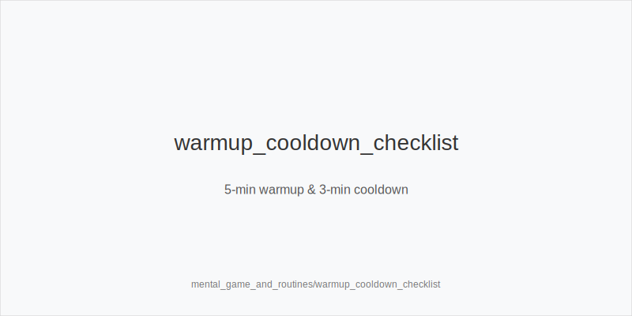

What it is
This module turns mindset and execution routines (warmup, focus, tilt guards, cooldown) into stable frequency shifts using a fixed action set: 3bet_ip_9bb, 3bet_oop_12bb, 4bet_ip_21bb, 4bet_oop_24bb, small_cbet_33, half_pot_50, big_bet_75, size_up_wet, size_down_dry, protect_check_range, delay_turn, probe_turns, double_barrel_good, triple_barrel_scare, call, fold, overfold_exploit. Trees and sizes never change; routines choose how often you use each token.

Why it matters
EV/hour depends on execution quality. Routines cut error rate, keep ladders intact, and prevent off-tree punts under stress or fatigue. Physics first, reads second: texture selects size family (size_down_dry on static, size_up_wet on dynamic). Routines then shift frequencies inside that family.

Rules of thumb

* Warmup complete, focused: standard aggression. On static flops use size_down_dry with small_cbet_33; mix double_barrel_good when turns add leverage. Why: clean baseline.
* High table load: bias to small_cbet_33 and half_pot_50; prefer delay_turn and protect_check_range; reduce triple_barrel_scare without top blockers. Why: lower APM cost.
* Tilt or fear spike: do not invent sizes; fold more vs big_bet_75 without blockers; choose size_down_dry for thin value. Why: protect bankroll while stable.
* Confidence spike: keep tokens; require blockers before big_bet_75 on dynamic turns (size_up_wet). Why: avoid overreach.
* After bad beat: physics first. Pause thin OOP calls; keep preflop ladders but trim bluff 3-bets without blockers. Why: reduce variance while composed.
* End-session fatigue: default to probe_turns after chk-chk; cut river hero-calls; bias delay_turn with medium strength. Why: simple, high-EV actions.
* Shot-taking window: smaller, lower-variance lines (small_cbet_33, half_pot_50); 4bet_ip_21bb / 4bet_oop_24bb only with premiums and blockers. Why: control risk.
* Recovery block (post-tilt cooldown): increase protect_check_range in stab-prone nodes; keep big_bet_75 only with scare + blockers. Why: prevent auto-profit against you.
* Confidence rebuild vs stations: value more with half_pot_50; thin value on static with size_down_dry. Why: merged callers pay.
* Focus peak on dynamic textures: when equity and blockers align, size_up_wet and consider big_bet_75 as double_barrel_good. Why: capitalize when bandwidth is high.

[[IMAGE: routine_state_switchboard | Routine states -> frequency shifts by token]]

[[IMAGE: error_rate_curve | Error rate vs tables/fatigue and recommended tokens]]

[[IMAGE: warmup_cooldown_checklist | 5-min warmup & 3-min cooldown]]

Mini example
Start HU 100bb after warmup. SB opens 2.0bb; BB 3bet_oop_12bb with A5s (blockers). Flop A83r in a 3-bet pot, pot ~18bb: size_down_dry with small_cbet_33. Mid-session load jumps 6->12 tables; you simplify: on K72r SRP, keep small_cbet_33, choose delay_turn with medium Kx; earlier streets include protect_check_range to avoid stabs. Later river A94r-6s-Kd vs big_bet_75 without blockers: fold. Ladders unchanged throughout.

Common mistakes

* Off-tree sizes under tilt. Fix: stay with small_cbet_33, half_pot_50, big_bet_75; shift frequency only.
* Forcing big_bet_75 on dry boards. Fix: prefer size_down_dry for thin value or check.
* Hero-calling under fatigue. Fix: fold vs polar big bets without blockers.
* Abandoning protect_check_range when overloaded. Fix: protect key checks and add delay_turn to control variance.
* Over-bluffing turns while multitabling. Fix: reduce double_barrel_good unless equity + blockers + fold equity align.

Mini-glossary
Warmup: brief prep that raises focus and restores standard frequencies.
Cooldown: short review to discharge tilt and plan next session adjustments.
APM: actions per minute; higher APM demands simpler tokens and sizes.
Autopilot: habitual play; pair with probe_turns and protect_check_range to prevent leaks.
Stop-loss/win: session guardrails that preserve decision quality.
Table cap: maximum tables before accuracy drops; triggers simpler tokens.
Execution load: cognitive demand; when high, bias delay_turn and small_cbet_33.

Contrast
Bankroll/variance sets macro policy; online dynamics use opponent signals. This module uses internal state to shift frequencies while preserving the same actions and size families.

See also
- exploit_advanced (score 27) -> ../../exploit_advanced/v1/theory.md
- icm_final_table_hu (score 27) -> ../../icm_final_table_hu/v1/theory.md
- icm_mid_ladder_decisions (score 27) -> ../../icm_mid_ladder_decisions/v1/theory.md
- live_etiquette_and_procedures (score 27) -> ../../live_etiquette_and_procedures/v1/theory.md
- live_full_ring_adjustments (score 27) -> ../../live_full_ring_adjustments/v1/theory.md