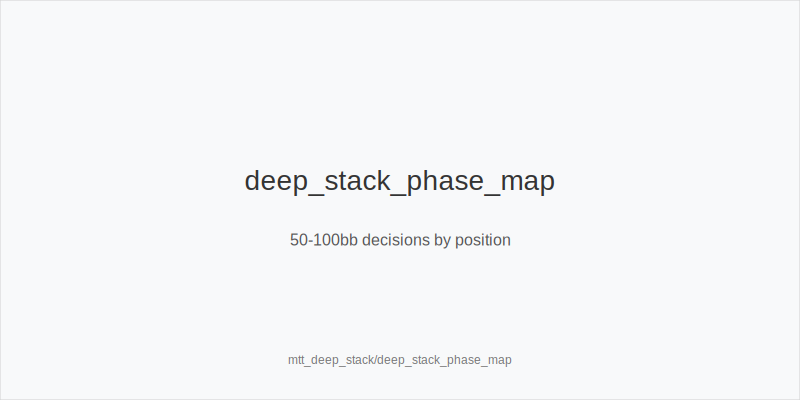
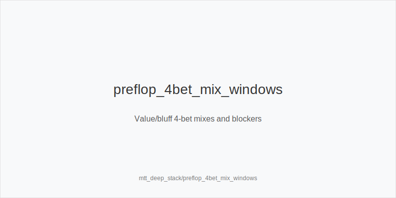
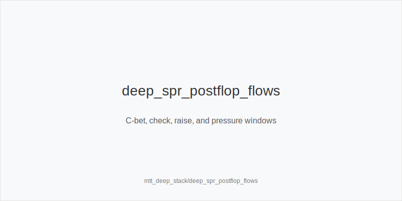

What it is
Deep-stack MTT play covers 50-100bb effective on 9-max tables. Higher SPR lets you flat more IP, value-bet thinner, and pressure turns and rivers with credible stories. Early seats remain tighter; OOP flats risk multiway, so prefer proactive 3-bet trees.

[[IMAGE: deep_stack_phase_map | 50-100bb decisions by position]]

[[IMAGE: preflop_4bet_mix_windows | Value/bluff 4-bet mixes and blockers]]

[[IMAGE: deep_spr_postflop_flows | C-bet, check, raise, and pressure windows]]

Why it matters
Antes inflate pots; deeper stacks magnify mistakes across two or three streets. The pool under-4bets, over-defends flop, then overfolds turns and some scare rivers. Clean ladders (3bet_ip_9bb, 3bet_oop_12bb, 4bet_ip_21bb, 4bet_oop_24bb) plus disciplined postflop sizing convert that into chips.

Rules of thumb
- Preflop ladders: vs CO/BTN steals, use 3bet_ip_9bb. From blinds, prefer 3bet_oop_12bb over wide flats to avoid dominated multiway. Keep 4bet_ip_21bb value-lean vs tight 3-bettors; mix 4bet_oop_24bb rarely with top-end and best blockers.
- Flats: add IP flats with suited connectors, pairs, and Axs/Kxs that realize well. Reduce OOP flats in early seats; fold marginal offsuit broadways without blockers.
- Squeeze policy: punish open+call with 3bet_oop_12bb from blinds and 3bet_ip_9bb from BTN. Do not trap-call OOP and create bad SPR.
- Flop sizes: small_cbet_33 on dry and ace-high boards to tax floats. half_pot_50 when ranges are closer or you plan a turn barrel. big_bet_75 only with size_up_wet or nut advantage; avoid vanity big bets.
- Lines: protect_check_range OOP on middling textures that invite raises. delay_turn when flop checks and the turn improves your range. probe_turns when the turn favors OOP or villain under-c-bets.
- Aggression gates: double_barrel_good on range-shifting turns after a small flop bet. triple_barrel_scare on credible scare rivers when blockers support the story. Tag overfold_exploit where population folds too often to OOP turn pressure.
- Geometry: plan flop+turn to keep river SPR workable. Do not bloat OOP without nut share; keep sizing consistent with your commit plan.

Mini example
70bb effective. CO opens 2.2bb, BTN 3bet_ip_9bb, CO calls OOP. Pot ~20bb; stacks ~61bb; SPR ~3.0. Flop K72r: BTN small_cbet_33 ~6.5bb to deny and keep range wide; CO calls. Turn 5x bricks: BTN half_pot_50 ~10bb (double_barrel_good) targeting underpairs and Kx with weak kickers. River A appears: with an ace blocker, BTN triple_barrel_scare; without blockers or equity, check back.

Common mistakes
- Over-flatting OOP in early seats; you invite multiway and poor realization. Prefer 3bet_oop_12bb or fold.
- Big-bet-then-give-up lines on wet flops without equity. Use small_cbet_33 or check; reserve big_bet_75 for size_up_wet or nut advantage.
- Bluff 4-betting into tight 3-bettors. Keep 4bet_ip_21bb and 4bet_oop_24bb value-lean; use blockers sparingly.
- Skipping turn pressure where overfold_exploit applies. Chips are won on turns; plan two-street sequences.

Mini-glossary
3bet_ip_9bb / 3bet_oop_12bb: Default 3-bet sizes IP/OOP that set SPR for pressure.
4bet_ip_21bb / 4bet_oop_24bb: Value-lean 4-bet families; mix bluffs mainly IP with best blockers.
small_cbet_33 / half_pot_50 / big_bet_75: Postflop size families mapped to texture and plan.
size_up_wet / size_down_dry: Adjust sizing on dynamic vs static boards.
delay_turn / probe_turns / protect_check_range: Tools to time aggression and protect OOP ranges.
double_barrel_good / triple_barrel_scare: Aggression gates for range turns and scare rivers.
overfold_exploit: Node tag where population folds too much; bias pressure.

Contrast
Compared to mid-stack (25-50bb), deep-stack increases IP flats and river play while demanding tighter OOP discipline. Versus cash, antes keep pots larger, so seize initiative with 3-bets and plan flop+turn pressure rather than bloated rivers.

See also
- live_chip_handling_and_bet_declares (score 31) → ../../live_chip_handling_and_bet_declares/v1/theory.md
- cash_short_handed (score 29) → ../../cash_short_handed/v1/theory.md
- donk_bets_and_leads (score 29) → ../../donk_bets_and_leads/v1/theory.md
- hand_review_and_annotation_standards (score 29) → ../../hand_review_and_annotation_standards/v1/theory.md
- icm_final_table_hu (score 29) → ../../icm_final_table_hu/v1/theory.md