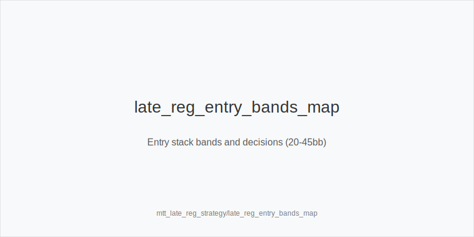
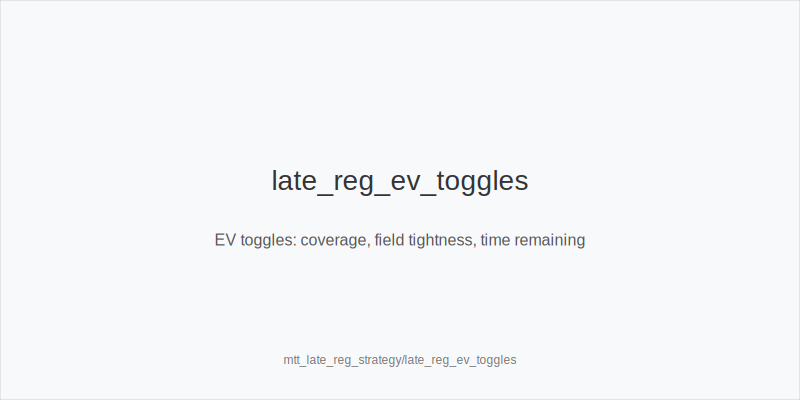
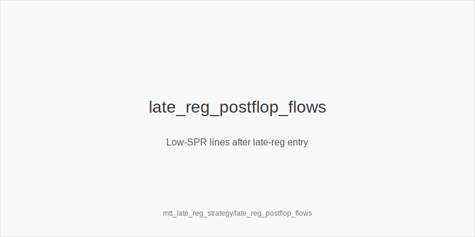

What it is
Late registration strategy is how you enter 9-max MTTs mid-event and play from 20-45bb stacks. You weigh seat draw quality, who covers whom (coverage), field tendencies, and time remaining. Your ranges, sizings, and postflop lines tighten when covered and expand when you cover weaker stacks.

[[IMAGE: late_reg_entry_bands_map | Entry stack bands and decisions (20-45bb)]]

[[IMAGE: late_reg_ev_toggles | EV toggles: coverage, field tightness, time remaining]]

[[IMAGE: late_reg_postflop_flows | Low-SPR lines after late-reg entry]]

Why it matters
Late-reg changes your equity sources. You skip deep-stack edges, but you gain higher blinds and antes that reward clean preflop trees and two-street pressure. Bad flats OOP create dominated, low-SPR hands versus stronger fields. Coverage asymmetry and table composition can swing EV more than card quality at the margins.

Rules of thumb
- Entry 20-25bb: jam/reshove-first. Map to 3bet_oop_12bb or 3bet_ip_9bb proxies. Avoid flats OOP. Keep 4bet_ip_21bb / 4bet_oop_24bb value-lean only.
- Entry 26-35bb: mix small opens and reshoves. From blinds, prefer squeeze over flat versus open+call (3bet_oop_12bb). 4bet_ip_21bb stays value-lean; 4bet_oop_24bb rare.
- Entry 36-45bb: add IP flats that realize well. OOP still prefer 3bet_oop_12bb over dominated flats in 9-max formations.
- Coverage and formation: widen pressure when you cover; tighten call-offs when covered. Avoid multiway OOP by squeezing instead of flatting open+call.
- Postflop defaults: small_cbet_33 on static Axx/Kxx where you are uncapped. Use half_pot_50 to set two-street commit lines with value+equity. Use big_bet_75 only with size_up_wet and real equity or nut advantage. OOP, protect_check_range on middling; deploy delay_turn or probe_turns when the turn shifts range advantage.
- Exploits: pools overfold turns to covering stacks; tag overfold_exploit nodes and bias pressure toward those turns.
- PKO note: coverage widens call-offs versus short large bounties; otherwise keep the same entry-band baselines.

Mini example
You late-reg with 24bb. CO opens 2.2bb; you BTN 3bet_ip_9bb (jam-proxy) leveraging blockers and position. CO calls. Pot ~20bb, stacks ~14bb, SPR ~0.7. Flop A72r: small_cbet_33 to tax broadways and deny equity. Called. Turn Kx (range card): half_pot_50 as a commit step with Ax/Kx and strong draws; otherwise slow down. If you were covered, reduce preflop frequency and prefer fold over marginal reshoves.

Common mistakes
- Flatting OOP at 20-30bb and inviting squeezes, creating bad SPRs.
- Calling 3-bets too wide when covered; fold and wait for better formations.
- Using big_bet_75 on volatile boards without size_up_wet equity; you over-commit.
- Bluff 4-betting at 26-35bb without coverage and blockers.
- Ignoring overfold_exploit on turns after late-reg when pools play face-up.

Mini-glossary
Coverage: who can bust whom; being covered increases your risk of ruin.
Entry bands: stack-at-entry groups (20-25, 26-35, 36-45bb) with distinct trees.
Commit line: planned two-street sequence that cleanly commits with value+equity.
Squeeze: 3-bet over open+caller to avoid dominated multiway (3bet_oop_12bb / 3bet_ip_9bb).

Contrast
Unlike deep-start entries, late-reg favors shove/reshove proxies, fewer OOP flats, and two-street pressure. Versus PKO, only the coverage-driven call-off deltas shift; your sizing families and risk control remain the same.

_This module uses the fixed families and sizes: size_down_dry, size_up_wet; small_cbet_33, half_pot_50, big_bet_75._

See also
- hand_review_and_annotation_standards (score 27) → ../../hand_review_and_annotation_standards/v1/theory.md
- live_etiquette_and_procedures (score 27) → ../../live_etiquette_and_procedures/v1/theory.md
- live_full_ring_adjustments (score 27) → ../../live_full_ring_adjustments/v1/theory.md
- live_speech_timing_basics (score 27) → ../../live_speech_timing_basics/v1/theory.md
- online_hud_and_db_review (score 27) → ../../online_hud_and_db_review/v1/theory.md