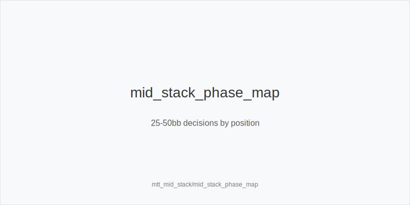
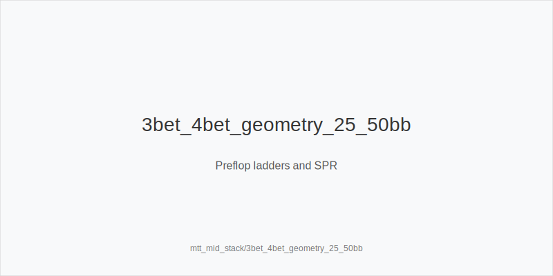
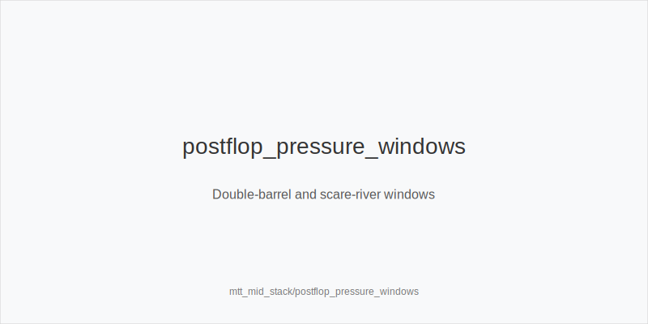

What it is
Mid-stack MTT play covers 25-50bb effective on 9-max tables. SPRs allow two-street commit lines, especially in 3-bet pots. You will press edges with disciplined preflop ladders and pressure-first postflop plans, not river heroics.

[[IMAGE: mid_stack_phase_map | 25-50bb decisions by position]]

[[IMAGE: 3bet_4bet_geometry_25_50bb | Preflop ladders and SPR]]

[[IMAGE: postflop_pressure_windows | Double-barrel and scare-river windows]]

Why it matters
Antes inflate pots while stacks are deep enough to maneuver. The pool under-4bets, over-defends flop, then overfolds turns. Clean trees capture dead money and avoid dominated flats that create bad multiway SPR in 9-max.

Rules of thumb
- Preflop ladders: vs CO/BTN steals, use 3bet_ip_9bb. From blinds, prefer 3bet_oop_12bb over flat to avoid multiway. Keep 4bet_ip_21bb value-lean vs tight 3-bettors; use 4bet_oop_24bb sparingly.
- Squeeze policy: punish cold-calls. Map squeezes to 3bet_oop_12bb from blinds and 3bet_ip_9bb from BTN. Do not trap-call OOP with dominated offsuit.
- Postflop sizes: small_cbet_33 on dry to tax broadways. Use half_pot_50 when ranges are closer or you are setting up a turn shove. Choose big_bet_75 only with size_up_wet and real equity or nut advantage.
- Line selection: OOP on middling textures, protect_check_range. After flop checks, delay_turn IP on cards improving your range; probe_turns when turn favors OOP or villain under-c-bets.
- Aggression gates: double_barrel_good on range-shifting turns after small flop bets. triple_barrel_scare on credible scare rivers when blockers back the story.
- Exploits: tag overfold_exploit where pools fold too much to OOP turn barrels or IP double barrels at 25-40bb. Bias size up there.
- Geometry: plan two-street sequences (flop+turn). Avoid size_down_dry in volatile spots at 30-40bb unless extracting thin value with clear domination.

Mini example
40bb effective. CO opens 2.2bb, BTN 3bet_ip_9bb. CO calls OOP. Pot ~20bb, stacks ~31bb, SPR ~1.6. Flop K72r: BTN small_cbet_33 ~6.5bb to deny and keep range wide. CO calls. Turn 5x bricks: BTN half_pot_50 ~13bb (double_barrel_good) sets a clean river shove with value and best bluffs. If river A hits BTN range and BTN holds blocker, triple_barrel_scare; without blockers, check back.

Common mistakes
- Flatting OOP vs late-seat 3-bets at 30-40bb and playing a guessing game on turn. Prefer 3bet_oop_12bb pre or fold.
- Using big_bet_75 on wet boards without equity. You polarize yourself without a plan to folds or raises.
- Bluff 4-betting light versus tight 3-bettors. Keep 4bet_ip_21bb and 4bet_oop_24bb value-heavy in these pools.
- Auto c-betting monotone or paired-lows. Mix small_cbet_33 and delay_turn; do not torch into check-raises.

Mini-glossary
3bet_ip_9bb / 3bet_oop_12bb: Preflop raise sizes for pressure and squeeze; set SPR for two-street plans.
4bet_ip_21bb / 4bet_oop_24bb: Value-lean 4-bet families at 25-50bb.
small_cbet_33 / half_pot_50 / big_bet_75: Postflop size families aligned to range interaction and geometry.
size_up_wet / size_down_dry: Texture-based size shifts on dynamic vs static boards.
protect_check_range / delay_turn / probe_turns: Line tools to keep equity, stab later, or reclaim initiative.
double_barrel_good / triple_barrel_scare: Turn and river aggression gates when narrative is strong.
overfold_exploit: Node tag where the pool folds too often; increase pressure and sizing.

Contrast
Compared to short-stack, mid-stack emphasizes planning two streets and leveraging blockers on turns and rivers. Compared to deep cash, you avoid wide flats OOP in 9-max and keep 4-bets value-lean while pressing turn pressure windows.

See also
- exploit_advanced (score 27) → ../../exploit_advanced/v1/theory.md
- icm_final_table_hu (score 27) → ../../icm_final_table_hu/v1/theory.md
- live_chip_handling_and_bet_declares (score 27) → ../../live_chip_handling_and_bet_declares/v1/theory.md
- live_etiquette_and_procedures (score 27) → ../../live_etiquette_and_procedures/v1/theory.md
- live_full_ring_adjustments (score 27) → ../../live_full_ring_adjustments/v1/theory.md